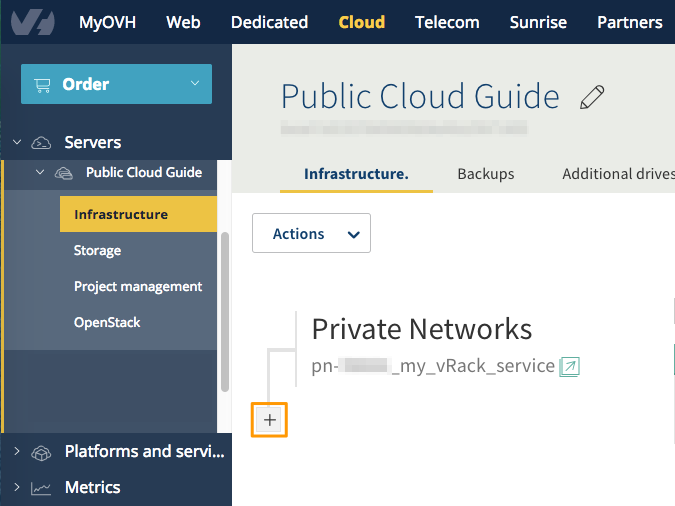
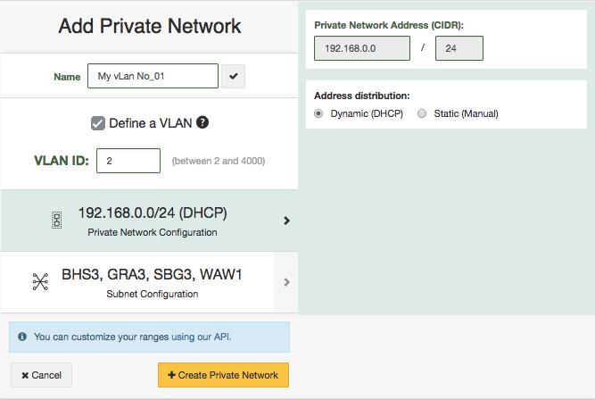
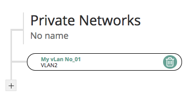

**Ostatnia aktualizacja dnia 2018-02-14**

## Wprowadzenie

W tym przewodniku opisano sposób tworzenia i usuwania sieci prywatnej w infrastrukturze Public Cloud za pomocą Panelu klienta.

Sieć prywatną można utworzyć w dowolnym momencie, jednak dodanie do sieci już uruchomionej instancji jest możliwe tylko za pośrednictwem interfejsu API OVH.
Oto odpowiedni przewodnik: [Dodanie usługi vRack do instancji Public cloud przez API OVH](https://docs.ovh.com/pl/public-cloud/uruchomienie-vrack-instancje-api-ovh/){.external}

## Wymagania początkowe

- Dostęp do [Panelu klienta](https://www.ovh.com/auth/?action=gotomanager){.external}
- Uruchomiona usługa vRack - [Włączanie i wyłączanie usługi vRack w Projekcie](https://docs.ovh.com/pl/public-cloud/Wlaczanie-wylaczanie-vrack/){.external}
- Uruchomiony i przypisany Projekt do usługi vRack - [Połączenie instancji Public Cloud z innymi produktami OVH za pomocą vRack](https://docs.ovh.com/pl/public-cloud/polaczenie-vrack-public-cloud-inne-uslugi/){.external}

## W praktyce

### Tworzenie sieci prywatnej
Przejdź do sekcji `Cloud`{.action}, a następnie w lewym menu wskaż `Projekt`{.action} i wybierz zakładkę `Infrastruktura`{.action}

Aby dodać prywatną sieć, kliknij przycisk `+`{.action}.

{.thumbnail}

W następnym kroku pojawi się kilka opcji konfiguracji.

{.thumbnail}

Parametr|Opis|
|---|---|
|Nazwa|wybrana przez Ciebie nazwa sieci dla łatwiejszej identyfikacji.|
|Zdefiniuj sieć VLAN|możesz ustawić VLAN ID, który jest osadzany w vRack i pozwala na łączenie produktów OVH Cloud oraz umożliwia komunikację w prywatnej sieci.|
|Adresowanie IP|możesz wybrać sposób adresowania: Statyczny, gdy chcesz skonfigurować sieć ręcznie lub Dynamiczny (DHCP), gdy zakładasz, że sieć będzie zaadresowana automatycznie.|
|Regiony|wybierz regiony, w których zostanie utworzona sieć. Jeśli wybierzesz dynamiczny rozkład adresów, zakres zostanie automatycznie podzielony między wybranymi regionami.|

{.thumbnail}

Nawet jeśli sieć została aktywowana za pomocą protokołu DHCP, interfejs sieciowy można zaadresować w innym zakresie, konfigurując go ręcznie.

Gdy Twoja sieć prywatna zostanie aktywowana, będzie widoczna w drzewie sieci prywatnych w zakładce "Infrastruktura".
Teraz możesz tworzyć instancje jednocześnie podłączając je do tej sieci prywatnej.

### Usuwanie prywatnej sieci

Usuwanie sieci prywatnej jest możliwe, jeśli żadna z instancji nie korzysta z tej sieci. W przeciwnym razie wyświetli się błąd.

Umieść kursor myszy na nazwie sieci, aby wyświetlić się ikonę kosza.

{.thumbnail}

Kliknij ikonę kosza i potwierdź operację usuwania.

## Sprawdź również:

- [Dodanie usługi vRack do instancji Public cloud przez API OVH](https://docs.ovh.com/pl/public-cloud/uruchomienie-vrack-instancje-api-ovh/){.external}

Przyłącz się do społeczności naszych użytkowników na stronie <https://community.ovh.com/en/>.

