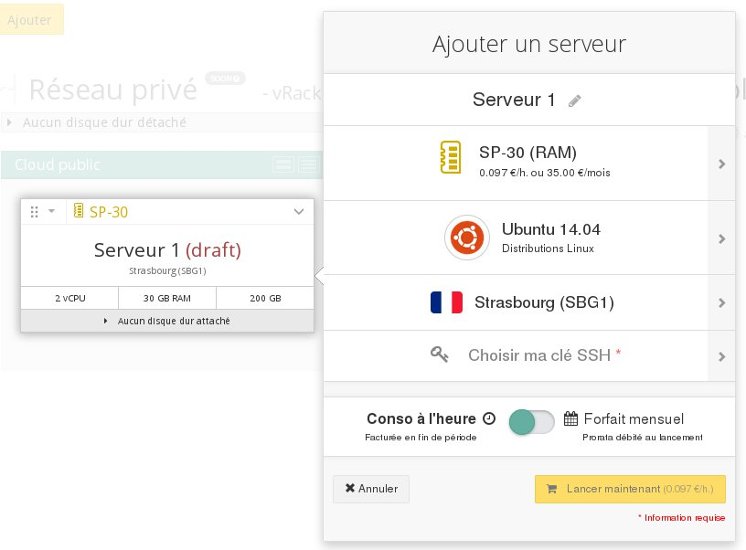

## 
Met Public Cloud kunt u snel en gemakkelijk virtuele servers (instances) creëren binnen enkele klikken. Deze instances zijn te vergelijken met [de nieuwste versie van OVH VPS](http://www.ovh.nl/vps/) maar ze voldoen ook aan andere behoeften. 
De voornaamste verschillen tussen VPS en Public Cloud instances: 

VPS: 

- Eenvoudige klanteninterface
- Gericht op een enkele machine
- Groot aantal distributies

Public Cloud Instance: 

- Keuze om maandelijks of per uur te betalen
- OpenStack API
- Instances werken samen

## Vooraf vereist

- inloggen op url="https://www.ovh.com/manager/cloud/"]OVH Control Panel[/url]
- een aangemaakte en geconfigureerde SSH sleutel voor uw OVH manager: 

## De server toevoegen
Klik linksbovenaan op de knop Toevoegen

{.thumbnail}

- Kies Voeg een server toe

{.thumbnail}

## Bepaal de karakteristieken van de server

- Als u op het pijltje rechts van het model klikt, verschijnt er een nieuw menu:

{.thumbnail}
U kunt daarna het type instance kiezen

- VPS-SSD specificaties

|van 1 tot 2 vCores|van 2 tot 8GB RAM|van 10GB tot 40GB opslag|

- CPU specificaties

|van 2 tot 32 vCores|van 7 tot 120GB RAM|van 200 tot 1600GB opslag|

- RAM specificaties

|van 2 tot 16 vCores|van 30 tot 240GB RAM|van 200 tot 1600GB opslag|

## CPU kiezen

- Bijvoorbeeld Ubuntu 14.04

{.thumbnail}

## Kies de datacenter regio

- Bijvoorbeeld Straatsburg

{.thumbnail}

## Selecteer de te gebruiken SSH sleutel

- Bijvoorbeeld:

{.thumbnail}

## Informatie
Wanneer een Windows instance is gecreëerd is het niet nodig om een SSH key te configureren.

## Geef de VS een naam en start hem op

- Geef de VS een naam 
- Kies tussen maandelijkse facturatie of per uur

## Belangrijk:
Bij het kiezen van een maandelijkse facturatie voor een instance bent u verplicht deze minstens tot het einde van die maand te houden.

- Klik op nu lanceren

## 
[Teruggaan naar de index van Cloud handleidingen]({legacy}1785)

