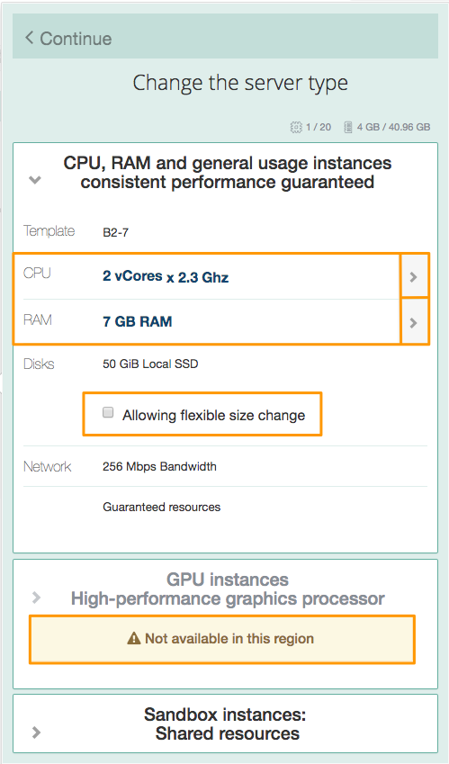
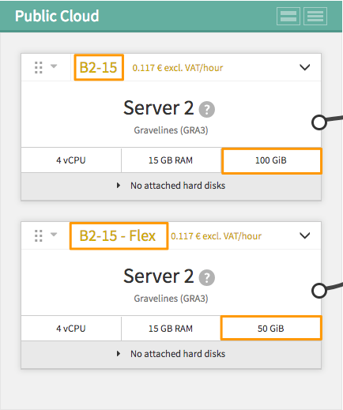

**Ostatnia aktualizacja dnia 2018-03-02**

 
## Wprowadzenie
Usługa [Public Cloud](https://www.ovh.pl/cloud/){.external} pozwala szybko i łatwo tworzyć wirtualne serwery (instancje) za pomocą kilku kliknięć.

W tym przewodniku przedstawiamy, jak utworzyć instancję za pośrednictwem Panelu klienta.

## Wymagania początkowe

- Dostęp do [Panelu klienta](https://www.ovh.com/auth/?action=gotomanager){.external}
- Utworzony Projekt Public Cloud
- Dodany do Projektu klucz SSH
- Utworzona sieć prywatna - nie jest wymagana, ale zalecana.
 

## W praktyce

### Tworzenie instancji

W sekcji Cloud wskaż Projekt, następnie w zakładce `Infrastruktura`{.action} kliknij przycisk `Dodaj`{.action}, a następnie `Dodaj serwer`{.action}

{.thumbnail}

W rezultacie pojawi się wstępna konfiguracja serwera, którą należy dostosować do swoich potrzeb.

Poniżej pokazano i opisano kolejne elementy konfiguracyjne:

{.thumbnail}

- zazn. 1 - wprowadź nazwę instancji dla łatwiejszego zarządzania;
- zazn. 2 - wybierz Region, instancji nie można przenieść do innego regionu po uruchomieniu;
- zazn. 3 - system operacyjny - system można zmienić w dowolnym momencie, to wiąże się z usunięciem wszelkich danych z instancji;
- zazn. 4 - parametry serwera - rozwiń okno typu serwera, aby wybrać typ serwera wybierając ilość pamięci RAM lub procesor. 

{.thumbnail}
 
Pamiętaj, że niektóre typy instancji są dostępne tylko w niektórych regionach. 
Niektóre systemy operacyjne, jak Windows wymagają uruchomienia silniejszych instancji, dlatego te dwa parametry są od siebie zależne. Jeśli wybrany zostanie system z serii Windows, tylko serwery, które obsługują specyficzne potrzeby systemu, będą dostępne w polu wyboru, na przykład: po wybraniu systemu Windows instancje typu Sandbox nie są dostępne.

Po wybraniu instancji pojawi się opcja `Zezwalaj na elastyczną zmianę rozmiaru`. Zaznaczenie tej opcji uruchamia instancję z pamięcią 50 GB, zapewniając szybsze migawki i możliwość późniejszej zmiany rozmiaru instancji. 
Jeśli opcja nie jest wybrana podczas tworzenia serwera - będziesz mógł zmienić rozmiar instancji tylko na większy, bez możliwości powrotu do wersji początkowej.

- zazn.5 - klucz SSH - wskaż klucz SSH, który będzie umożliwiał logowanie do instancji (nie dotyczy instancji uruchamianej z systemem Windows);
- zazn.6 - opcje zaawansowane (sieć prywatna, ilość zainstalowanych instancji) - wskaż sieć prywatną VLAN, aby automatycznie utworzyć drugi interfejs sieciowy dla instancji.
 
Aby uruchomić instancję z wybranymi parametrami - kliknij `Uruchom teraz`{.action}. Uruchomienie potrwa kilka minut.

Poniżej widoczne są dwie instancje - jedna z włączoną opcją i jedna bez.

{.thumbnail}

### Usunięcie instancji

Kiedy chcesz usunąć instancję, kliknij menu instancji i opcję `Usuń`{action}. 

{.thumbnail}

Potwierdzenie jest wymagane: 

{.thumbnail}

> [!alert]
> 
> Ta operacja jest nieodwracalna.
>

Użyteczne jest utworzenie migawki obrazu instancji (snapshotu), aby móc zainstalować kolejną instancję korzystając z wykonanego obrazu.

Jeśli podczas usuwania instancji jest do niej przypisany dysk, nie zostanie on usunięty. W dowolnym momencie dysk będzie można dodać do nowej lub działającej już instancji.

## Sprawdź również

[Zmiana typu rozliczenia z godzinowego na miesięczne dla instancji Public Cloud](https://docs.ovh.com/pl/public-cloud/zmiana-typu-rozliczenia/){.external}

[Dodanie przestrzeni dyskowej](https://docs.ovh.com/pl/public-cloud/dodanie_przestrzeni_dyskowej/){.external}

[Połączenie instancji Public Cloud z innymi produktami OVH za pomocą vRack](https://docs.ovh.com/pl/public-cloud/polaczenie-vrack-public-cloud-inne-uslugi/){.external}

Przyłącz się do społeczności naszych użytkowników na stronie <https://community.ovh.com/en/>.