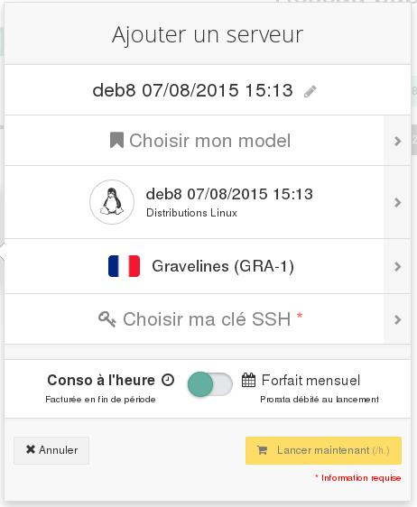

## 
W niektórych sytuacjach będziesz musiał przywrócić instancję za pomocą wykonanej wcześniej kopii zapasowej  (na przykład w przypadku nieprawidłowej operacji wykonanej w konfiguracji instancji). 
Lub być może będziesz chciał utworzyć nową instancję na podstawie kopii zapasowej, ponieważ będziesz chciał zduplikować instancję, aby rozdzielić ruch lub uzyskać wysoką dostępność.

Przewodnik ten wyjaśnia, jak używać kopii zapasowych do odtwarzania, duplikowania i przywracania instancji.

## Wstępne wymagania

- Dysponowanie kopią zapasową instancji Public Cloud
- Dysponowanie już utworzonym serwerem wirtualnym

## 

- Zaloguj się do panelu klienta Public Cloud OVH.
- Kliknij na Kopie zapasowe.

{.thumbnail}

- Kliknij na ikonkę "utwórz serwera na podstawie tej kopii zapasowej" z prawej strony w linii backupu do przywrócenia. 
- Pojawi się takie okno:

{.thumbnail}

- Możesz tutaj spersonalizować nazwę serwera VPS.
- Możesz wybrać model.

Uwaga

Aktualnie w panelu klienta można przywrócić kopię tylko w centrum danych, z którego pochodzi kopia zapasowa. Aby przenieść tę kopię zapasową do innego centrum danych, należy skorzystać z api OpenStack.

- Wybierz klucz SSH.
- Wybierz tryb płatności.
- Kliknij na Uruchom teraz.
- Serwer wirtualny będzie dostępny po kilku sekundach.

## 

- Zaloguj się do panelu klienta Public Cloud OVH.
- Rozwiń następujące menu i kliknij na Edytuj:

{.thumbnail}

- Pojawi się takie okno:

{.thumbnail}

- Spersonalizuj nazwę serwera, jeśli chcesz.
- Wybierz model (parametry takie same lub wyższe niż aktualna wirtualna maszyna).
- Kliknij na dystrybucje.
- Pojawią się kopie zapasowe:

{.thumbnail}

- Kliknij na Moje kopie zapasowe:

{.thumbnail}

- Wybierz kopię zapasową do przywrócenia.
- Wybierz tryb płatności.
- Kliknij na Zastosuj zmiany.
- Serwer wirtualny będzie dostępny po kilku sekundach.

Instancja nie będzie zawierać danych zapisanych po utworzeniu tej kopii zapasowej.

## 
[Przewodniki Cloud]({legacy}1785)

