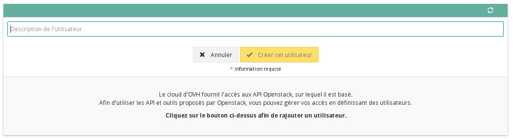
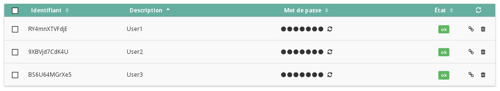

## 
Esta guía ofrece las indicaciones necesarias para crear un acceso a Horizon, el panel de administración oficial de OpenStack. Hay funcionalidades que solo están disponibles desde esta interfaz.

## 

- Conéctese al [área de cliente cloud](https://www.ovh.com/manager/cloud/) y haga clic en «Gestión y consumo del proyecto».

{.thumbnail}

- Haga clic en «OpenStack».

{.thumbnail}

- Haga clic en «Añadir un usuario».

{.thumbnail}

- Introduzca una descripción del usuario.

## Importante:
Esta descripción permitirá posteriormente reconocer fácilmente al usuario en la lista creada; no servirá como clave de conexión.

- Haga clic en «Crear el usuario».

{.thumbnail}

- El usuario se creará. Conserve la contraseña generada automáticamente, ya que no será posible recuperarla más adelante.

La lista de usuarios se mostrará como en la siguiente imagen:

{.thumbnail}
En ella podrá ver, para cada usuario, el nombre, la descripción y tres botones que permiten respectivamente:

- Regenerar la contraseña.

{.thumbnail}

## Atención:
Este botón no muestra la contraseña, sino que genera una nueva.

- Eliminar el usuario

{.thumbnail}

## 

- Haga clic en el icono que representa una llave inglesa

{.thumbnail}

- Seleccione la opción «Abrir OpenStack Horizon»

{.thumbnail}

- Se abrirá la página [https://horizon.cloud.ovh.net](https://horizon.cloud.ovh.net). 

- Introduzca el usuario y la contraseña OpenStack previamente creados.