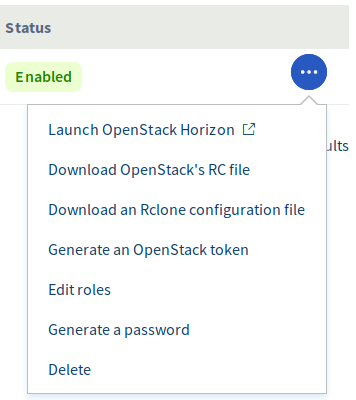
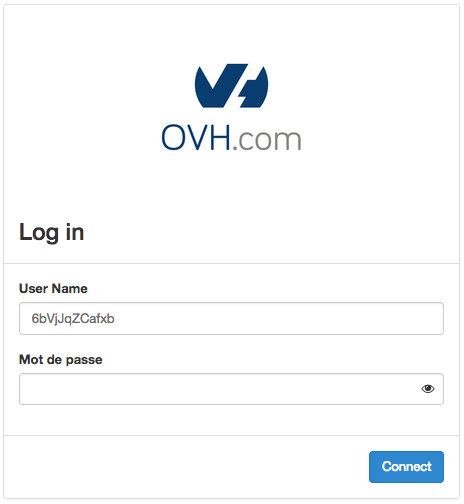

**Ostatnia aktualizacja dnia 2018-01-16**

## Wprowadzenie

Horizon jest implementacją interfejsu administracyjnego projektu OpenStack Dashboard. Niektóre funkcje zarządzania dostępne są tylko w tym interfejsie.

## Wymagania początkowe

- Utworzony projekt Public Cloud

## W praktyce

### Tworzenie użytkownika OpenStack Horizon

Aby uzyskać dostęp do panelu Horizon, należy utworzyć co najmniej jednego użytkownika. Jest to możliwe w sekcji OpenStack widocznej w lewym menu projektu Public Cloud.

{.thumbnail}

Kliknij na przycisk `Dodaj Użytkownika`{.action}, następnie zostanie wyświetlone pole, gdzie możemy dodać opis konta, np. imię lub nazwę nowego użytkownika OpenStack.
Gdy operacja zostanie zakończona, wyświetlony zostanie komunikat potwierdzający założenie konta.

W każdej chwili możemy utworzyć kolejnego użytkownika - przycisk pokazany na zrzucie ekranu - zaznaczenie nr 1.

Identyfikator (ID) oraz hasło są generowane automatycznie. Hasło będzie widoczne w panelu klienta do momentu odświeżenia witryny. Możesz je skopiować, aby użyć tego samego hasła przy kolejnym logowaniu. Można również wygenerować nowe hasło, klikając na strzałki tuż obok kropek maskujących dotychczasowe hasło > zaznaczenie nr 2.

Kliknij w ikonę menu `...`{.action}.

{.thumbnail}

###  Logowanie do OpenStack Horizon

Kliknij w ikonę menu `...`{.action}. Wybór opcji `Otwórz Openstack Horizon`{.action} otwiera okno logowania, gdzie konieczne jest podanie identyfikatora (ID) wpisując go w pole `User name` oraz aktualnego hasła.

{.thumbnail}

{.thumbnail}

Po zalogowaniu będzie widoczny interfejs OpenStack Horizon:

{.thumbnail}

## Sprawdź również

Przyłącz się do społeczności naszych użytkowników na stronie <https://community.ovh.com>.