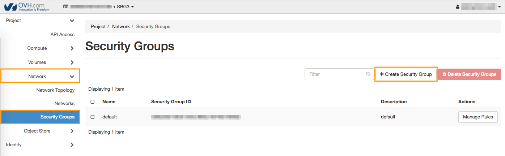

**Laatste update 07-03-2018**

## Introductie

Beveiligingsgroepen zijn groepen IP-adressen en poortfilterregels. Ze zijn van toepassing op alle instances die aan een project zijn gekoppeld en definiëren de netwerktoegang tot de instance. De groepsregels zijn specifiek voor een project. De leden kunnen de standaardregels voor hun groep bewerken en nieuwe regelgroepen toevoegen.

Alle projecten hebben een standaardbeveiligingsgroep voor elke regio. Wanneer een instance wordt gemaakt, wordt de standaardbeveiligingsgroep voor de regio automatisch toegepast. Bij OVH staan de standaardinstellingen van de beveiligingsgroep inkomend en uitgaand verkeer voor instances toe.

**In deze handleiding wordt uitgelegd hoe u beveiligingsgroepen aanmaakt en verwijdert via de Horizon-interface.**

## Vereisten

- U moet toegang hebben tot uw Horizon-interface. 

## Instructies

Log eerst in op de [Horizon](https://horizon.cloud.ovh.net/){.external}-interface. Kies in het menu bovenaan het scherm de regio waarin u een beveiligingsgroep wilt maken:

{.thumbnail}

De beveiligingsgroep is gemaakt in de door u geselecteerde regio. Als u een beveiligingsgroep in verschillende regio's wilt gebruiken, moet u deze in elke regio maken.

Klik op de knop `Network`{.action}, vervolgens op `Security Groups`{.action}:

{.thumbnail}

Klik op `+ Create Security Group`{.action} om een beveiligingsgroep te maken. Geef de groep een naam en geef deze een beschrijving (optioneel):

{.thumbnail}

Bevestig het vervolgens met de knop `Create Security Group`{.action}.

Als u een beveiligingsgroep wilt verwijderen, vinkt u het vakje ernaast aan en klikt u op `Delete Security Groups`{.action}.

## Verder

Ga in gesprek met andere communityleden op <https://community.ovh.com/en/>.