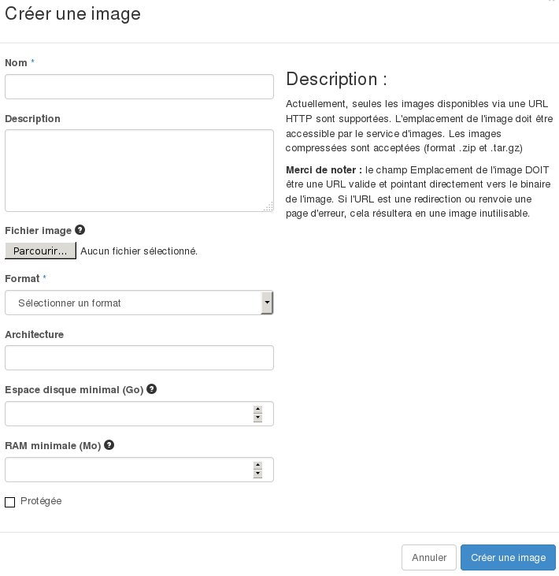
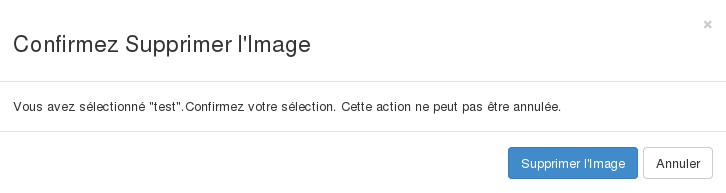

## 
Se vuoi aggiungere immagini personalizzate, puoi utilizzare l'interfaccia OpenStack Horizon.
In questo modo puoi, ad esempio, importare le immagini delle tue vecchie macchine virtuali nel Public Cloud, a condizione che il loro formato sia compatibile.

Questa guida ti mostra come creare, caricare ed eliminare immagini nell'interfaccia Horizon da cui gestisci i tuoi servizi Cloud OVH.

## Requisiti necessari

- [Crea un utente per accedere a Horizon]({legacy}1773)
- Accedi al menu Immagini dell'interfaccia OpenStack Horizon

{.thumbnail}

## 

- Se non hai ancora creato immagini, compare automaticamente la lista delle immagini pubbliche:

{.thumbnail}

- A questo punto puoi caricare un'immagine da un URL o crearne una personale cliccando su Crea un'immagine, che apre questo menu:

{.thumbnail}

## Ci sono vari campi da completare, alcuni obbligatori (*) e altri facoltativi:

- Nome dell'immagine (*)
- Descrizione dell'immagine
- File Immagine (invio dalla tua posta in locale)
- Formato dell'immagine (*):

|AKI|Amazon Kernel Image|
|AMI|Amazon Machine Image|
|ARI|Amazon Ramdisk Image|
|ISO|ISO 9660|
|QCOW2|Emulatore QEMU|
|RAW|
|VDI|
|VHD|
|VMDK|

- Architettura: x86_64
- Spazio disco minimo (in GB): se non specificato, il valore di default è 0.
- RAM minima (in MB): se non specificato, il valore di default è 0.

Puoi definire anche se l'immagine sarà pubblica e se la sua eliminazione sarà protetta.
Una volta confermati questi parametri, l'immagine va in lista d'attesa per la creazione:

{.thumbnail}
Clicca sul nome dell'immagine per visualizzarne i dettagli:

{.thumbnail}
Dalla colonna Azioni è possibile:

- caricare l'immagine selezionata per creare un'istanza, in questo caso si apre questo menu:

{.thumbnail}

- modificare i dettagli dell'immagine (solo per le immagini che hai creato)
- eliminare l'immagine (solo per le immagini che hai creato), in questo caso viene richiesta una conferma:

{.thumbnail}

## 
[Ritorna all'indice delle guide Cloud]({legacy}1785)

