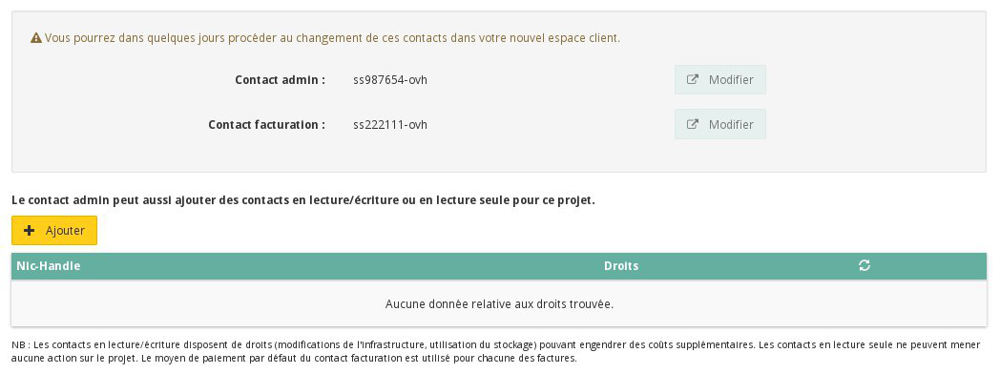
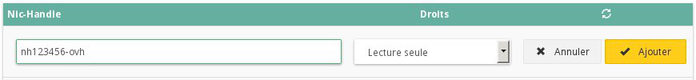

## Preambule
Il est possible que vous rencontriez la nécessité de donner l'accès à certains de vos projets à d'autres utilisateurs, sans pour autant donner la possibilité d'interagir sur l'ensemble de vos services et cela pour des raisons de sécurité. Dans cette situation, il est tout à fait possible de déléguer un ou plusieurs projets à d'autres comptes OVH, que cela soit en mode lecture, ou bien en mode lecture / écriture.

Ce guide vous explique comment effectuer cela.

### Prérequis
- 2 comptes OVH

## Deleguer son projet
- Se connecter à l'espace client Public Cloud OVH
- Cliquer sur "Gestion et conso. du projet"

{.thumbnail}

- Cliquer sur "Contacts et droits"

{.thumbnail}

Vous pouvez depuis ce nouveau menu :

- Configurer vos contacts propriétaire et facturation
- Déléguer vos projets à d'autres comptes OVH

{.thumbnail}

### Configuration de la delegation
- Cliquer sur le bouton "Ajouter"
- Entrer le Nic-Handle du compte a ajouter

{.thumbnail}

- Choisir le type de droits

|---|---|
|Lecture seule|Lecture / écriture|

Une fois validé, vous pouvez vérifier les différents comptes ajoutés avec leur type de droits

{.thumbnail}

### Acces au projet depuis un autre compte
Suite a la configuration de la délégation du projet, celui ci apparaitra sur le menu a gauche dans l'Espace Client OVH du compte configuré :

{.thumbnail}