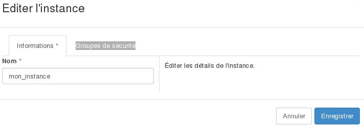

## 
Se deseja configurar os grupos de segurança da sua instância, quer seja para remover ou adicionar, poderá efetuá-lo a partir do manager OpenStack Horizon ao editar a sua instânica.
Esta funcionalidade permite-lhe igualmente modificar a sua instância.

Este guia explica-lhe o procedimento a ter em conta para efetuar estas alterações.

## Pré-requisitos

- [Criar um acesso ao Horizon]({legacy}1773)
- Uma instância

## 
Para editar uma instância, é necessário:

- Ligar-se à interface Horizon
- Clicar em "Instâncias" no menu da esquerda.
- Selecionar "Editar a instância" na lista "dropdown" correspondente à instância.

{.thumbnail}

## Separador "informação"
Esta secção permite modificar o nome da instância

Nome: Indicar o nome desejado para a instância.

{.thumbnail}

## Grupos de segurança
Esta secção permite modificar o grupo de segurança a aplicar à instância

Selecionar ou desselecionar o grupo de segurança para a instância.

{.thumbnail}

- Para concluir, clique em "Gravar"

## 
[Voltar à lista dos guias Cloud]({legacy}1785)

