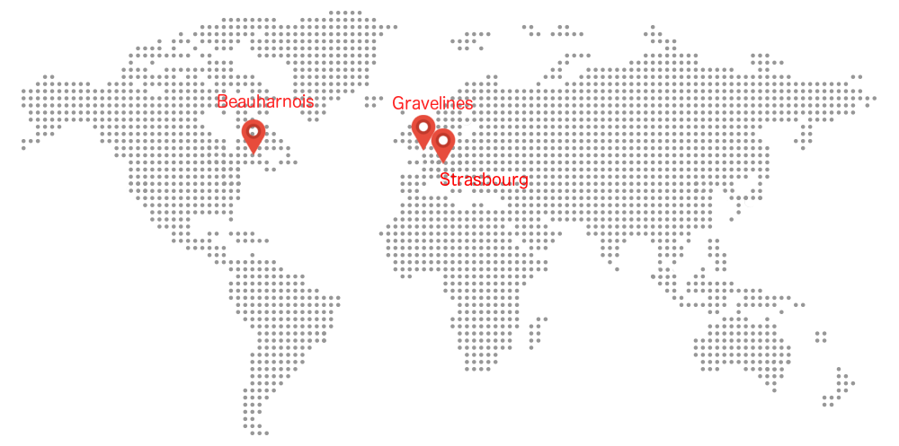

## SBG1, GRA1, BHS1
SBG1, GRA1, and BHS1 are the three historic regions, they offer the same features. The only difference between these three regions is the geographical location.

|Region name|Location|
|---|---|
|SBG1|Strasbourg, FR|
|GRA1|Gravelines, FR|
|BHS1|Beauharnois, CA|

{.thumbnail}

## SBG3, GRA3, BHS3
The introduction of the new 2017 range goes hand in hand with the arrival of new regions: SBG3, GRA3, BHS3.

There is no difference between previous regions (SBG1, GRA1, and BHS1) and new ones. All the regions can be used in the same way.

> [!primary]
>
> You can connect projects deployed in different regions
> by associating them within a single vRack. It will thus be possible
> to create the same private network (same VLAN ID), and projects can
> be connected through a private and secure network.
> 