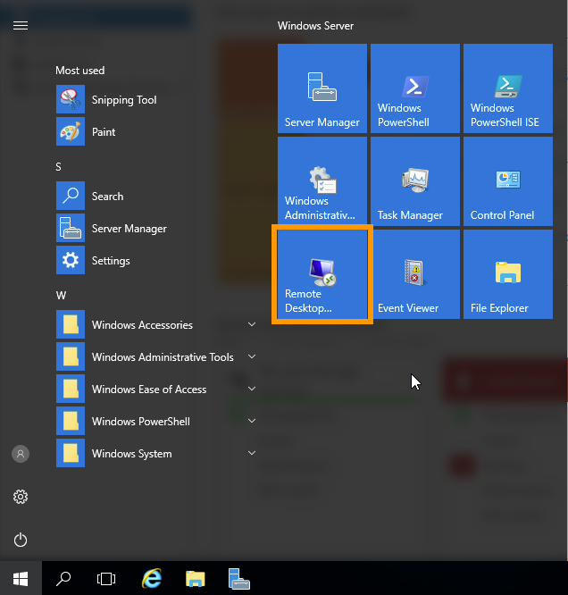

**Última actualización: 11/06/2018**

## Objetivo

Para conectarse a una instancia de Public Cloud, el procedimiento es similar a una conexión convencional a un servidor (VPS, servidor dedicado...), pero en este caso tiene un usuario específico.

**Esta guía explica cómo conectarse a una instancia de Public Cloud Linux o Windows.**


## Requisitos

- Estar conectado al [área de cliente de OVH](https://www.ovh.com/auth/?action=gotomanager){.external}.
- Haber creado una [instancia de Public Cloud](https://www.ovh.es/public-cloud/instancias/){.external}.


## Procedimiento

### Conectarse a una instancia Linux desde un entorno Linux o Mac

Utilice el siguiente comando para conectarse por SSH a su instancia de Public Cloud:

```sh
ssh *usuario*@IP_instancia
```

En Public Cloud, el usuario dependerá de la distribución que utilice. A continuación se ofrece una lista (no exhaustiva) de los usuarios según la distribución:

|Distribución|Usuario|
|---|---|
|Archlinux|arch|
|Centos 6|centos|
|Centos 7|centos|
|CoreOS|core|
|Debian 7|debian|
|Debian 8|debian|
|Debian 9|debian|
|Fedora 25|fedora|
|Fedora 26|fedora|
|FreeBSD 11.0 ZFS|freeBSD|
|Ubuntu 14.04|ubuntu|
|Ubuntu 16.04|ubuntu|
|Ubuntu 16.10|ubuntu|
|Ubuntu 17.04|ubuntu|

> [!primary]
>
> Si se conecta directamente, tendrá los permisos del usuario correspondiente. Si quiere disponer de privilegios de **superusuario**, utilice el comando `sudo`.
>


#### Advertencia sobre la huella del servidor SSH remoto

La primera vez que se conecte, deberá confirmar la autenticidad del host tecleando **yes**.

```sh
The authenticity of host 217.xxx.xxx.98 (217.xxx.xx.98) cant be established.
ECDSA key fingerprint is f4:95:09:ce:b6:63:73:ea:54:db:76:5e:64:f1:5e:6d.
Are you sure you want to continue connecting (yes/no)?`
```


### Conectarse a una instancia Linux desde un entorno Windows

Para conectarse a una instancia Linux desde Windows, puede usar un programa como [PuTTY](https://www.putty.org/){.external} o, en las últimas versiones de Windows 10, utilizar las [funciones nativas](https://docs.microsoft.com/es-es/windows/wsl/about){.external}. A continuación, siga los pasos arriba descritos para Linux.


### Conectarse a una instancia Windows

#### Finalizar la instalación

Una vez creada la instancia, deberá finalizar el **Sysprep** (preparación del sistema). Para ello, abra la consola VNC desde el [área de cliente de OVH](https://www.ovh.com/auth/?action=gotomanager){.external} como se muestra en la imagen:


En primer lugar podrá elegir su país, el idioma de la aplicación y el idioma del teclado. Haga clic en `Next`{.action}:


A continuación, asigne una contraseña al usuario **administrator**:


Haga clic en `Finish`{.action} para terminar. La instancia se reiniciará. 

Ya podrá conectarse al servidor Windows.


#### Conectarse a Windows

Para conectarse a su instancia Windows, utilice directamente el **Escritorio remoto** de su equipo Windows.



A continuación solo tendrá que indicar la IP de su instancia (en la primera etapa de la conexión a través del escritorio remoto) e introducir el nombre de usuario (**administrator**) y la contraseña que haya establecido.


Aparecerá un mensaje solicitándole que confirme la conexión. Haga clic en `Sí`{.action}:


Ya se habrá conectado a la instancia.

> [!primary]
>
> Si tiene problemas para conectarse a su instancia Windows, compruebe que el firewall de Windows autorice la conexión RDP. Para más información, consulte [esta guía](https://docs.ovh.com/es/vps/windows-first-config/){.external}.
>


## Más información

IntInteractúe con nuestra comunidad de usuarios en [ovh.es/community](https://www.ovh.es/community/){.external}.