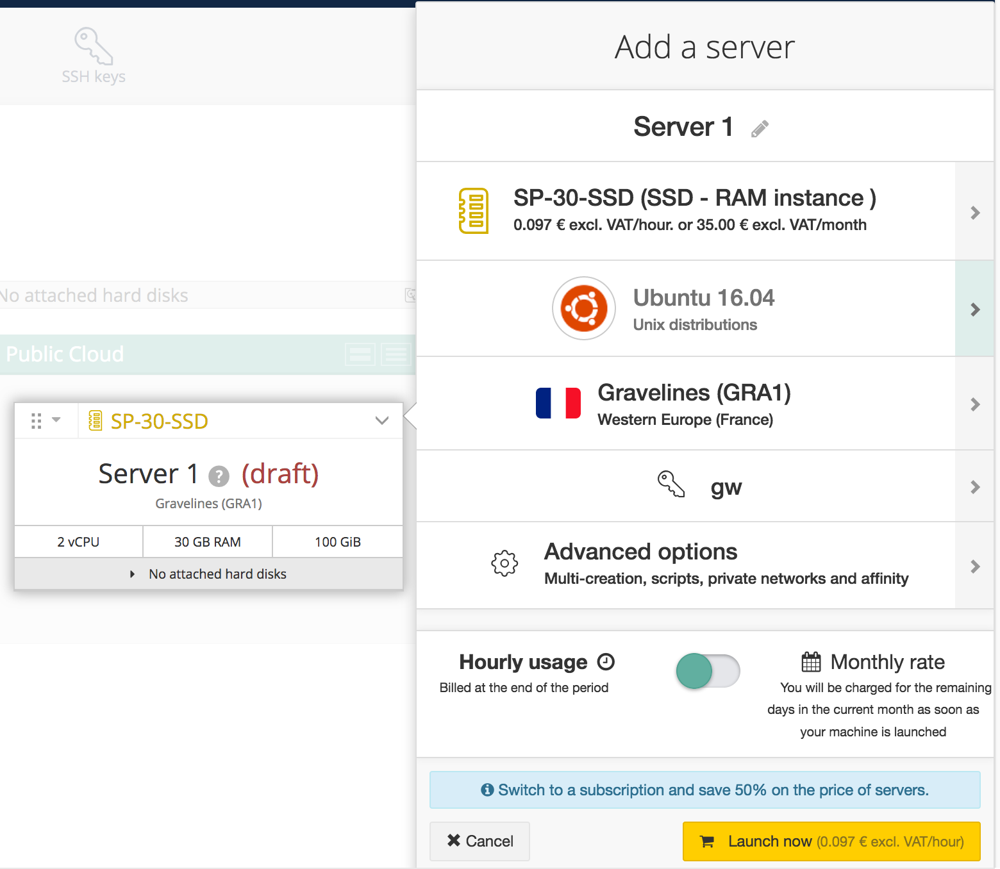
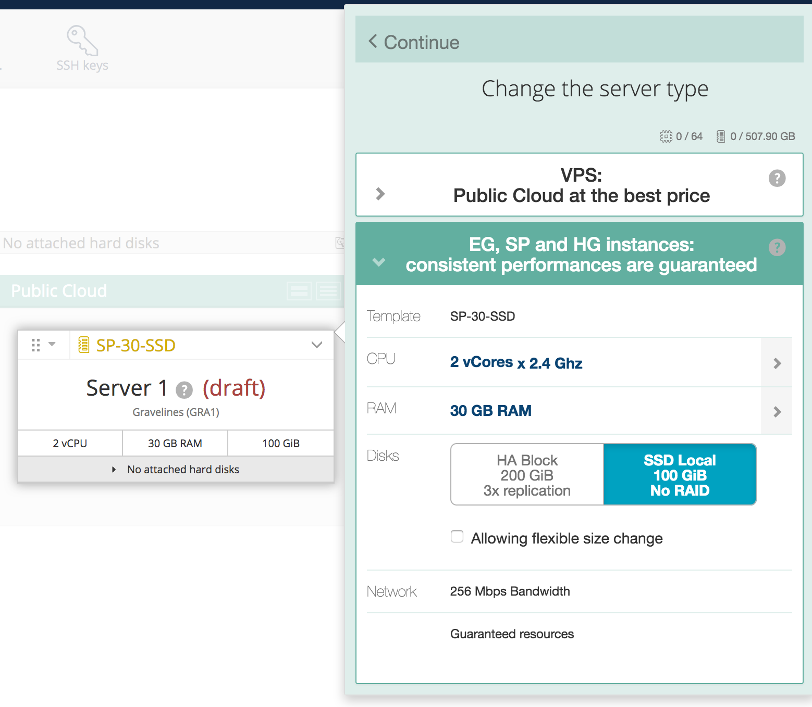
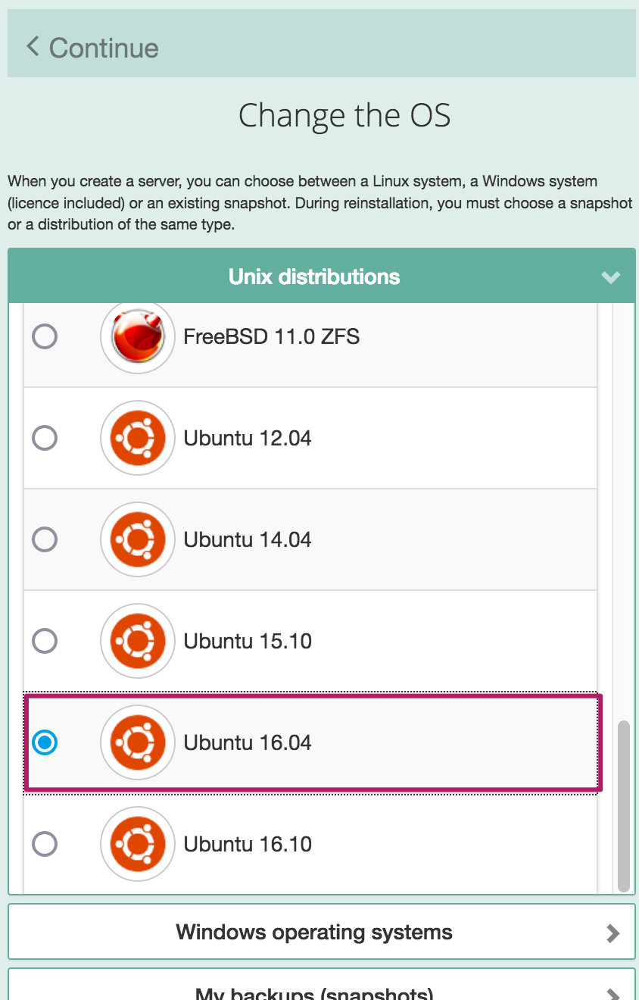
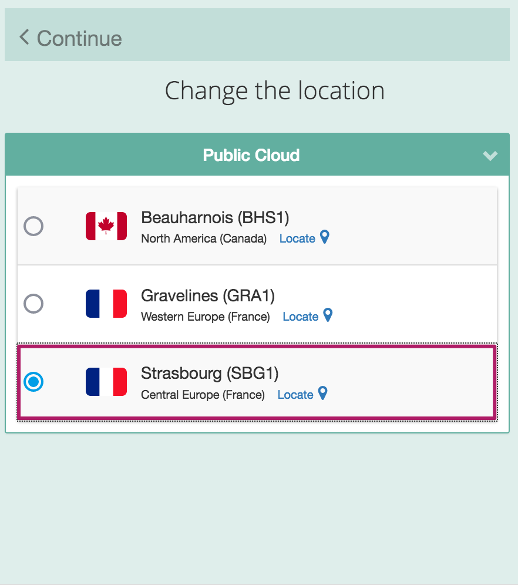
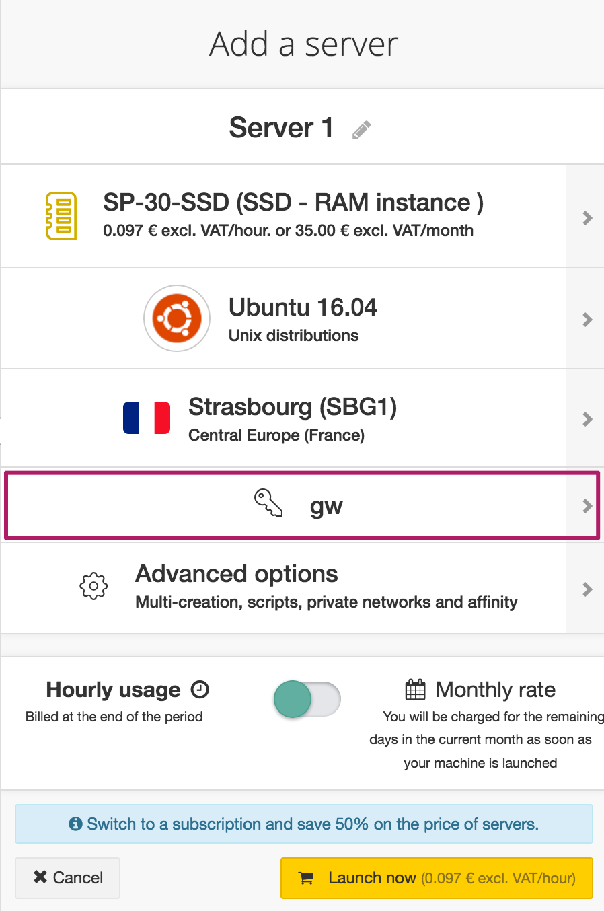
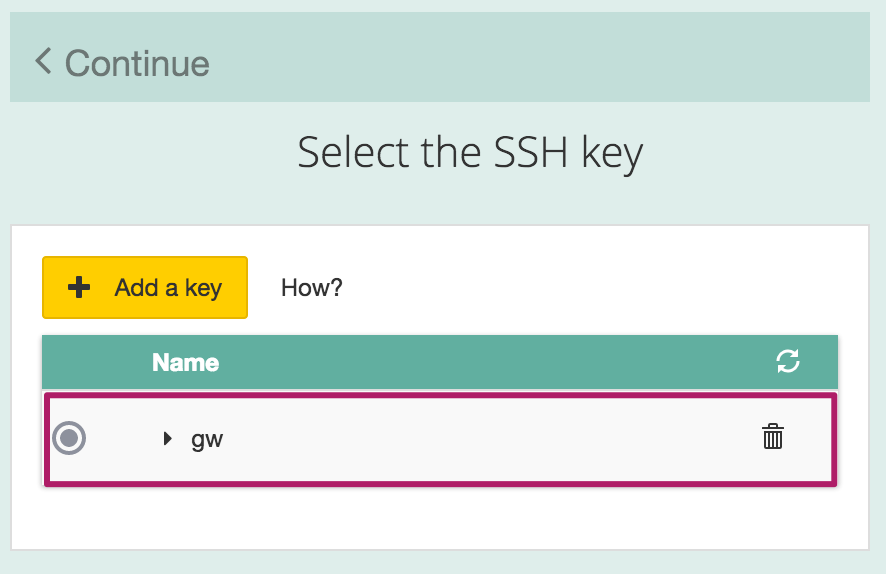
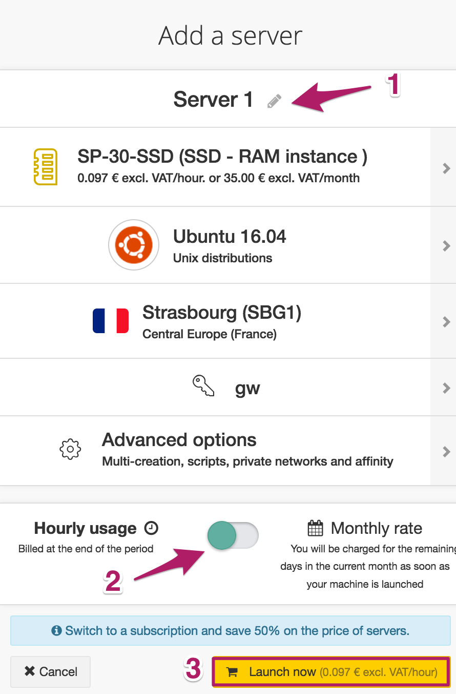

## Preamble
Public Cloud allows you to easily and quickly create virtual servers (instances) at any time in just a few clicks. This guide will walk you through the creation of an instance.

### Prerequisites

- Log in to the OVH Customer [Control Panel](https://www.ovh.com/manager/cloud/){.external}
- [Create and configure a SSH key](https://docs.ovh.com/au/en/public-cloud/create-ssh-keys/){.external} in your OVH Public Cloud control panel

## Creating the instance

### Adding the server
Click the button `Add`{.action} in the top left corner

{.thumbnail}

Choose `Add a server`{.action}

{.thumbnail}

### Choosing the features of the server
Click the model to display a new menu.

Select for instance the SP-30-SSD model.

{.thumbnail}

You can then choose the instance type:

- The **VPS-SSD** range provides instances at a reduced price for limited requirements
- The **HG** range is based on CPU performance and provides instances with many high-frequency cores
- The **SP** range is based on RAM performance-and provides instances with optimized memory
- The **EG** range provides a balance of CPU/RAM, a good choice for general-purpose usage

### Choosing the operating system
Click on the distribution to display a new menu which will allow you to choose from a variety of the most popular operating systems such as Linux and Windows based systems provided by OVH, or even your own pre-saved snapshots.

For example: Select Ubuntu 16.04

{.thumbnail}

### Choosing the region for the datacenter
Click the model to display a new menu.

Select Strasbourg for instance.

{.thumbnail}

> [!primary]
>
> OVH adds regions to its cloud offer on a regular basis.
> 

### Selecting the SSH key to be used
Click the menu entry whose icon depicts a key.

{.thumbnail}

Then select the key of your choice.

{.thumbnail}

> [!success]
>
> When creating a Windows instance, the configuration of an SSH key
> is not required.
> 

### Naming and starting the instance
(1) Name the instance by clicking on the pencil icon. (2) Choose between hourly or monthly billing.

{.thumbnail}

> [!alert]
>
> When creating an instance with monthly billing, you
> agree to pay for the service until the end of the current month. Be careful,
> this is an automatic renewal at the beginning of the next month.
> 

Then (3) Click `Launch now`{.action}

The new instance will be available in minutes (the time required for transferring the system image and starting the operating system). This process usually takes less than 2 minutes.