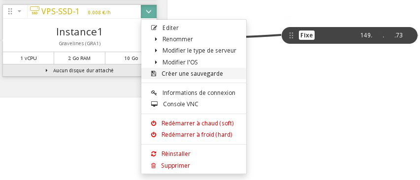

## Preambule
La partie " **Cloud**" de l'espace client OVH a été conçue afin de vous permettre de gérer vos instances de manière simple et rapide.

Vous y trouverez l'ensemble de vos projets séparés en 2 parties :

- Infrastructure, comprenant l'ensemble de vos instances, sauvegardes, disques, clés SSH, etc...
- Stockage, comprenant la liste de vos conteneurs

Ce guide se spécialisera dans la gestion de vos instances, et vous expliquera notamment comment éditer, redémarrer ou encore supprimer celles ci.

### Prérequis
- [Créer une clé SSH](../guide.fr-fr.md){.ref}
- [Créer une instance dans l'espace client OVH](../guide.fr-fr.md){.ref}

## Premier pas
Voici le visuel du menu que vous pouvez obtenir pour votre instance :

{.thumbnail}

Vous trouverez donc les informations suivantes :

- Le modèle et le cout de votre instance
- Son nom et sa région
- Les ressources disponibles
- Les éventuels disques additionnels attachés
- L'adresse IP de votre instance à droite

### Edition de l'instance
En cliquant sur le choix " **Éditer**" du menu précédent, une nouvelle fenêtre apparaitra :

{.thumbnail}

Vous pourrez depuis ce menu :

- Renommer votre instance
- Changer le modèle de votre instance
- Réinstaller votre instance sur un autre système d'exploitation

> [!alert]
>
> Vos données seront supprimées lors de la réinstallation.
> 

- Passer de la facturation à l'heure, vers le forfait mensuel

> [!alert]
>
> Une nouvelle facture sera donc générée au prorata temporis selon le jour du
> mois en cours.
> 

### Création de sauvegarde
Il est possible de créer une sauvegarde de votre instance depuis le même menu. Pour plus de renseignement, vous pouvez utiliser le guide suivant :

- [Sauvegarder une instance]({legacy}1881){.ref}

### Informations de connexion
Ce choix vous permet de faire apparaitre une fenêtre avec la commande ssh à utiliser pour vous connecter sur votre instance.

{.thumbnail}

### Console VNC
Il est en effet possible d'accéder à la console VNC de votre instance.

Cela vous permettra d'avoir un accès direct à votre instance. Il faudra cependant avoir configuré un mot de passe sur l'utilisateur " **root**" de votre instance dans un premier temps.

Il est possible de vous aider du guide suivant pour effectuer cela :

- [Accéder à la console d'une instance dans Horizon]({legacy}1782){.ref}

### Redemarrage de l'instance
Votre instance peut aussi être redémarrer depuis ce même menu, et de 2 manières différentes :

- Redémarrage à chaud (Logiciel)
- Redémarrage à froid (Matériel)

### Reinstallation de l'instance
Il est possible de réinstaller votre instance avec le même système d'exploitation.

> [!alert]
>
> Vos données seront supprimées lors de la réinstallation.
> 

### Suppression de l'instance
Le dernier choix proposé sera la suppression de votre instance. Cela permet de ne plus être facturé de votre instance en cas de facturation à l'heure.

> [!alert]
>
> Votre instance et les données présentes ne seront alors plus récupérable.
> 