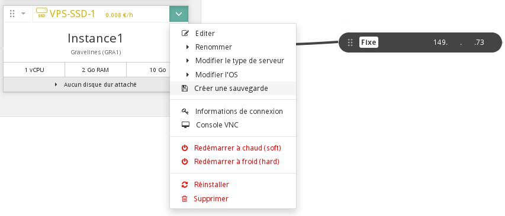

## 
Sekcja "Cloud" w panelu klienta OVH pozwala na proste i szybkie zarządzanie instancjami. 

Znajdziesz tu wszystkie swoje projekty podzielone na 2 części:

- Infrastruktura, zwierająca wszystkie instancje, kopie zapasowe, dyski, klucze SSH, itp.
- Przestrzeń dyskowa, zawierająca listę kontenerów.

Przewodnik ten pokazuje, jak zarządzać instancjami i wyjaśnia, jak je edytować, restartować i usuwać.

## Wymagania

- [Utworzenie kluczy SSH]({legacy}1769)
- [Utworzenie instancji w panelu klienta OVH]({legacy}1775)

## 
Tak wygląda menu dla danej instancji:

{.thumbnail}
Znajdują się tu następujące informacje:

- Model i koszt instancji
- Jej nazwa i region
- Dostępne zasoby
- Ewentualne dodatkowe dyski przypisane do instancji
- Adres IP instancji

## Edycja instancji
Po kliknięciu na  "Edytuj" w poprzednim menu, pojawi się nowe okno:

{.thumbnail}
W tym menu możesz:

- Zmienić nazwę instancji
- Zmienić model instancji
- Przeinstalować instancję korzystając z innego systemu operacyjnego

## Uwaga
Podczas reinstalacji dane są usuwane.

- Przejść z abonamentu godzinowego na abonament miesięczny

## Uwaga
Zostanie wygenerowana nowa faktura z proporcjonalną opłatą w zależności od dnia bieżącego miesiąca.

## Tworzenie kopii zapasowej
W tym menu możesz utworzyć kopię zapasową instancji. Więcej informacji znajdziesz w tym przewodniku: 

- [Kopia zapasowa instancji]({legacy}1881)

## Informacje na temat połączenia
Po wybraniu tej opcji wyświetli się okno z poleceniem ssh, za pomocą którego można się zalogować na instancję.

{.thumbnail}

## Konsola VNC
Można uzyskać dostęp do konsoli VNC instancji.

Dzięki temu będziesz mieć bezpośredni dostęp do instancji. Najpierw trzeba będzie skonfigurować hasło dla użytkownika "root". 

Udostępniamy przewodnik na ten temat:

- [Dostęp do konsoli instancji w interfejsie Horizon]({legacy}1782)

## Restart instancji
W tym menu możesz wykonać restart instancji. Dostępne są 2 sposoby:

- Restart programowy
- Restart sprzętowy

## Reinstalacja instancji
Można wykonać reinstalację instancji na ten sam system operacyjny.

## Uwaga
Podczas reinstalacji dane są usuwane.

## Usuwanie instancji
Ostatnia proponowana opcja to usunięcie instancji. Pozwala to na zakończenie fakturowania, jeśli instancja jest fakturowana w trybie godzinowym.

## Uwaga
Po usunięciu nie będzie można odzyskać instancji i danych.

## 

- [Rozpoczęcie pracy z instancją Windows]({legacy}1995)
- [Dostęp root i zdefiniowanie hasła]({legacy}1786)

## 
[Przewodniki Cloud]({legacy}1785)

