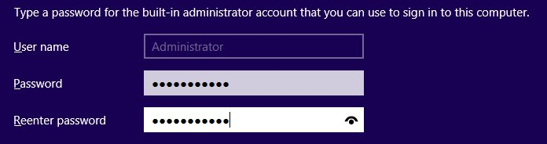

## 
Możesz korzystać z usługi Public Cloud do instalowania stron www przy użyciu IIS lub aplikacji kompatybilnych tylko z systemem Windows. Jedynie w przypadku instancji EG i SP można zainstalować system Windows Server 2012 r2 (z powodu dodatkowego kosztu za licencję).

Pierwsze kroki z instancją Windows różnią się od rozpoczęcia pracy z instancją z systemem Linux. Nie ma na przykład konfiguracji klucza SSH. Należy skorzystać z konsoli VNC, aby skonfigurować hasło dla konta administratora. 

W przewodniku tym wyjaśniamy, jak rozpocząć pracę z instancją Windows.


## Wymagania

- [Utworzenie instancji w panelu klienta OVH]({legacy}1775) z systemem Windows Server 2012.


## Konfiguracja hasła
Biorąc pod uwagę, że na instancji Windows nie można skonfigurować klucza SSH, najpierw należy skonfigurować hasło.

W tym celu należy skorzystać z konsoli VNC:


- Uruchom konsolę VNC danej instancji w panelu OVH.


{.thumbnail}

- Wpisz hasło dla konta administrator.


{.thumbnail}

## Uwaga!
Przed zaakceptowaniem hasła, sprawdź jego poprawność.


## Dostęp do zdalnego pulpitu
Po skonfigurowaniu hasła będziesz mógł się zalogować na instancję w trybie zdalnego pulpitu:

Na przykład z komputera z systemem Linux:


```
user@poste :~$ rdesktop 149.202.160.94 -k fr -u administrator

-------
Legenda argumentów:
-k: Typ klawiatury
-u: Użytkownik
```


Lub z poziomu komputera Windows.

{.thumbnail}


## Dostęp do Internetu
Domyślnie dla przeglądarki Internet Explorer włączona jest zwiększona ochrona. Podczas korzystania z przeglądarki może pojawiać się komunikat z ostrzeżeniem:

{.thumbnail}
Poza tym nie można pobierać danych. 

Aby korzystać z tej funkcji, należy wyłączyć zwiększoną ochronę. 


- Przejdź do pulpitu Windows do części "Local Server".


{.thumbnail}

- Kliknij na "IE Enhanced Security Configuration" i wyłącz zwiększoną ochronę.


{.thumbnail}
Teraz będziesz mógł dowolnie korzystać z przeglądarki i pobierać pliki.

{.thumbnail}


## 
[Przewodniki Cloud]({legacy}1785)

