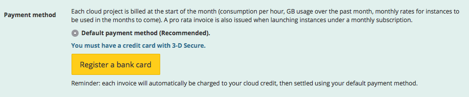

## Preambule
L'offre Public Cloud fournit un service de ressources informatiques hébergées (serveurs, stockage, réseaux, options, ...), elles sont accessibles à la demande de manière quasi-instantanée ce qui en fait un service offrant une grande adaptabilité et une grande facilité d'utilisation.

Le principe de facturation diffère du schéma classique de la location avec un engagement annuel. Il se rapproche plutôt de ce que font certains opérateurs téléphoniques qui facturent en fin de mois les minutes de communication consommées. C'est le principe du  **paiement à l'usage**  (Pay as you Go en Anglais). Ici, en fin de mois, vous serez facturé des heures de fonctionnement des serveurs ou de la quantité d'espace de stockage utilisée.

Ce fonctionnement permet de gagner en souplesse et d'apporter une réponse au plus proche des besoins utilisateur. Vous pouvez ajouter ou supprimer des ressources quand vous le souhaitez sans avoir à anticiper des montées en charge ou à payer des ressources dormantes.

Vous pourrez naturellement suivre votre facture en un coup d'œil depuis votre Espace Client. Une estimation de votre consommation en fin de moi est également disponible.

Ce document va vous accompagner dans les premières étapes de prise en main du service en créant un projet cloud.

### Prérequis
- Un moyen de payement et/ou un code de bon de paiement

## Étape 1 &#58; Ouvrir un compte OVH
Si vous n'avez pas encore d'identifiant OVH, il suffit de vous rendre sur la page de [création](https://www.ovh.com/fr/support/new_nic.xml){.external}. Vous arriverez sur un formulaire qu'il faudra remplir avec une adresse e-mail valide.

> [!success]
>
> Nous vous invitons à renseigner une adresse e-mail de secours.
> 

Dès que vous aurez fini de remplir le formulaire, vous recevrez un e-mail qui confirmera la création du compte.

## Étape 2 &#58; Se connecter a l'Espace Client
A l'aide de votre identifiant, connectez-vous à votre [Espace Client](https://www.ovh.com/manager){.external}.

OVH propose un vaste catalogue de produits, tous administrables via un unique Espace Client. Rendez-vous dans l'univers CLOUD en haut à gauche.

{.thumbnail}

Dans cet univers, nous allons créer un projet Public Cloud.

## Étape 3 &#58; Créer son premier projet Public Cloud
Pour créer un projet Public Cloud, cliquez sur `Commander`{.action} en haut à gauche, puis sélectionner `Projet cloud`{.action}.

Si vous n'avez jamais accepté les conditions particulières de Public Cloud, celles-ci seront affichées comme ci-dessous :

{.thumbnail}

Vous devez les lire et les accepter en cochant la case.

Renseignez également un nom de projet. Vous pourrez le modifier ensuite si besoin.

### Moyen de paiement
Comme expliqué plus haut, le service est facturé à l'usage. L'achat d'instances, de stockage, ... sera réalisé  **une fois le projet créé**.

Cependant afin de débuter, et ce uniquement pour votre premier projet, OVH requiert de choisir l'une de ces 3 méthodes :

- Méthode 1 : renseigner un moyen de paiement
C'est la méthode la plus simple. Vous enregistrez un moyen de paiement, et serez automatiquement débité en début de mois. Aucun risque d'oublier un renouvellement !
Les moyens de paiement disponibles peuvent varier en fonction de votre pays : carte bancaire compatible 3D Secure, compte bancaire, PayPal.
Un premier paiement équivalent à 10 euros vous sera demandé pour valider le bon fonctionnement de votre carte.

> [!alert]
>
> Note : s'il s'agit de votre premier achat chez OVH, seule la carte
> bancaire 3-D Secure sera proposée.
> 

{.thumbnail}

- Méthode 2 : acheter du crédit cloud
Si vous ne disposez pas de moyen de paiement, vous pouvez ajouter du crédit cloud. Le paiement initial est de 30 euros.
Ce crédit cloud sera rattaché à votre projet, et permettra de consommer des instances, stockage, options...
Le crédit cloud n'est pas transférable, ni remboursable. Il n'a aucune valeur monétaire et tout crédit non utilisé dans les 13 mois sera perdu.

{.thumbnail}

- Méthode 3 : activer un bon de paiement
Si vous disposez d'un code de bon de paiement (voucher), vous pouvez l'ajouter durant cette étape. La durée d'utilisation de votre Voucher et son montant peuvent varier.

{.thumbnail}

## Étape 4 &#58; Projet cree ? let's play !
Une fois votre projet créé, il sera disponible dans votre menu de gauche.

### Ajouter une instance ou du stockage
Via le bouton  `+Ajouter`{.action} , vous pouvez par exemple démarrer une instance cloud en quelques secondes.

Nous avons réalisé un  guide ([Créer une instance dans l'espace client OVH](../guide.fr-fr.md){.ref}) si nécessaire.

{.thumbnail}

### Gerer sa consommation
En cliquant sur le menu `Gestion du projet`{.action} , vous pourrez gérer vos moyens de paiement, vouchers, droits utilisateurs, et [analyser votre facturation](../guide.fr-fr.md){.ref}.

{.thumbnail}

Exemple d'estimation de facturation :

{.thumbnail}

Exemple de voucher :

{.thumbnail}