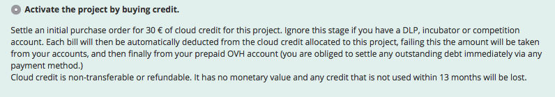
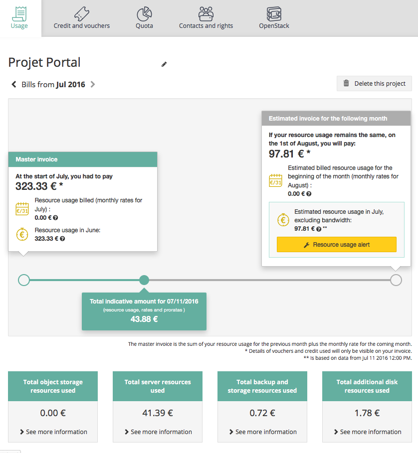

## 
Il servizio Public Cloud OVH è basato sul principio del pagamento a consumo (Pay as you Go), che garantisce una maggiore flessibilità.
Puoi aggiungere o eliminare risorse (istanze, storage, opzioni...) in base alle tue necessità, ricevere le tue fatture ogni mese e visualizzare la fatturazione stimata sui tuoi consumi direttamente dal tuo Spazio Cliente OVH.
  

## 
Se non hai ancora un identificativo OVH, accedi alla pagina di [creazione](https://www.ovh.it/supporto/new_nic.xml).
Completa il form, assicurandoti di inserire un indirizzo email valido.

## OVH consiglia:
Inserisci un indirizzo email esterno al tuo dominio e un altro di recupero.
Una volta completato il form, ricevi un'email di conferma della creazione del tuo account. Conserva il tuo identificativo cliente (NIC-handle) e la password associata, ti serviranno per effettuare l'accesso.
Se hai già un identificativo OVH ma non ricordi la password, consulta [questa guida]({legacy}2123).
  

## 
Inserisci le tue credenziali e accedi al tuo [Spazio Cliente OVH](https://www.ovh.com/manager).
OVH ti offre una vasta gamma di prodotti, che puoi gestire facilmente dal tuo Spazio Cliente OVH.

- Clicca sull'universo CLOUD in alto a sinistra.

{.thumbnail}
In questa sezione puoi creare il tuo progetto Public Cloud.
  

## 
Per acquistare i prodotti Public Cloud OVH, è necessario creare un progetto.
Se non le hai ancora accettate, visualizzi le condizioni particolari di utilizzo del servizio:

{.thumbnail}
Per continuare, leggi e poi accetta le condizioni contrattuali selezionando la casella corrispondente.
Assegna un nome al tuo progetto, sarà possibile modificarlo in un secondo momento.

## Modalità di pagamento
Il servizio Public Cloud viene fatturato a consumo. Una volta creato il progetto è possibile acquistare istanze e spazio di storage.
La prima volta che crei un progetto OVH ti chiede di scegliere uno di queste 3 modalità di pagamento:

- Metodo 1: registra una modalità di pagamento

È il metodo più semplice: registrando una modalità di pagamento, all'inizio di ogni mese le tue fatture vengono addebitate automaticamente.
Le modalità accettate variano in base al Paese. In Italia è possibile utilizzare una carta bancaria compatibile con il servizio 3D Secure o Paypal.
Attenzione: se stai effettuando il tuo primo acquisto in OVH, l'unica opzione proposta sarà la carta bancaria 3-D Secure.

{.thumbnail}

- Metodo 2: acquista credito Cloud

Se non vuoi registrare una modalità di pagamento, puoi aggiungere credito Cloud al tuo progetto. In questo caso, è necessario saldare una fattura iniziale di 30 euro.
Il tuo credito sarà associato al tuo progetto e potrai utilizzarlo per acquistare istanze, spazio di storage e opzioni.
Il credito Cloud non è trasferibile né rimborsabile e non ha valore monetario. Il credito non utilizzato entro 13 mesi verrà perso.

{.thumbnail}

- Metodo 3: attiva un Voucher

Se hai a disposizione un codice promozionale (Voucher), puoi utilizzarlo per creare il tuo progetto. La sua durata e il suo importo possono variare.

{.thumbnail}
  

## 
Una volta creato, il tuo progetto è disponibile nel menu a sinistra.

## Aggiungi un'istanza o spazio di storage
Cliccando sul pulsante Aggiungi puoi effettuare diverse operazioni, ad esempio avviare un'istanza o aggiungere server e dischi.
Per maggiori informazioni, consulta la guida .

{.thumbnail}

## Gestisci i consumi del tuo progetto
Clicca su Gestione e consumo del progetto per gestire le modalità di pagamento, i voucher, i permessi assegnati agli utenti e analizzare la tua fatturazione.
In caso di necessità, consulta la guida .

{.thumbnail}
Esempio di stima della fatturazione

{.thumbnail}
Esempio di voucher

{.thumbnail}

## 
[Ritorna all'indice delle guide Cloud]({legacy}1785)

