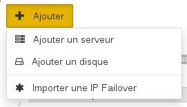
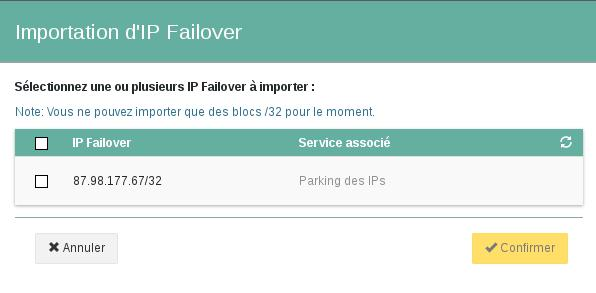
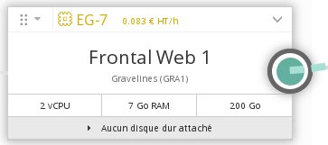
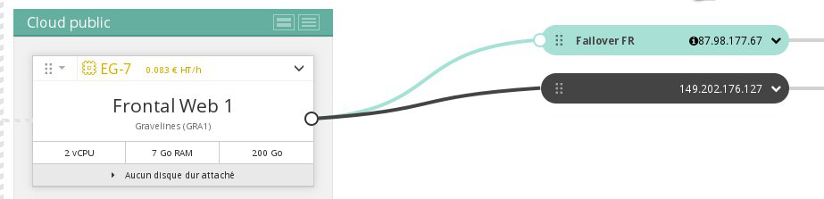

## 
Es posible que necesite configurar una dirección IP Failover en sus instancias por diversos motivos:

- tiene varios sitios web en su instancia; 
- aloja proyectos internacionales; 
- quiere migrar su actividad de un servidor dedicado a una instancia de Public Cloud. 

Esta guía explica cómo importar en un proyecto de Public Cloud una dirección IP Failover asociada a otro servicio de OVH.

## Requisitos
Para seguir todos los pasos descritos en esta guía, es necesario tener una IP Failover vinculada a un servidor dedicado o aparcada. 

En la sección «Dedicado» del área de cliente puede ver si tiene alguna IP Failover disponible.

{.thumbnail}

## Hacia Public Cloud
Acceda al [área de cliente Cloud](https://www.ovh.com/manager/cloud/). 

Haga clic en «Añadir» > «Importar IP Failover de OVH».

{.thumbnail}
Se abrirá la ventana de la imagen.

{.thumbnail}
Seleccione la IP que quiera importar y haga clic en «Confirmar». 

La IP tardará unos segundos en importarse.

{.thumbnail}
Cuando haya finalizado la importación, podrá verla en el área de cliente Cloud.

{.thumbnail}
Para elegir a qué servidor virtual quiere asignar la IP, haga clic en la flecha y seleccione «Cambiar el servidor asociado».

{.thumbnail}
Marque el servidor correspondiente.

{.thumbnail}
Confirme haciendo clic en «Asociar».

{.thumbnail}

## Hacia un servidor dedicado
Es posible volver a migrar la IP Failover hacia un servidor dedicado. 

Para ello, en la sección «Dedicado» del área de cliente, haga clic en el menú «IP» de la columna izquierda. 

A continuación, haga clic en el icono con forma de engranaje situado al final de la fila correspondiente a la dirección IP Failover.

{.thumbnail}
Haga clic en «Mover la IP Failover», seleccione el servicio de destino y haga clic en «Siguiente».

## 
 

