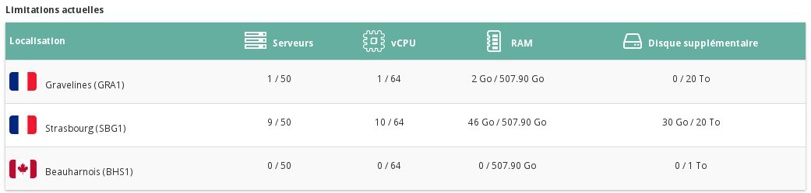
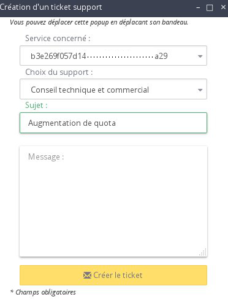

## Preambule
Pour des raisons de sécurité, un quota est mis en place concernant la possibilité de créer des instances et volumes additionnels. Cette limite n'est évidemment pas figée, et vous pouvez à tout moment faire une demande auprès du support Public Cloud afin que celle ci soit augmentée. Ce guide vous explique comment effectuer cela.

### Prérequis
- [Ajouter un moyen de paiement]({legacy}1984){.ref}

## Augmentation de quota
- Se connecter à l'espace client Public Cloud OVH
- Cliquer sur "Gestion et conso. du projet" en haut à droite :

{.thumbnail}

- Cliquer sur "Quota" :

{.thumbnail}

Vous pouvez visualiser vos limitations actuelles depuis cet écran :

{.thumbnail}

- Cliquer sur le bouton "Augmenter mes limites" :

{.thumbnail}

- Créer votre ticket support afin de faire votre demande d'augmentation de quota.

{.thumbnail}

Vous pouvez sélectionner depuis cette fenêtre :

- le projet concerné par l'augmentation de quota
- l'équipe support que vous souhaitez contacter
- saisir le sujet de votre ticket
- saisir votre message

Cela est aussi valable pour l'augmentation du nombre de projet possible.