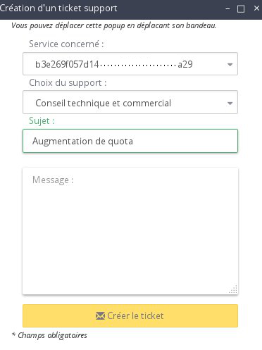

## 
Por razões de segurança implementámos uma quota no que diz respeito à possibilidade de criar instâncias e volumes adicionais.
Este limite não é evidentemente fixo e poderá a qualquer momento contactar o nosso suporte Public Cloud para que o mesmo seja aumentado.
Este guia explica-lhe o que fazer.

## Pré-requisitos

- [Adicionar um método de pagamento]({legacy}1984)

## 

- Ligar-se ao Espaço Cliente Public Cloud OVH
- Clique em "Gestão e consumo do projeto" no canto superior direito:

{.thumbnail}

- Clique em "Quota":

{.thumbnail}
Poderá visualizar as atuais limitações neste ecrã.

{.thumbnail}

- Clique no botão "Aumentar os meus limites":

{.thumbnail}

- Efetue a criação do ticket de suporte para solicitar o seu pedido de aumento de quota.

{.thumbnail}
Poderá selecionar nessa janela:

- O projeto em que pretende o aumento de quota
- a equipa de suporte que deseja contactar
- introduzir o assunto do seu ticket
- redigir a sua mensagem

Esta opção é igualmente válida para o aumento do número de projetos disponível.

## 
[Voltar à página inicial dos guias Cloud]({legacy}1785)

