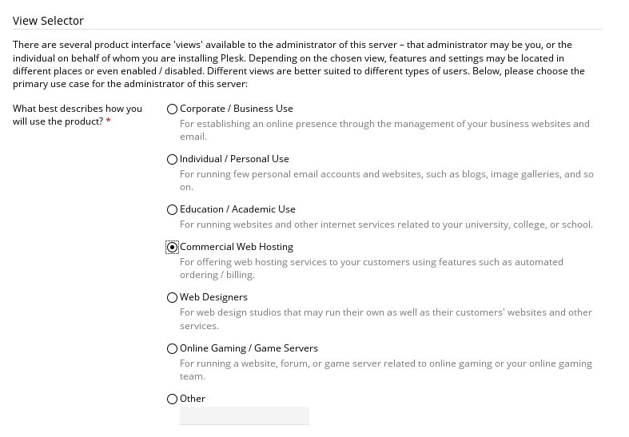
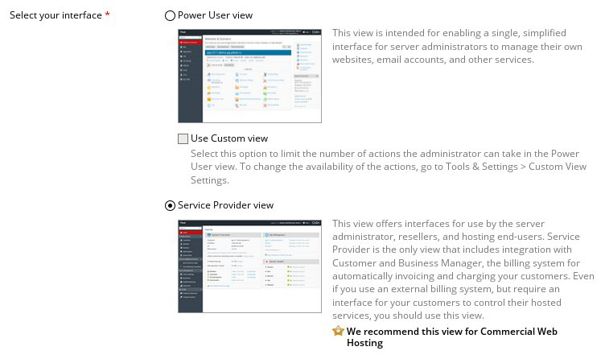
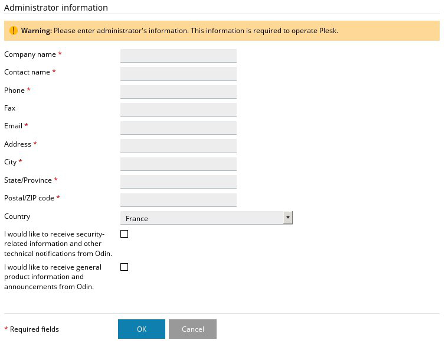
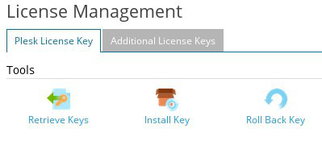

## Préambule
Plesk est une interface de gestion de serveurs simple à prendre en main permettant la gestion de plusieurs hébergements.

Il est possible de l'installer et de l'utiliser sur l'une de vos instances Public Cloud. Ce guide vous explique comment installer et configurer Plesk sur votre instance.

Source : [Plesk](http://download1.parallels.com/Plesk/Doc/en-US/online/plesk-installation-upgrade-migration-guide/){.external}


### Prérequis
- [Créer une instance dans l'espace client OVH](../guide.fr-fr.md){.ref}
- [Passer root et définir un mot de passe]({legacy}1786){.ref}


## Mise en place de Plesk

### Installation
Il est possible d'installer facilement Plesk depuis une connexion en SSH. Pour cela, il suffit de télécharger et de lancer le script d'installation de Plesk :


```bash
user@poste:~$ wget -O - http://autoinstall.plesk.com/one-click-installer | sh
```


> [!success]
>
> Il est possible d'effectuer une installation personnalisée en télécharger et
> lançant le script suivant :
> 
> ```bash
> user@poste:~$ wget http://autoinstall.plesk.com/plesk-installer
> user@poste:~$ sh ./plesk-installer
> ```
>

### Configuration
L'installation maintenant terminée, il est possible de se connecter a l'interface Plesk pour configurer celle ci. Pour effectuer cela, lancez un navigateur et connectez vous sur l'adresse  **https://IP.de.l.instance:8443**  à l'aide de vos identifiants  **root** .


{.thumbnail}

Une fois connecté, un assistant de configuration apparaitra afin de vous permettre de configurer le type d'affichage dont disposera l'interface Plesk. Cela se basera principalement sur des critères correspondant à votre type d'activité, par exemple, pour de la revente d'hébergement Web :

- Décrivez comment Plesk sera utilisé :


{.thumbnail}

- Puis choisissez le type d'affichage pour l'interface :


{.thumbnail}

Après cela, vous serez en mesure de renseigner les différentes informations concernant l'accès à votre instance, soit les éléments suivants :

- Le Hostname
- L'adresse IP
- Le mot de passe root


{.thumbnail}

Pour finir, il suffira de renseigner les différentes informations concernant le compte  **administrateur**  :


{.thumbnail}


### Ajout de la licence
L'étape suivante, correspond a l'ajout de votre licence.


> [!success]
>
> Nous ne commercialisons pas de licences Plesk pour le Public Cloud, vous pouvez cependant commander votre licence directement sur le site de Plesk.
> Vous pouvez aussi obtenir une clé de test sur ce même site.
> 

Lors de votre première connexion, vous vous trouverez sur une page vous proposant d'ajouter votre licence :


{.thumbnail}

Vous pouvez donc installer votre clé de licence.


{.thumbnail}

Informations Si vous souhaitez modifier votre licence, que cela soit pour remplacer votre clé de test, ou bien pour changer d'offre, il est possible de faire cela depuis l'interface Plesk en vous rendant dans la partie  **Server Management**  puis  **Tools & Settings**  :


{.thumbnail}

Puis dans la section  **Plesk** , sélectionnez  **License Management**  :


{.thumbnail}

Une fois la nouvelle clé ajoutée, on peut voir que le type de licence a changé :


{.thumbnail}