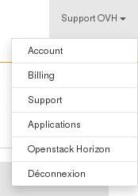
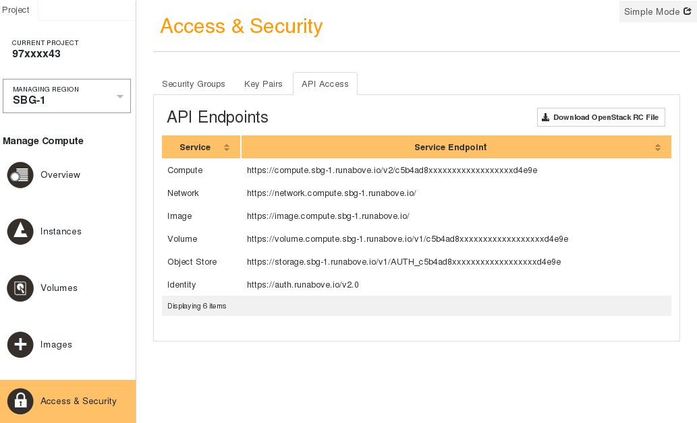

## 
Kaip galima matyti [svetainėje](https://www.runabove.com/index.xml), RunAbove tampa būsimų OVH inovacijų prekės ženklu. Tai įvairios laboratorijos, pavyzdžiui, [Desktop as a service](https://www.runabove.com/deskaas.xml) ir [IoT](https://www.runabove.com/iot-paas-timeseries.xml).

Laboratorijos, skirtos l'[Object Storage](https://www.runabove.com/cloud-storage.xml), [virtualioms mašinoms](https://www.runabove.com/cloud-instance.xml) ir [papildomiems diskams](https://www.runabove.com/cloud-disks.xml) jau nebeveikia RunAbove, tačiau jos padėjo patobulinti [OVH Public Cloud](https://www.ovh.com/fr/cloud/) paslaugą.


## 
Jei naudojotės RunAbove projektais, susijusiais su virtualiomis mašinomis, papildomais diskais ir objektų saugykla, jūs privalote kuo greičiau perkelti savo veiklą. Šiam tikslui paruošėme keletą gidų.


## Reikalavimai

- [Paruošti aplinką OpenStack API naudojimui]({legacy}1851)


## Įkelti OpenStack aplinkos kintamuosius RunAbove
Visų pirma reikalingas RC failas, kuriame pateikti visi OpenStack API naudojimui reikalingi duomenys:


- Prisijunkite prie RunAbove paskyros

- Spragtelėkite pavadinimą viršutiniame dešiniajame kampe ir pasirinkite OpenStack Horizon


{.thumbnail}

- Pasirinkite regioną kairėje

- Eikite į meniu Access & Security ir spragtelėkite langelį API Access


{.thumbnail}

- Spragtelėkite Download OpenStack RC File

- Įkelkite OpenStack aplinkos kintamuosius RunAbove naudodami RC failą


```
root@serveur:~$ source RunAbove_OpenRC.sh
```


## Migravimas
OVH paruošė gidus, kuriuose paaiškinama, kaip perkelti virtualių mašinų ir papildomų diskų atsargines kopijas iš vieno duomenų centro į kitą.

Tai suderinama su RunAbove ir padės migruoti jūsų veiklą:

Virtualių mašinų migravimas:

- [Atsarginės kopijos perkėlimas iš vieno duomenų centro į kitą]({legacy}1853)


Papildomų diskų migravimas:

- [Papildomo disko atsarginių kopijų migravimas iš vieno duomenų centro į kitą]({legacy}1941)


Objektų saugyklos migravimui, jūs galite atsisiųsti ir išsiųsti savo duomenis naujam projektui. Taip pat galimas 2 konteinerių sinchronizavimas:

- [Objektų konteinerių sinchronizavimas]({legacy}1919)


## Apmokėjimas
Priešingai nei RunAbove, galimas 2 tipų apmokėjimas:


- Valandinis apmokėjimas:

Kaip ir RunAbove atveju, sąskaita bus sugeruota kitą mėnesį už jūsų einamojo mėnesio suvartojimą.


- Mėnesinis apmokėjimas:

Pasirinkę šį apmokėjimą, galėsite pasinaudoti 50 proc. nuolaida. Sąskaita bus išrašyta automatiškai, proporcingai skaičiuojant likusias dienas iki einamojo mėnesio pabaigos.


## Funkcijos
Šiuo metu kai kurios funkcijos neprieinamos Public Cloud, tai:


- privatūs tinklai
- Floating IP


Privatūs tinklai bus prieinami jau netrukus ir suderinami su vRack tinklu.

Dabar jūs galite naudotis kitomis funkcijomis, kurios nebuvo prieinamos RunAbove, tačiau prieinamos Public Cloud, tai:


- Windows licencijos, prieinamos EG ir SP virtualioms mašinoms
- IP Failover adreso importavimas
- IP Load Balancing naudojimas


## 
[Grįžti į Cloud gidų sąrašą]({legacy}1785)

