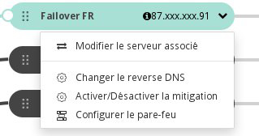

## Preambule
Ce guide vous explique comment basculer une IP fail over d'une instance à une autre. Cette opération peut avoir plusieurs applications, permettant généralement de limiter ou de supprimer les éventuels cas d'indisponibilité de service :

- basculer sur un site dans sa "nouvelle version" ;
- faire tourner votre production sur un serveur répliqué pendant que vous faites une maintenance, une mise à jour, sur le serveur de production.

### Prérequis
- Au moins deux instances Public Cloud démarrées
- Une IP Fail Over

## Migration de l'IP Fail Over
- Au départ, l'IP est routée sur Serveur 1, je souhaite la rediriger sur le serveur 2.

{.thumbnail}

- Cliquer sur le chevron, puis Modifier le serveur associé.

{.thumbnail}

- Cocher la case de sélection sur le serveur de destination.

{.thumbnail}

- Cliquer sur Attacher.

> [!success]
>
> L'IP Fail Over peut être configurée sur le serveur de destination avant
> d'effectuer le basculement, ou après, bien sûr. Si elle est pré-configurée,
> elle se met à répondre dès que l'opération de routage est terminée.
> 