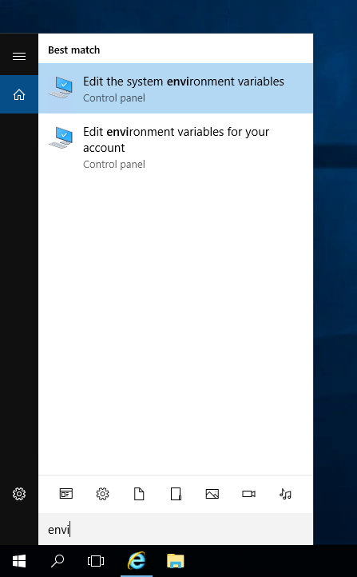

**Ostatnia aktualizacja dnia 2018-03-26**

## Wprowadzenie

Zarządzanie usługami Public Cloud za pomocą komend wydawanych z poziomu konsoli systemu jest możliwe po pobraniu i zainstalowaniu narzędzi OpenStack.
Dzięki API OpenStack można zautomatyzować zarządzanie generując skrypty. Klient Nova OpenStack pozwala na zarządzanie instancjami i przestrzenią dyskową.
Klient Glance OpenStack pozwoli Ci na zarządzanie obrazami i kopiami zapasowymi, natomiast klient Swift pozwala na zarządzanie przestrzenią dyskową object storage.

**Przewodnik ten wyjaśnia procedurę instalacji narzędzi OpenStack.**

Linki do przewodników na temat poszczególnych klientów API znajdziesz w dole strony.


## Wymagania początkowe

- Dostęp do [Panelu klienta](https://www.ovh.com/auth/?action=gotomanager){.external}
- Dostęp root do środowiska, które chcesz skonfigurować


## W praktyce

### W dystrybucji Debian

Otwórz terminal lub połącz się przez SSH ze środowiskiem, na którym będziesz mógł zainstalować dodatkowe pakiety do obsługi modułów OpenStack.

#### Krok 1: aktualizacja cache pakietów

Użyj polecenia `apt-get update`:

```sh
apt-get update
```

#### Krok 2: instalacja klientów dla Nova (compute) i Glance (image service)

Użyj poniższego polecenia:

```sh
apt-get install python-glanceclient python-novaclient -y
```

Po przejściu tego etapu zaleca się utworzenie specjalnego użytkownika, aby nie używać użytkownika root.


#### Krok 3: uzyskanie dostępu do pomocy CLI Nova i Glance:

Aby uzyskać dostęp do pomocy narzędzi CLI Nova i Glance, wykonaj te polecenia:

```sh
nova help
glance help
```

> [!primary]
> 
> Dokumentacja związana z API OpenStack jest dostępna [na tej stronie](https://docs.openstack.org/python-openstackclient/latest/){.external}.
> 


### W dystrybucji CentOS

Otwórz terminal lub połącz się przez SSH ze środowiskiem, na którym chcesz zainstalować dodatkowe pakiety do obsługi modułów OpenStack.


#### Krok 1: aktualizacja cache pakietów

Użyj polecenia:

```sh
yum update -y
```

#### Krok 2: instalacja rpm rdo-release

Wykonaj polecenie:

```sh
yum install -y https://rdoproject.org/repos/rdo-release.rpm
```

#### Krok 3: instalacja klienta Nova

Użyj polecenia:

```sh
yum install -y python-novaclient
```


#### Krok 4: instalacja klienta Glance

Użyj poniższego polecenia:

```sh
yum install -y python-glanceclient
```

Po przejściu tego etapu zaleca się utworzenie specjalnego użytkownika, aby nie używać użytkownika root.


#### Krok 5: uzyskanie dostępu do pomocy CLI Nova i Glance

Wykonaj te polecenia:

```sh
nova help
glance help
```


> [!primary]
> 
> Dokumentacja związana z API OpenStack jest dostępna [na tej stronie](https://docs.openstack.org/python-openstackclient/latest/){.external}.
> 


### W systemie Windows

Pobierz i zainstaluj wersję 2.7.10 oprogramowania Python. Możesz wybrać opcję automatycznego dodania języka programowania Python do Path zaznaczając tę opcję w konfiguratorze instalacji:

{.thumbnail}

Można także przeprowadzić instalację samodzielnie. W tym celu przedstawiamy poszczególne kroki:


#### Krok 1: edycja zmiennych środowiskowych systemu

Wyszukaj ustawienia zmiennych środowiskowych systemu i przejdź do `Edit the system environment variables`:

{.thumbnail}


#### Krok 2: edytowanie właściwości systemu

Przejdź do zakładki `Advanced`{.action} (Zaawansowane) i kliknij na `Environment Variables`{.action}, aby edytować ustawienia.

{.thumbnail}


#### Krok 3: konfiguracja zmiennych środowiskowych

W sekcji `System Variables` (Zmienne systemowe) wybierz `New`(Nowe) - nadaj nazwę PYTHON_HOME i dodaj ścieżkę do Pythona (domyślnie C:\Python27).

{.thumbnail}


#### Krok 4: dodanie ścieżki dla zmiennych

Po dodaniu Pythona, edytuj Path (ścieżka) w System Variables i dodaj na końcu ścieżki: %PYTHON_HOME%\ oraz %PYTHON_HOME%\Script rozdzielając je średnikiem:

...;%PYTHON_HOME%\;%PYTHON_HOME%\Script


#### Krok 6: restart systemu Windows

Wprowadzone zmiany zostaną wdrożone po reinstalacji systemu.


#### Krok 7: instalacja klienta OpenStack

Otwórz program linii poleceń (CMD) będąc zalogowanym jako Administrator i zainstaluj klienta OpenStack poleceniem:

```sh
# pip install python-openstackclient
```

Po poprawnej instalacji wyświetlone zostanie podsumowanie:

{.thumbnail}


#### Krok 8: weryfikacja instalacji

Ważne jest, aby weryfikację przeprowadzić w nowo otwartym oknie programu CMD (linii poleceń) wpisując "python" z dowolnej lokalizacji w systemie.

{.thumbnail}

W wyniku zostanie wyświetlona wersja zainstalowanego oprogramowania.


## Sprawdź również

[Pierwsze kroki z API Swift](https://docs.ovh.com/pl/public-cloud/pierwsze_kroki_z_api_swift/){.external}

[Pierwsze kroki z API Nova](https://docs.ovh.com/pl/public-cloud/pierwsze_kroki_z_api_nova/){.external}

[Pierwsze kroki z API Glance](https://docs.ovh.com/pl/public-cloud/rozpoczecie_pracy_z_api_glance/){.external}


Skontaktuj się ze społecznością naszych użytkowników na stronie <https://community.ovh.com/en/>.

