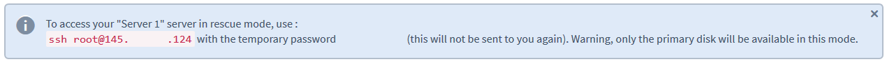

**Last updated 13th March 2019**

## Objective

If your instance has been poorly configured, or if you have lost your SSH key, your instance may be inaccessible.

In such circumstances, you can use rescue mode to reconfigure your instance or recover to recover your data. 

**This guide will show you how to put your instance in rescue mode**

## Requirements

* a [Public Cloud Instance](https://www.ovh.co.uk/public-cloud/instances/){.external} set up in your OVH account
* access to the [OVH Control Panel](https://www.ovh.com/auth/?action=gotomanager){.external}
* administrative (root) access to the instance via SSH

## Instructions

### Activate rescue mode

First, log in to the [OVH Control Panel](https://www.ovh.com/auth/?action=gotomanager){.external} and click the `Cloud`{.action} menu.

{.thumbnail}

Next, select your PCI project from the side-menu on the left of the screen.

{.thumbnail}

Next, click the dropdown arrow on your instance and select `Reboot in rescue mode`{.action}

{.thumbnail}

You will now see the 'Reboot in rescue mode' dialog box. Click the dropdown list to select the Linux distribution you want to use in rescue mode and then click the `Start`{.action} button.

{.thumbnail}

Once your instance has been rebooted in rescue mode, a message will appear at the top of the screen, containing your temporary password.

{.thumbnail}

### Access your data

Once rescue mode has been activated, your instance's data will be attached as an additional disk. You will now need to mount it, by taking the following steps.

First, establish an SSH connection to your instance. Once you're connected, verify the available disks with this command:

```
root@instance:/home/admin# lsblk

NAME MAJ:MIN RM SIZE RO TYPE MOUNTPOINT
vda 253:0 0 1G 0 disk
└─vda1 253:1 0 1023M 0 part /
vdb 253:16 0 10G 0 disk
└─vdb1 253:17 0 10G 0 part
```

Next, mount the partition:

```
root@instance:/home/admin# mount /dev/vdb1 /mnt
```

Your data will now be accessible from the /mnt folder.

### Deactivate rescue mode

Once you have completed your tasks, you can deactivate rescue mode by rebooting your instance normally. To do this, click on the dropdown arrow on your instance, and select `Exit rescue mode`{.action}.

{.thumbnail}

### Activate rescue mode using the OpenStack API

You can also activate rescue mode via the OpenStack API using the following command:

```
# root@server:~# nova rescue INSTANCE_ID
```

To exit rescue mode, use the following command:

```
# root@server:~# nova unrescue INSTANCE_ID
```

## Go further

Join our community of users on <https://community.ovh.com/en/>.