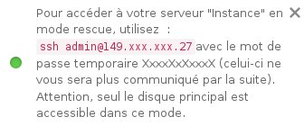

## 
Em caso de má configuração ou perda da password SSH, é possível que deixe de poder aceder à sua instância.
Propomos-lhe então um modo de rescue para poder aceder aos seus dados para poder corrigir os seus diferentes ficheiros de conmfiguração.

Este modo funciona de forma simples:
A sua instância é lançada numa nova imagem, ou seja, uma instância com uma configuração básica.
O disco da sua instância fica então associado à esta instância como um disco adicional, e basta montá-la para poder acder aos dados.

Este guia explica-lhe como pode utilizar o modo de reescue.


## Pré-requisitos

- [Criar uma instância no Espaço Cliente OVH]({legacy}1775)


## Passar a instância em modo de rescue
Para passar a sua instância em modo de rescue basta clicar na flecha no canto superior direito da sua instância e selecionar "Iniciar em modo de rescue":

{.thumbnail}
Deverá de seguida escolher a imagem na qual deseja iniciar o seu servidor em modo de rescue:

{.thumbnail}
Encontrará as imagens que propomos de forma padrão, bem como uma imagem adicional "Distribuição Rescue Made-in-OVH" que permite que se ligue à sua instância em modo de rescue com a ajuda de uma password temporária.

Após o servidor estar em modo de rescue, uma nova janela será apresentada em baixo à direita contendo a sua password temporária:

{.thumbnail}


## Aceder aos seus dados
Como explicado anteriormente, os dados da sua instância serão associados ao modo de rescue como um disco adicional.
Basta que os monte ao seguir o procedimento seguinte:


- Ligar-se como root:


```
admin@instance:~$ sudo su
```


- Verificar os discos disponíveis:


```
root@instance:/home/admin# lsblk
NAME MAJ:MIN RM SIZE RO TYPE MOUNTPOINT
vda 253:0 0 1G 0 disk
└─vda1 253:1 0 1023M 0 part /
vdb 253:16 0 10G 0 disk
└─vdb1 253:17 0 10G 0 part
```


- Montar a partição;


```
root@instance:/home/admin# mount /dev/vdb1 /mnt
```


Os seus dados estarão então acessíveis na pasta /mnt.

Poderá, por exemplo, editar o ficheiro que contém a lista das chaves SSH utilizadas pelo utilizador admin:


```
root@instance:/home/admin# vim /mnt/home/admin/.ssh/authorized_keys
```


## Reiniciar a sua instância em modo normal
Após todas as operações efetuadas, basta que reinicie a sua instância normalmente, e para tal basta que clique na flecha no canto superior direito da sua instância e clique em "Sair do modo de rescue" :

{.thumbnail}


## Com as API OpenStack
Pode reiniciar a sua instância em modo de rescue através da API OpenStack ao utilizar o seguinte comando:


```
root@server:~# nova rescue INSTANCE_ID
```


Para sair do modo de rescue poderá utilizar o seguinte comando:


```
root@server:~# nova unrescue INSTANCE_ID
```


## 

- [Criação das chaves SSH]({legacy}1769)
- [Configurar chaves SSH suplementares]({legacy}1924)


## 
[Voltar à página inicial dos guias Cloud]({legacy}1785)

