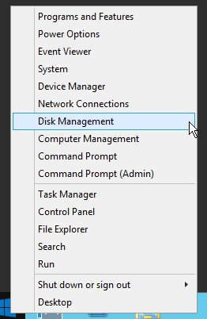

## 
Jeśli Twoja działalność się rozwija i zapotrzebowanie na zasoby wzrasta, możesz za pomocą kilku kliknięć zwiększyć zasoby, którymi dysponuje Twoja instancja. 

Przewodnik ten wyjaśnia, jak zwiększyć zasoby w interfejsie OpenStack Horizon.

## Uwaga
Możliwe jest tylko przejście na wyższy model.

Zmiana ta spowoduje przerwanie działania instancji na czas operacji.

## Wstępne wymagania

- [Dostęp do interfejsu Horizon]({legacy}1773)
- Instancja

## Zmiana rozmiaru instancji
Aby zmienić rozmiar instancji, należy:

- Zalogować się do interfejsu Horizon.
- Kliknąć na Instancje w menu z lewej strony.
- Wybrać Zmień rozmiar instancji z rozwijalnej listy dla tej instancji.

{.thumbnail}

## Zakładka Wybór odmiany
W tej sekcji widać aktualny rozmiar. Można wybrać nowy rozmiar dla zasobów instancji.

{.thumbnail}

## Uwaga
Można wyświetlić wykorzystane zasoby w porównaniu z całkowitymi zasobami przypisanymi do projektu.

## Zakładka Ustawienia zaawansowane
W tej sekcji można zarządzać partycjonowaniem dysku.

Partycjonowanie dysku: (Automatyczne lub Ręczne)

{.thumbnail}

- Po zakończeniu konfiguracji kliknij na Zmień rozmiar

## Zmiana rozmiaru dysku w systemie Windows
 Uwaga 
Podczas zmiany rozmiaru instancji Windows, rozmiar partycji nie jest aktualizowany automatycznie. Należy skorzystać z opcji zwiększenia rozmiaru korzystając z funkcji
Zarządzanie dyskiem:

- Uruchom opcję zarządzania dyskiem:

{.thumbnail}

- Kliknij prawym przyciskiem na głównej partycji

{.thumbnail}

- Rozszerz partycję główną:

{.thumbnail}

- Zatwierdź zmianę rozmiaru dysku:

{.thumbnail}

## 
[Przewodniki Cloud]({legacy}1785)

