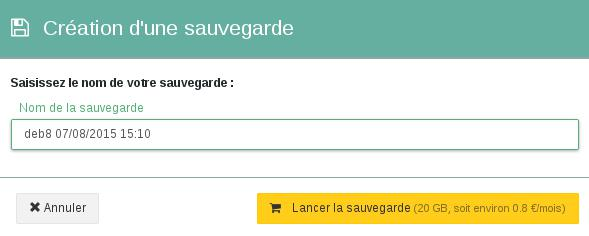

## 
Bei der Public Cloud können Sie jederzeit ein Backup Ihrer Instanz erstellen. Mit diesem Backup können Sie:

- Ihre Instanz auf eine frühere Konfiguration zurücksetzen.
- eine Instanz neu erstellen / duplizieren.

In dieser Hilfe erfahren Sie, wie Sie mit nur ein paar Klicks ein solches Backup (Snapshot) erstellen.

## Voraussetzungen

- Sie müssen in Ihr OVH Public Cloud Kundencenter eingeloggt sein.
- Es muss bereits eine virtuelle Maschine erstellt sein.

## 

- Öffnen Sie folgendes Menü für den virtuellen Server, für den Sie das Backup erstellen möchten:

{.thumbnail}

- Klicken Sie auf "Eine Sicherung erstellen"
- Es erscheint ein neues Fenster, in dem Sie dem Snapshot einen Namen geben können.

{.thumbnail}

- Klicken Sie auf "Das Backup starten"

{.thumbnail}
Wie Sie sehen können, zeigt das Kunden-Interface auch die monatlichen Kosten dieses Backups an.

- Sie finden das Backup dann im entsprechenden Menübereich.

{.thumbnail}

- Hier finden Sie dann auch die Details des Backups.

{.thumbnail}

## 
... lesen Sie auch unsere anderen Hilfen zum Thema Cloud!

