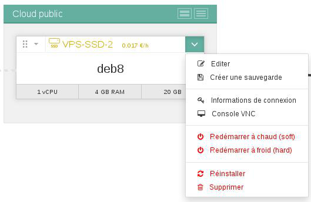

## Preambule
Le Public Cloud vous permet à tout moment de créer une sauvegarde de votre instance. Cette sauvegarde pourra vous servir pour :

- Restaurer votre instance sur une ancienne configuration
- Recréer / dupliquer une instance

Ce guide vous explique comment, en quelques clics, créer cette sauvegarde (snapshot).

### Prérequis
- Être connecté à l'espace client OVH Public Cloud
- Avoir une machine virtuelle déjà crée

## Création de la sauvegarde
- Développer le menu suivant sur le serveur virtuel à sauvegarder :

{.thumbnail}

- Cliquer sur Créer une sauvegarde
- La fenêtre suivante apparaît, et vous propose de personnaliser le nom de la sauvegarde :

{.thumbnail}

- Cliquer sur Lancer la sauvegarde :

{.thumbnail}

> [!success]
>
> On remarque que l'interface client évalue le coût mensuel que représente
> cette sauvegarde.
> 

- On retrouve ensuite les sauvegardes dans la section correspondantes :

{.thumbnail}

- Les détails de la sauvegarde sont disponibles :

{.thumbnail}