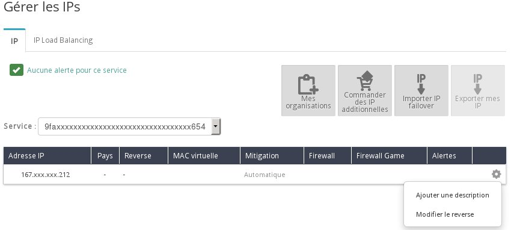
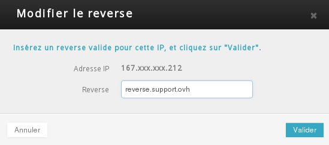

## 
Per eseguire alcune operazioni, potrebbe essere necessario configurare un reverse DNS per gli indirizzi IP della tua istanza. Ad esempio, nella configurazione di un server di posta, il reverse DNS ti permette di aumentare lo "score" relativo all'invio delle tue email.

Questa guida ti mostra come effettuare questa operazione.

## Requisiti necessari

- Un'istanza
- Un record di tipo A nella tua zona DNS che punta verso il tuo indirizzo IP

## 

- Verifica l'indirizzo IP della tua istanza nella sezione Cloud del tuo Spazio Cliente OVH:

{.thumbnail}

- Accedi alla sezione Dedicato del tuo Spazio Cliente OVH

{.thumbnail}

- Clicca su IP nel menu a sinistra e seleziona l'ID del tuo progetto in Servizio:

{.thumbnail}

- Seleziona Modifica il reverse cliccando sull'icona a destra dell'indirizzo IP in questione.

- Inserisci il tuo reverse DNS nel campo corrispondente e Conferma

{.thumbnail}
Se hai aggiunto recentemente il record A, è necessario attendere la propagazione della tua zona DNS per la corretta esecuzione di questa operazione.
A questo punto, il reverse DNS è visibile nella lista degli indirizzi IP del tuo progetto.

{.thumbnail}

## 
[Ritorna all'indice delle guide Cloud]({legacy}1785)

