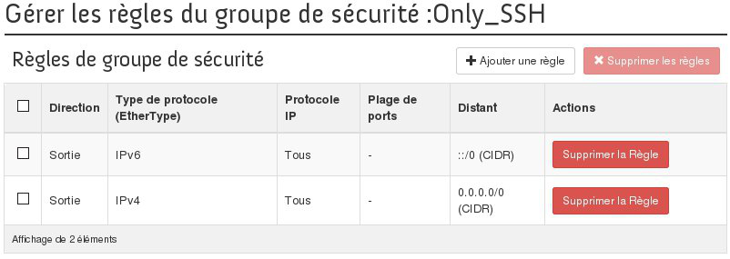
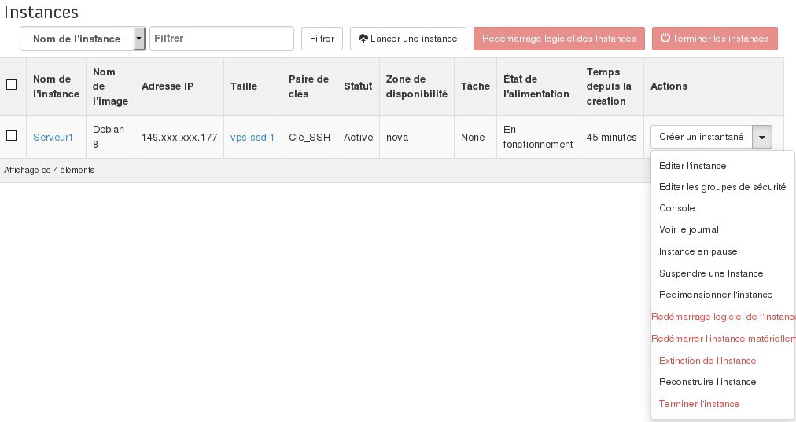

## Préambule
Pour des raisons de sécurité, il est possible de configurer et d'utiliser des règles de filtrage qui définiront les accès à vos instances. Vous pourrez donc autoriser ou bloquer certaines connexions entrantes ou sortantes l'aide de ces groupes de sécurité. Cela pourra être appliqué pour du trafic provenant de certaines adresses IPs, ou même des instances configurées sur des groupes de sécurité en particulier.

Ce guide vous expliquera comment effectuer cela afin protéger vos instances.


### Prérequis
- [Créer un accès à Horizon]({legacy}1773){.ref}
- Se connecter sur l'interface Horizon


## Configuration du groupe de securite

### Creation du groupe de securite
- Se rendre dans le menu "Accès et Sécurité" puis l'onglet "Groupes de sécurité".


{.thumbnail}


> [!success]
>
> Un groupe de sécurité "default" est déjà présent, celui-ci laisse passer
> tout le trafic entrant et sortant.
> 

- Cliquer sur "Créer un groupe de sécurité"


{.thumbnail}

- Une fois le nom et la description ajoutés, cliquer sur "Créer un groupe de sécurité".

En cliquant sur "Gérer les règles" on peut voir les règles qui ont été créées par défaut :


{.thumbnail}


> [!alert]
>
> Un nouveau groupe de sécurité laissera passer uniquement le trafic sortant par
> défaut.
> 


### Configuration d'une instance avec ce groupe de securite
- Se rendre dans le menu "Instances"
- Créer une nouvelle instance
- Se rendre sur l'onglet "Accès et Sécurité" et cocher le nouveau groupe de sécurité uniquement.


{.thumbnail}

Il est possible de changer la configuration des groupes de sécurité des instances déjà créés en sélectionnant l'option "Éditer les groupes de sécurité".


{.thumbnail}


### Configuration du groupe de securite
Comme précisé précédemment, le groupe de sécurité créé ne laisse passer que le trafic sortant par défaut :


```bash
root@serveur:~$ ssh admin@149.xxx.xxx.177

ssh: connect to host 149.xxx.xxx.177 port 22: Connection timed out
```

- Se rendre dans le menu "Accès et Sécurité" puis l'onglet "Groupes de sécurité".
- Cliquer sur "Gérer les règles" puis sur "Ajouter une règle"


{.thumbnail}

Une fois la règle ajoutée, il faudra patienter quelques minutes pour que celle-ci soit appliquée.


{.thumbnail}


```bash
root@serveur:~$ ssh admin@149.xxx.xxx.177

Last login: Tue Oct 13 13:56:30 2015 from proxy-109-190-254-35.ovh.net
admin@serveur1:~$
```