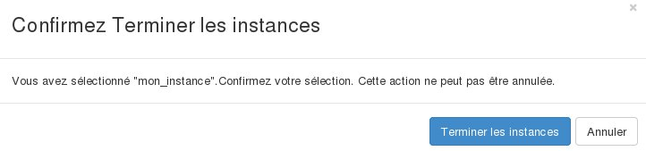

## 
Jeśli nie potrzebujesz jednej ze swoich instancji, możesz w każdej chwili ją usunąć.

Przewodnik ten wyjaśnia, jak usunąć instancję w interfejsie Horizon.

## Uwaga
Dane przechowywana na instancji zostaną usunięte. 
Możesz utworzyć kopię zapasową instancji, jeśli chcesz zachować dane i w przyszłości uruchomić identyczną instancję.

## Wstępne wymagania

- [Dostęp do interfejsu Horizon]({legacy}1773)
- Instancja

## 
Aby usunąć instancję, należy:

- Zalogować się do interfejsu Horizon.
- Kliknąć na Instancje w menu z lewej strony.

{.thumbnail}

- Wybrać instancję.
- Kliknąć na przycisk Zniszcz instancję.

{.thumbnail}

- Kliknąć na Zniszcz instancję, aby potwierdzić usunięcie.

## Informacja
Po usunięciu instancji, nie będzie za nią pobierana opłata. Nie będziesz mógł odzyskać tej instancji.

## 
[Przewodniki Cloud]({legacy}1785)

