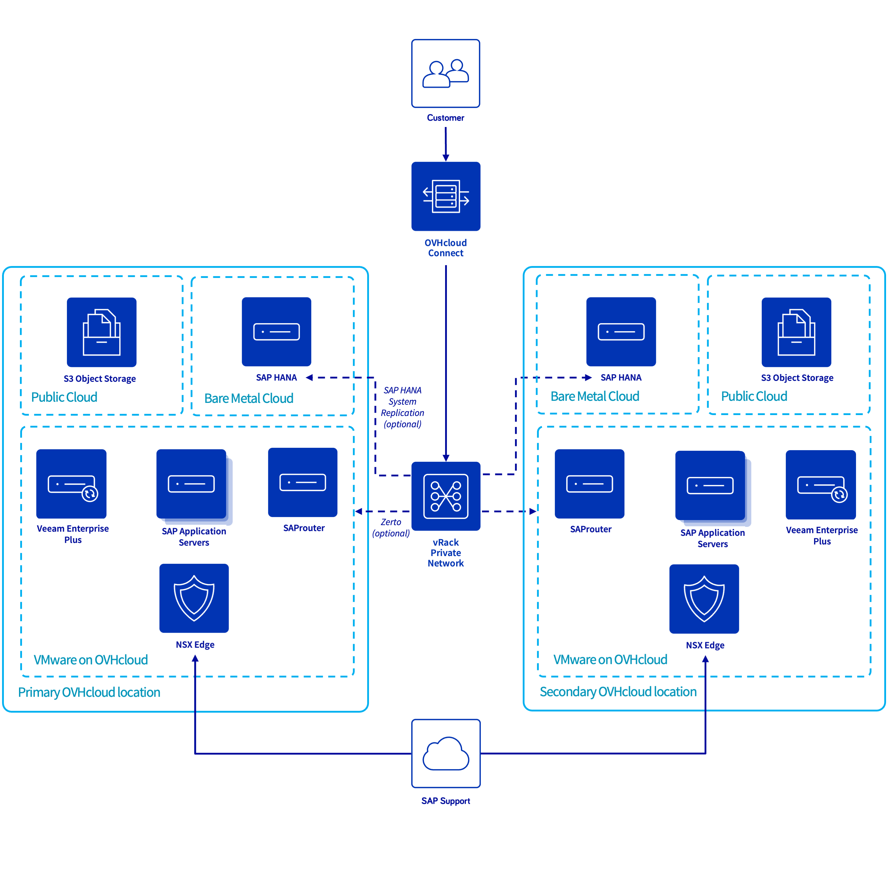

**Last updated 15th March 2023**

## Objective

The following concept allows you to build an architecture with a SAP HANA database up to 1.5 TB, and takes advantage of all VMware on OVHcloud features (templates, Zerto, NSX, DRS, Fault Tolerance, High Availability) for your SAP Application Servers in a single OVHcloud location or multiple OVHcloud locations.

{.thumbnail}

| Objective | Description |
| --- | --- |
| Objective #1 | Building a cost-effective SAP infrastructure based on existing VMware on OVHcloud for application servers and dedicated servers to host SAP HANA databases. |
| Objective #2 | No compliance requirements with any SecNumCloud qualification or PCI DSS certification. |
| Objective #3 | An infrastructure Recovery Point Objective (RPO) of 15 minutes. |
| Objective #4 (optional) | An SAP infrastructure available in a secondary OVHcloud location which can be activated in the event of a major issue impacting the primary OVHcloud location. This secondary OVHcloud location offers an infrastructure RPO near to zero. |

## Concept elements

### Network connectivity

To guarantee the quality of communication between your local site and your SAP infrastructure hosted at OVHcloud, we recommend using OVHcloud Connect. This solution provides you with a secure and high-performance link between your offices and OVHcloud. To get more information, please refer to the [OVHcloud Connect documentation](https://www.ovhcloud.com/en/network/ovhcloud-connect/).

Instead of using OVHcloud Connect, a point-to-point VPN can also be deployed with NSX Edge. To learn how to configure an NSX Edge Gateway VPN with OVHcloud, please refer to [our documentation](/pages/cloud/private-cloud/nsx_configurer_un_vpn_via_une_gateway_edge).

A prerequisite for updating your servers and for SAP Support access is to configure an Additional IP. A public IP subnet will be used as outbound link on your NSX Edge. Find more information in the [Additional IP documentation](/pages/platform/network-services/additional-ip-buy).

### SAP HANA database

The SAP HANA database is hosted on a dedicated server of the SAP HANA on Bare Metal server range (references HGR-SAP-1/2/3). To know how to deploy a SAP HANA database on an OVHcloud dedicated server, please refer to [our documentation](/pages/cloud/sap/install-sap-hana-sles).

To ensure the recovery of the SAP HANA configuration (INI files), we suggest to set the value `true` for the parameter `include_configuration_backup`. This parameter enables the backup of all settings stored in INI files during the data backup of the SAP HANA database.

Deploying a SAP HANA database on a dedicated server offers a [cost-effective infrastructure](https://www.ovhcloud.com/en/bare-metal/uc-sap-hana/) that meets compliance and regulatory requirements.

In order to reduce the RPO and the RTO in a single OVHcloud location, you can add another SAP HANA database on a second dedicated server and configure SAP HANA System Replication between these databases. Please refer to the SAP official documentation available on the [SAP Help Portal](https://help.sap.com/docs/SAP_HANA_PLATFORM/6b94445c94ae495c83a19646e7c3fd56/86267e1ed56940bb8e4a45557cee0e43.html?locale=en-US). In this context, you could use a replication SYNC mode.

This architecture prevents outages caused by hardware incidents on your SAP HANA database hosted in a single OVHcloud location.

### SAP Application Servers

The SAP Application Servers infrastructure is hosted on VMware on OVHcloud. We advise to take into consideration the [SAP Note 2161991](https://launchpad.support.sap.com/#/notes/2161991), especially chapter 2 and 3, and the [SAP Note 2015392](https://launchpad.support.sap.com/#/notes/2015392), to set a compliant configuration between SAP and virtual machines.

The Fault Tolerance feature provided by VMware guarantees the availability of your SAP Application Servers in case of ESXi host failures. Your virtual machine is automatically activated on another member of your VMware cluster. We advise enabling it on your virtual machines which host the SAP Central Services (SCS), if you do not manage an SAP cluster for this service in another way. The Fault Tolerance could also be enabled on your SAP Application Servers which host a critical service. 
However, to be able to enable the Fault Tolerance, the virtual machine cannot exceed 8 vCPU and 128 GB of memory.

For SAP Application Servers which do not host a critical service, we recommend ensuring that the vSphere HA feature is enabled in your VMware cluster. It monitors the health of each ESXi host in the cluster, and automatically restarts the virtual machines hosted on the impacted ESXi host. 

The vSphere Distributed Resource Scheduler can also be activated with VM/Host rules to avoid running all SAP Application Servers on the same ESXi host.

### Backup infrastructure

We recommend using a S3 Object Storage bucket in a different OVHcloud location from the one on which your workload runs, to protect yourself from a major outage on the primary OVHcloud location.

#### SAP HANA database

OVHcloud will soon provide an OVHcloud Backint Agent for SAP HANA certified to backup your SAP HANA database to a S3 Object Storage on OVHcloud.

This Backint Agent allows you to take advantage of an S3 Object Storage, like retention policy or immutable policy.

#### File systems

To protect the file systems on which important SAP files are stored, a cost-effective solution can be deployed with a daily running of a script which copies the content of these sensible file systems to a S3 Object Storage on OVHcloud.

With this solution, only the content of these sensible file systems is protected. In case of a loss of an entire virtual machine, a build from scratch should be started and the recovery of the content of the SAP file systems could be done.

Another solution to accelerate the recovery of your virtual machine is to deploy or use an existing Veeam Enterprise Plus server in your VMware on OVHcloud service linked to an S3 Object Storage on OVHcloud.

Veeam Enterprise Plus allows you to back up and restore snapshots of your virtual machines. It ensures a quick recovery in case of an issue with your VMware on OVHcloud solution.

To learn how to install a Veeam Enterprise Plus server in your VMware on OVHcloud solution, please refer to the [OVHcloud documentation](/pages/cloud/storage/backup/veeam_veeam_backup_replication).

### Long-term and archive storage

Some data needs to be stored and backed up with long retention for legal and/or technical reasons, ideally in a dedicated storage space with limited access once the data has been written. OVHcloud offers a Cold Archive solution for this application, featuring the highest security for your data by design.

For more information, please refer to the [OVHcloud documentation](https://www.ovhcloud.com/en/public-cloud/cold-archive/).

### SAP Support connection

To allow the connection from SAP Support to your SAP landscape on OVHcloud, we advise you to deploy a virtual machine within your VMware on OVHcloud solution, configure an Additional IP and attach it to NSX Edge. Then install the SAProuter service on this virtual machine, according to the [official SAProuter documentation by SAP Support](https://support.sap.com/en/tools/connectivity-tools/saprouter/install-saprouter.html).

Configure your NSX Edge to route the ingress traffic to your SAProuter.

As this virtual machine is exposed to the Internet, adapt ingress firewall rules to only allow the connection from the SAP IP public range to your SAProuter server. Allow communication from your new SAProuter to your SAP infrastructure for only the needed ports/protocols. All of this information is available on the [SAP Support pages](https://support.sap.com/en/tools/connectivity-tools/saprouter/install-saprouter.html).

### Dual OVHcloud location (optional)

To eliminate the risk of losing a single OVHcloud location deployment, consider adding a secondary OVHcloud location.

#### Network connectivity

As with the primary OVHcloud location, we recommend using OVHcloud Connect. If this solution is not suitable for you, a point-to-point VPN can be deployed with NSX Edge for the second OVHcloud location.

#### SAP HANA database

The SAP HANA System Replication called SAP HSR is used to replicate the data and configuration of OVHcloud location 1 (primary OVHcloud location) to OVHcloud location 2 (secondary OVHcloud location). This replication allows you to secure your data in another SAP HANA database and thus achieve the lowest RPO possible.

To configure a SAP HANA replication, please refer to the official SAP documentation which is available on the [SAP Help Portal](https://help.sap.com/docs/SAP_HANA_PLATFORM/6b94445c94ae495c83a19646e7c3fd56/86267e1ed56940bb8e4a45557cee0e43.html?locale=en-US). However, within the scope of this concept with two OVHcloud locations, we advise you to enable the data and log compression and use the ASYNC replication mode. Find more information on the [SAP Help Portal](https://help.sap.com/docs/SAP_HANA_PLATFORM/6b94445c94ae495c83a19646e7c3fd56/92447e0a105c4facad3553b28aaec318.html).

> [!warning]
> If you trigger a takeover to another OVHcloud location, you should switch the SAP Application Servers too, to guarantee the performance between the SAP Application Servers and the SAP HANA database.

It is also possible to add another SAP HANA database in the primary OVHcloud location on a second dedicated server and thus minimise the RPO and RTO in the event of a hardware incident in the primary OVHcloud location.

An n-tier replication is structured as follows: 

SAP HANA1(OVHcloud location 1) -> SAP HANA2(OVHcloud location 1) -> SAP HANA3(OVHcloud location 2). 

To learn how to configure this replication, please refer to the [SAP Help Portal](https://help.sap.com/docs/SAP_HANA_PLATFORM/6b94445c94ae495c83a19646e7c3fd56/ca6f4c62c45b4c85a109c7faf62881fc.html?locale=en-US).

#### SAP Application Servers

To secure your infrastructure in the event of a major incident in your primary OVHcloud location, we advise you to enable the feature named Zerto for your VMware on OVHcloud solution, allowing you to replicate your virtual machines to another OVHcloud location of another VMware on OVHcloud service. With this feature, you secure your SAP Application Servers in another OVHcloud location with a synchronous replication, and you reduce the RTO and the RPO if you have to switch to your secondary OVHcloud location.

To know how to enable this feature, please refer to the [OVHcloud documentation](/pages/cloud/private-cloud/zerto_virtual_replication_as_a_service).

> [!warning]
> If you trigger a switch to the secondary OVHcloud location through Zerto, the SAP HANA database has to be switched too, to ensure the performance between the SAP Application Servers and the SAP HANA database.

#### Backup infrastructure

As mentioned in the beginning of this guide, we recommend using an S3 Object Storage bucket on a different OVHcloud location from the one on which your workload runs, to avoid a major outage on the primary location. A cross backup is safer for your business data.

#### SAP Support connection

To guarantee the connection continuity with the SAP Support, we recommend configuring a second SAProuter with a different public IP address in the second OVHcloud location. If your Disaster Recovery Plan is triggered, and if the SAP Support has to connect to your SAP systems, only the public IP address in the SAP Support LaunchPad should be updated to recover the connection.

## Go further

- [SAP HANA Administration Guide for SAP HANA Platform](https://help.sap.com/docs/SAP_HANA_PLATFORM/6b94445c94ae495c83a19646e7c3fd56/86267e1ed56940bb8e4a45557cee0e43.html?locale=en-US)
- [Add flexibility to your applications with Additional IP](https://www.ovhcloud.com/en/network/additional-ip/)
- [2161991 - VMware vSphere configuration guideline](https://launchpad.support.sap.com/#/notes/2161991)
- [2015392 - VMware recommendations for latency-sensitive SAP applications](https://launchpad.support.sap.com/#/notes/2015392)
- [Setting up Zerto Virtual Replication between two OVHcloud datacenters](/pages/cloud/private-cloud/zerto_virtual_replication_as_a_service)
- [Setting up Veeam Backup & Replication](/pages/cloud/storage/backup/veeam_veeam_backup_replication)
- [Installing SAProuter](https://support.sap.com/en/tools/connectivity-tools/saprouter/install-saprouter.html)

If you need training or technical assistance to implement our solutions, contact your sales representative or click on [this link](https://www.ovhcloud.com/en/professional-services/) to get a quote and ask our Professional Services experts for assisting you on your specific use case of your project.

Join our community of users on <https://community.ovh.com/en/>.
