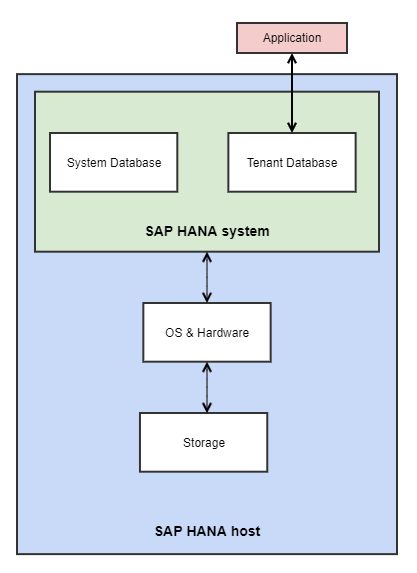

**Last updated 29th March 2022**

## Objective

OVHcloud provides SAP-certified hardware on which to build a SAP HANA solution.

**This guide provides a general guideline on how to install a SAP HANA system on SLES15 SP3 server hosted on OVHcloud hardware.**

> [!warning]
>
> While the material contained in this guide has been formulated with all due care, OVHcloud does not warrant or represent that the material constitutes an official SAP guide.
>
> All technical integration/installation/administration tasks of SAP solutions shall be validated by a SAP professional.

## Requirements

You must have:

- read the [SAP HANA Master Guide](https://help.sap.com/viewer/eb3777d5495d46c5b2fa773206bbfb46/2.0.01/en-US).
- sized and structured your SAP HANA infrastructure and data directories.
- installed all the latest required sources and packages.
- applied every fine-tuning processes mandated by SAP.

Please refer to the general guideline documentation on [how to prepare an OVHcloud SLES system for SAP HANA](../sap-prepare-sles-for-sap-hana/).

## Instructions

### Target host architecture

{.thumbnail}

### Installation procedure

To install the SAP HANA Database server, we will use SAP **HANA DataBase LifeCycle Manager** which we will refer to as **HDBLCM** in this document.

There are two available HDBLCM versions:

- Non-Resident (Located in Installation Media)
- Resident (Located in '/hana/shared/<SID>/HDBLCM')

The 'Non-Resident' HDBLCM allows you to:

- install SAP HANA and components.
- update SAP HANA and components

The 'Resident' HDBLCM allows you to:

- configure the inter-service communication.
- configure the SLD connection.
- rename a SAP HANA system.
- uninstall SAP HANA and/or components.
- unregister SAP HANA
- install/update additional components.
- add additional hosts.

**NB: You can use HDBLCM in graphical user interface, command-line, or Web user interface.**

<ol start="1">
  <li>Download the latest SAP HANA sources from the<a href=https://launchpad.support.sap.com/#/softwarecenter> SAP software-center</a></li>
</ol>

*** NB: Always use the HDBLCM version corresponding to your SAP system. ***

<ol start="2">
  <li>Run the SAP HDBLCM tool:</li>
</ol>

```bash
/hana/shared/src/DATA_UNITS/HDB_SERVER_LINUX_X86_64/hdblcm --verify_signature
SAP HANA Lifecycle Management - SAP HANA Database 2.00.058.00.1634122452
************************************************************************
Scanning software locations...
Detected components:
   SAP HANA Database (2.00.058.00.1634122452) in /hana/shared/sps/SAP_HANA_DATABASE/server
   SAP HANA Database Client (2.10.15.1634075415) in /hana/shared/sps/SAP_HANA_CLIENT/client
Do you want to specify additional components location? (y/n) [n]: n
```

<ol start="3">
  <li>Select the install action:</li>
</ol>

```bash
Index | Action             | Description
------------------------------------------------------------------------------------
1     | HDB (update)       | Update SAP HANA Database version 2.00.057.00.1629894416
      |                    | xx-hana-ovh (Database Worker (worker))
2     | install            | Install new system
3     | extract_components | Extract components
4     | Exit (do nothing)  |
```

<ol start="4">
  <li>Follow the installation wizard:</li>
</ol>

```bash
Select additional components for installation: Enter 2,3 to install both server and client
Enter local hostwork group: leave empty as this is a SCOS deployment
Select System Usage / Enter Index [4]:
Index | System Usage | Description
-------------------------------------------------------------------------------
1     | production   | System is used in a production environment
2     | test         | System is used for testing, not production
3     | development  | System is used for development, not production
4     | custom       | System usage is neither production, test nor development
Installation path: #please refer to the LVM section of the SLES for SAP HANA cookbook.
Enter Local host name: #default should pick up the current hostname
Do you want to add hosts to the system?: #As this is a SCOS deployment, enter ‘n’
Enter the SAP HANA System ID : # The SAP system ID (SID) is the identifier for the SAP HANA system.
Do you want to enable data and log volume encryption? [n]: y
Enter Location of Data Volumes [/hana/data/HDB]:
Enter Location of Log Volumes [/hana/log/HDB]:
Restrict maximum memory allocation? [n]: n
Apply System Size Dependent Resource Limits? (SAP Note 3014176) [y]:
Enter SAP Host Agent User (sapadm) Password:
Confirm SAP Host Agent User (sapadm) Password:
Enter SAP Host Agent User (sapadm) Password:
Confirm SAP Host Agent User (sapadm) Password:
Enter System Administrator (hdbadm) Password:
Confirm System Administrator (hdbadm) Password:
Enter System Administrator (hdbadm) Password:
Confirm System Administrator (hdbadm) Password:
Enter System Administrator Home Directory [/usr/sap/HDB/home]:
Enter System Administrator Login Shell [/bin/sh]:
Enter System Administrator User ID [1001]:
Enter ID of User Group (sapsys) [79]:
Enter System Database User (SYSTEM) Password:
Enter System Database User (SYSTEM) Password:
Enter System Database User (SYSTEM) Password:
Confirm System Database User (SYSTEM) Password:
Restart system after machine reboot? [n]: y
```

> [!primary]
> 
> Sidenote on the SID: 3 characters are allowed. Letters or Numbers. No mixing allowed.
>
> NB: you can change the system ID after deployment but it is more complex than setting it outright.
> NB2: this ID must be unique in your SAP eco system.
>
> Example: HDB
>
> Example2: HD1 #corresponds to HANA Development 1
>
> Example3: HP1 #corresponds to HANA Production 1

> [!primary]
> 
> Sidenote on the instance number: a SAP Instance number is a two-digits number from 00 to 97 (98 and 99 are reserved for routing purposes.).
>
> This number is used to differentiate instances as it is possible to install multiple instances on the same server.


<ol start="5">
  <li>Check the installer summary:</li>
</ol>

```bash
Summary before execution:
=========================
SAP HANA Database System Installation
   Installation Parameters
      SAP HANA System ID: HDB
      Instance Number: 00
      Configure Python version: python2
      Local Host Worker Group: default
      System Usage: test
      Do you want to enable data and log volume encryption?: Yes
      Location of Data Volumes: /hana/data/HDB
      Location of Log Volumes: /hana/log/HDB
      SAP HANA Database secure store: ssfs
      Certificate Host Names: xx-hana-ovh -> xx-hana-ovh
      System Administrator Home Directory: /usr/sap/HDB/home
      System Administrator Login Shell: /bin/sh
      System Administrator User ID: 1001
      ID of User Group (sapsys): 79
      SAP HANA Database Client Installation Path: /hana/shared/HDB/hdbclient
      Remote Execution: ssh
      Database Isolation: low
      Verify the authenticity of SAP HANA components: Yes
      Install Execution Mode: standard
      Installation Path: /hana/shared
      Local Host Name: xx-hana-ovh
   Software Components
      SAP HANA Database
         Install version 2.00.057.00.1629894416
         Location: /hana/shared/src/DATA_UNITS/HDB_SERVER_LINUX_X86_64/server
      SAP HANA Local Secure Store
         Do not install
      SAP HANA AFL (incl.PAL,BFL,OFL)
         Do not install
      SAP HANA EML AFL
         Do not install
      SAP HANA EPM-MDS
         Do not install
      SAP HANA Database Client
         Install version 2.9.28.1627673934
         Location: /hana/shared/src/DATA_UNITS/HDB_CLIENT_LINUX_X86_64/client
      SAP HANA Studio
         Do not install
      SAP HANA Smart Data Access
         Do not install
      SAP HANA XS Advanced Runtime
         Do not install
   Log File Locations
      Log directory: /var/tmp/hdb_HDB_hdblcm_install_2021-10-20_09.26.04
      Trace location: /var/tmp/hdblcm_2021-10-20_09.26.04_29443.trc
Note: Volume encryption will be enabled. You need to back up root keys after the installation.
```

<ol start="6">
  <li>Press 'y' to launch the installation:</li>
</ol>

```bash
Do you want to continue? (y/n):
```

### Post-install steps

<ol start="1">
  <li>Ensure the HANA database processes are running:</li>
</ol>

```bash
hdbadm@sv-hana:/usr/sap/HDB/HDB00> ./HDB info
USER          PID     PPID  %CPU        VSZ        RSS COMMAND
hdbadm       9627     9626   0.0      19052       7676 -sh
hdbadm      21442     9627   0.0      15432       3928  \_ /bin/sh ./HDB info
hdbadm      21475    21442   0.0      39048       3752      \_ ps fx -U hdbadm -o user:8,pid:8,ppid:8,pcpu:5,vsz:10,rss:10,args
hdbadm      28803        1   0.0      23292       3196 sapstart pf=/hana/shared/HDB/profile/HDB_HDB00
hdbadm      28810    28803   0.0     461388      73236  \_ /usr/sap/HDB/HDB00/sv-hana/trace/hdb.sapHDB_HDB00 -d -nw -f /usr/sap/ HDB/HDB00/sv-hana/daemon.ini pf=/usr/sap/HDB/SYS/profile/HDB_HDB00_sv
hdbadm      28830    28810   0.7    7645668    4552072      \_ hdbnameserver
hdbadm      29087    28810   0.1    2548960     184576      \_ hdbcompileserver
hdbadm      29090    28810   0.1    2793308     214696      \_ hdbpreprocessor
hdbadm      29137    28810   2.1    9995564    7187052      \_ hdbindexserver -port 30003
hdbadm      29140    28810   0.6    6072836    1632940      \_ hdbxsengine -port 30007
hdbadm      29529    28810   0.1    4503448     484688      \_ hdbwebdispatcher
hdbadm       4905        1   0.0     715972      52900 hdbrsutil  --start --port 30003 --volume 3 --volumesuffix mnt00001/ hdb00003.00003 --identifier 1634742350
hdbadm       4512        1   0.0     715920      52384 hdbrsutil  --start --port 30001 --volume 1 --volumesuffix mnt00001/ hdb00001 --identifier 1634742319
hdbadm       4043        1   0.0     569080      31524 /usr/sap/HDB/HDB00/exe/sapstartsrv pf=/hana/shared/HDB/profile/HDB_HDB00  -D -u hdbadm
```

<ol start="2">
  <li>Test the database connection using hdbsql (command line tool to execute statements on a SAP HANA database):</li>
</ol>

```bash
hdbsql -i 00 -d SystemDb -u SYSTEM
Password:
Welcome to the SAP HANA Database interactive terminal.
hdbsql SYSTEMDB=> SELECT * FROM M_DATABASES;
DATABASE_NAME,DESCRIPTION,ACTIVE_STATUS,ACTIVE_STATUS_DETAILS,OS_USER,OS_GROUP,RESTART_MODE,FALLBACK_SNAPSHOT_CREATE_TIME
"SYSTEMDB","SystemDB-HDB-00","YES","","","","DEFAULT",?
"HDB","HDB-00","YES","","","","DEFAULT",?
```

<ol start="3">
  <li>Backup the encryption root keys (See the SAP HANA Administration Guide)</li>
  <li>Install the SAP HANA license</li>
  <li>Install administration tools (<a href="https://help.sap.com/viewer/a2a49126a5c546a9864aae22c05c3d0e/2.0.02/en-US"> SAP HANA Studio</a>, <a href="https://help.sap.com/viewer/df02d156db744412ad1f9e887aba68ad/2.5.0.0/en-US">SAP HANA Cockpit</a> etc...)</li>
</ol>

## Go further

General guideline documentation on [how to update SAP HANA on a a OVHcloud SLES system](../update-sap-hana-sles/).

General guideline documentation on [how to backup SAP HANA on a a OVHcloud SLES system](../backup-sap-hana/).
