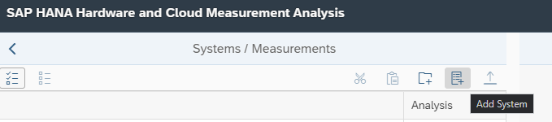
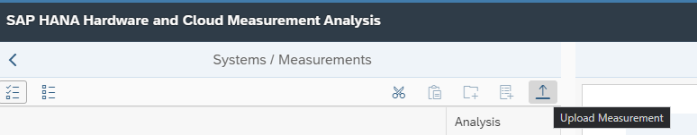

**Dernière mise à jour le 29/03/2022**

## Objectif

OVHcloud fournit du matériel certifié SAP sur lequel construire une solution SAP.

**Ce guide fournit des instructions générales sur la préparation d'un serveur SUSE Linux Enterprise Server (SLES), pour des applications SAP hébergées sur du matériel OVHcloud, afin d'installer une solution SAP HANA.**

> [!warning]
>
> Bien que les éléments contenus dans ce guide aient été formulés avec toute la vigilance requise, OVHcloud ne garantit pas et ne déclare pas que les éléments contenus dans ce guide constituent un guide officiel SAP.
>
> Toutes les tâches d'intégration technique/d'installation/d'administration des solutions SAP doivent être validées par un professionnel SAP.

## Architecture système

### Prérequis

- Un accès à l’[espace client OVHcloud](https://www.ovh.com/auth/?action=gotomanager&from=https://www.ovh.com/fr/&ovhSubsidiary=fr)
- un [serveur dédié HGR-HCI Baremetal](https://www.ovhcloud.com/fr/bare-metal/high-grade/).
- une installation de SLES15 SP3 for SAP Applications

#### Installation de l'OS

Pour déployer votre image cloud-ready SLES for SAP sur un serveur bare-metal, suivez notre guide « [Comment utiliser la fonctionnalité Bring Your Own Image](https://docs.ovh.com/gb/en/dedicated/bringyourownimage/) ».

Vous pouvez également déployer une image ISO de SLES à travers l'IPMI : [Installation d'un Système d'Exploitation à l'aide d'IPMI](https://docs.ovh.com/fr/dedicated/utilisation-ipmi-serveurs-dedies/#installation-dun-systeme-dexploitation-a-laide-dipmi-v1)

#### Conditions générales

Il est recommandé d'appliquer la dernière mise à jour du noyau recommandée par SAP, à moins qu'il n'y ait des raisons spécifiques de ne pas le faire.

L'utilisation d'un noyau et de paquets Linux mis à jour à partir de Service Packs SLES non répertoriés dans la SAP Note 2235581 n'est pas prise en charge et invalidera la certification.

La commande 'hostname' (sans options) ne peut retourner que le nom d'hôte et non le nom de domaine complet (FQDN) .

***Pour plus de détails, voir la SAP Note 2235581***

***Pour plus de détails, voir la SAP Note 2205917***

#### SLES 15 SP3 Requirements

Voici les paramètres optimaux recommandés par SAP pour héberger une base de données SAP HANA sur SLES 15.

***Pour plus de détails, voir la SAP Note 2684254***

#### Dépôts de paquets

Après l'installation du système, assurez-vous que tous les dépôts de paquets sont correctement installés/activés :

```bash
zypper products
Refreshing service 'Basesystem_Module_15_SP3_x86_64'.
Refreshing service 'Desktop_Applications_Module_15_SP3_x86_64'.
Refreshing service 'Legacy_Module_15_SP3_x86_64'.
Refreshing service 'SAP_Applications_Module_15_SP3_x86_64'.
Refreshing service 'SUSE_Linux_Enterprise_High_Availability_Extension_15_SP3_x86_64'.
Refreshing service 'SUSE_Linux_Enterprise_Server_for_SAP_Applications_15_SP3_x86_64'.
Refreshing service 'Server_Applications_Module_15_SP3_x86_64'.
Building repository 'SLE-Module-Basesystem15-SP3-Pool' cache ...................................[done]
Retrieving repository 'SLE-Module-Basesystem15-SP3-Updates' metadata ...........................[done]
Building repository 'SLE-Module-Basesystem15-SP3-Updates' cache ................................[done]
Building repository 'SLE-Module-Desktop-Applications15-SP3-Pool' cache .........................[done]
Retrieving repository 'SLE-Module-Desktop-Applications15-SP3-Updates' metadata .................[done]
Building repository 'SLE-Module-Desktop-Applications15-SP3-Updates' cache ......................[done]
Building repository 'SLE-Module-Legacy15-SP3-Pool' cache .......................................[done]
Retrieving repository 'SLE-Module-Legacy15-SP3-Updates' metadata ...............................[done]
Building repository 'SLE-Module-Legacy15-SP3-Updates' cache ....................................[done]
Building repository 'SLE-Module-SAP-Applications15-SP3-Pool' cache .............................[done]
Retrieving repository 'SLE-Module-SAP-Applications15-SP3-Updates' metadata .....................[done]
Building repository 'SLE-Module-SAP-Applications15-SP3-Updates' cache ..........................[done]
Retrieving repository 'SLE-Product-HA15-SP3-Updates' metadata ..................................[done]
Building repository 'SLE-Product-HA15-SP3-Updates' cache .......................................[done]
Building repository 'SLE-Module-Server-Applications15-SP3-Pool' cache ..........................[done]
Retrieving repository 'SLE-Module-Server-Applications15-SP3-Updates' metadata ..................[done]
Building repository 'SLE-Module-Server-Applications15-SP3-Updates' cache .......................[done]
Loading repository data...
Reading installed packages...
S  | Repository                                 | Internal Name                   | Name                                                     | Version | Arch   | Is Base
---+--------------------------------------------+---------------------------------+----------------------------------------------------------+---------+--------+--------
i+ | SLE-Module-Basesystem15-SP3-Pool           | sle-module-basesystem           | Basesystem Module                                        | 15.3-0  | x86_64 | No
i+ | SLE-Module-Desktop-Applications15-SP3-Pool | sle-module-desktop-applications | Desktop Applications Module                              | 15.3-0  | x86_64 | No
i+ | SLE-Module-Legacy15-SP3-Pool               | sle-module-legacy               | Legacy Module                                            | 15.3-0  | x86_64 | No
i+ | SLE-Module-SAP-Applications15-SP3-Pool     | sle-module-sap-applications     | SAP Applications Module                                  | 15.3-0  | x86_64 | No
i+ | SLE-Module-Server-Applications15-SP3-Pool  | sle-module-server-applications  | Server Applications Module                               | 15.3-0  | x86_64 | No
i+ | SLE-Product-HA15-SP3-Pool                  | sle-ha                          | SUSE Linux Enterprise High Availability Extension 15 SP3 | 15.3-0  | x86_64 | No
i  | SLE-Product-SLES_SAP15-SP3-Pool            | SLES_SAP                        | SUSE Linux Enterprise Server for SAP Applications 15 SP3 | 15.3-0  | x86_64 | Yes
```

#### Service UUID

Le service UUID est obligatoire et permet de générer des UUID temporels dont l’unicité est garantie. Ceci est nécessaire pour les applications SAP.

Pour l'installer :

```bash
zypper install uuid
```

Après l'installation, assurez-vous que le socket est activé et démarré :

```bash
systemctl status uuidd.socket
uuidd.socket - UUID daemon activation socket
     Loaded: loaded (/usr/lib/systemd/system/uuidd.socket; enabled; vendor preset: enabled)
     Active: active (running) since Wed 2021-10-20 16:53:54 CEST; 1 weeks 6 days ago
   Triggers: ● uuidd.service
     Listen: /run/uuidd/request (Stream)
     CGroup: /system.slice/uuidd.socket
Oct 20 16:53:54 systemd[1]: Listening on UUID daemon activation socket.
```

Si vous ne voyez pas `Active: active (running) since ...`, vous pouvez démarrer le socket manuellement :

```bash
systemctl start uuidd.socket
```

Les versions récentes de sapconf et saptune se chargent de cette étape.

***Pour plus de détails, voir SAP Note 1275776 - Linux: Preparing SLES for SAP environments.***

#### Paquets et librairies

Assurez-vous que les paquets suivants sont correctement installés :

- libssh2-1
- libopenssl-1_0
- saptune (si vous souhaitez utiliser l’outil SAP)

***NB : Le dépôt de paquets SLE-Module-Legacy15-SP3 est requis pour installer ces paquets.***

```bash
zypper search -i openssl- libssh saptune

S | Name          | Summary                                                      | Type
--+---------------+--------------------------------------------------------------+--------
i | libssh2-1     | A library implementing the SSH2 protocol                     | package
i | libssh4       | SSH library                                                  | package
i | openssl-1_1   | Secure Sockets and Transport Layer Security                  | package
i | saptune       | Comprehensive system tuning management for SAP solutions     | package
i | yast2-saptune | An alternative and minimal interface for configuring saptune | package
```

Si un paquet est manquant, vous pouvez utiliser la commande suivante pour l'installer :

```bash
zypper install nom_du_paquet
```

### Réglages GRUB/Noyau

Pour les réglages GRUB et noyau Linux, vous pouvez choisir entre deux méthodes de configuration :

- Réglage automatique à l'aide d'un outil SAP
- Réglage manuel

Nous allons aborder les deux méthodes dans ce guide.

**NB : Les exigences de réglages peuvent changer à chaque nouvelle sortie de version SP/Solution. Veuillez vous assurer de suivre les SAP Notes et appliquer ces exigences en conséquence.**

#### Utilisation de saptune

Saptune est un outil de configuration permettant de préparer un système à exécuter des charges de travail SAP en mettant en œuvre les recommandations de diverses notes SAP.

```bash
#Désactiver sapconf pour éviter les conflits
systemctl disable sapconf
#Lister la les solutions offertes par saptune
saptune solution list
#Appliquer la solution HANA
saptune solution apply HANA
#Démarrer le daemon saptune
saptune daemon start
#Vérifier la bonne application de la solution saptune
saptune solution verify
#Output:
The running system is currently well-tuned according to all of the enabled notes.
```

Lorsque vous utilisez sapconf ou saptune, vérifiez que les paramètres gérés par ces outils n'ont pas été configurés ailleurs (ex: paramètres de boot, sysctl.conf, etc.).

Un conflit de configuration peut entraîner un comportement incohérent du système et rend le débogage très difficile.

**Pour plus de détails, voir SAP Note 1275776**

#### Réglage manuel

##### **Désactiver l'équilibrage autoNUMA**

SAP HANA est une base de données compatible NUMA (accès mémoire non uniforme).<br>
Ainsi, la solution ne s'appuie pas sur les fonctionnalités du noyau Linux pour optimiser automatiquement l'utilisation de NUMA.
En fonction de la charge de travail, il peut être avantageux de désactiver l'équilibrage automatique des NUMA (autoNUMA).

Afin de désactiver définitivement autoNUMA, soit :

<ol start="1">
  <li>Editez /etc/default/grub : </li>
</ol>

Recherchez la ligne commençant par `GRUB_CMDLINE_LINUX_DEFAULT` et ajoutez à cette ligne :

```bash
numa_balancing=disable
```

Enregistrez vos modifications et exécutez :

```bash
grub2-mkconfig -o /boot/grub2/grub.cfg
```

Après un redémarrage, l'autoNUMA sera désactivé.

**Ou :**

<ol start="2">
  <li>Utilisez le bootloader YaST: </li>
</ol>

```bash
yast bootloader
```

Choisissez l'onglet `Kernel Parameters` (ALT-k) et modifiez la section `Optional Commandline Parameters` en y ajoutant :

```bash
numa_balancing=disable
```

##### **CPU Power Saving**

<ol start="1">
  <li>Vérifiez que le pilote recommandé est activé et que le mode sans danger pour l'alimentation du processeur est activé. Exécutez la commande suivante en tant qu'utilisateur root dans le shell Linux : </li>
</ol>

```bash
cat /sys/devices/system/cpu/cpuidle/current_driver
```

La valeur correcte pour le pilote cpuidle doit être `acpi_idle`. Si c'est bien le cas, aucune autre étape n'est requise. Dans le cas où la sortie affiche la mauvaise valeur `intel_idle`, suivez les étapes de la SAP Note.

<ol start="2">
  <li>Vérifiez le mode d'économie d'énergie du processeur en exécutant la commande suivante : </li>
</ol>

```bash
cat /sys/devices/system/cpu/cpu*/cpufreq/scaling_governor
```

La valeur correcte pour le mode d'économie d'énergie du processeur doit être `performance`.

Si la sortie affiche au moins une ligne avec "ondemand", suivez les étapes du système SAP Note 1890444 - Slow HANA en raison du mode économie d'énergie du processeur.

##### **Désactiver les transparent hugepages**

Avec SLES 15, l'utilisation de « transparent hugepages » (THP) est généralement activée pour le noyau Linux.

Le protocole THP permet la gestion de plusieurs pages sous forme de pages volumineuses pour réduire l'empreinte du tampon TLB (Translation Lookaside Buffer), dans des situations où cela pourrait être utile.

En raison de la façon particulière dont la mémoire est gérée par HANA, l'utilisation de THP peut conduire à des situations de gel du système et des dégradations.

Pour vérifier la configuration, exécutez la commande suivante :

```bash
cat /sys/kernel/mm/transparent_hugepage/enabled
```

Sa sortie devrait se lire comme suit :

```bash
always madvise [never]
```

Si ce n'est pas le cas, vous pouvez désactiver l'utilisation du THP en utilisant la commande suivante :

```bash
echo never > /sys/kernel/mm/transparent_hugepage/enabled
```

Il n'est pas nécessaire d'arrêter la base de données pour appliquer cette configuration. Ce paramètre est alors valide jusqu'au prochain démarrage du système.

Afin de rendre la désactivation de l'utilisation du THP permanente, vous disposez des options suivantes :

<ol start="1">
<li>Editez /etc/default/grub : </li>
</ol>

Recherchez la ligne commençant par `GRUB_CMDLINE_LINUX_DEFAULT` et ajoutez à cette ligne :

```bash
transparent_hugepage=never
```

Enregistrez vos modifications et exécutez :

```bash
grub2-mkconfig -o /boot/grub2/grub.cfg
```

Après un redémarrage, l'utilisation du THP sera désactivée.

**Ou**

<ol start="2">
<li>Utilisez le bootloader YaST, exécutez : </li>
</ol>

```bash
yast bootloader
```

Choisissez l'onglet `Kernel Parameters` (ALT-k) et éditez la section « Optional Commandline Parameters » en ajoutant `transparent_hugepage=never`.

Pour activer cette modification, un redémarrage du système est nécessaire.

Dans un environnement scale-out, ces changements doivent être effectués sur chaque serveur de l'environnement.

Dans le cas où vous avez déjà une instance HANA en cours d'exécution, le redémarrage du serveur ne doit être effectué que lorsqu'un serveur de secours est configuré. Ne redémarrez pas tous les serveurs en même temps.

Pour les instances à noeud unique, un temps d'arrêt doit être pris en compte.

##### **Configurer les C-States pour une latence plus faible (s'applique uniquement aux systèmes basés sur Intel)**

Les CPUs modernes mettent en place des états d’inactivité pour économiser l’énergie ou pour permettre aux CPUs voisins de fonctionner avec une fréquence d’horloge plus élevée quand il n’y a pas de travail à faire.<br>
D'une part, le temps supplémentaire nécessaire pour arrêter et redémarrer l'exécution du code peut entraîner des dégradations de performances.<br>
D’autre part, interdire aux CPUs d’entrer en état d’inactivité peut limiter la fréquence de fonctionnement des CPUs voisins. Les états inactifs peuvent être affectés par les paramètres du BIOS.

Un équilibre recommandé peut être atteint en limitant la latence de réveil des états d’économie d’énergie du processeur (états C) à 70 microsecondes (usecs), ce qui limite les états d’inactivité au `light sleep`, en choisissant l’une des options suivantes :

Si vous n'utilisez ni sapconf ni saptune, vous pouvez limiter les états C à `very light sleep` en définissant les paramètres de noyau suivants :

```bash
intel_idle.max_cstate=1 processor.max_cstate=1
```

Pour définir définitivement ce paramètre, utilisez l'une des options suivantes :

<ol start="1">
  <li>Modifiez /etc/default/grub : </li>
</ol>

Recherchez la ligne commençant par `GRUB_CMDLINE_LINUX_DEFAULT` et ajoutez à cette ligne `intel_idle.max_cstate=1 processor.max_cstate=1`

Enregistrez vos modifications et exécutez :

```bash
grub2-mkconfig -o /boot/grub2/grub.cfg
```

Après un redémarrage, l'utilisation des états C2 et supérieurs sera désactivée.

**Ou**

<ol start="2">
<li>Utilisez le bootloader YaST, exécutez : </li>
</ol>

```bash
yast bootloader
```

Choisissez l'onglet « Kernel Parameters » (ALT-k) et éditez la section « Optional Commandline Parameters » en ajoutant `intel_idle.max_cstate=1 processor.max_cstate=1`

Pour activer cette modification, un redémarrage du système est nécessaire.

Dans un environnement évolutif, ces changements doivent être effectués sur chaque serveur du paysage.

Dans le cas où vous avez déjà une instance HANA en cours d'exécution, le redémarrage du serveur ne doit être effectué que lorsqu'un serveur de secours est configuré. Ne redémarrez pas tous les serveurs en même temps. Pour les instances à noeud unique, un temps d'arrêt doit être pris en compte.

##### **Fusion d'échantillons de noyau (KSM)**

La fonctionnalité KSM permet de réduire la surcharge de la mémoire physique en détectant les pages mémoire avec un contenu identique.<br>La fonctionnalité est utile pour les VMs, mais le compromis espace-temps ne paie pas pour les instances HDB non exécutées sur les VMs.<br>
Par défaut, la fusion d'échantillons de noyau est généralement désactivée.

Si vous avez néanmoins activé KSM, SAP vous conseille de le désactiver :

<ol start="1">
  <li>Ajoutez la commande suivante à un script exécuté au démarrage du système, tel que /etc/init.d/boot.local :</li>
</ol>

```bash
echo 0 > /sys/kernel/mm/ksm/run
```

***Pour plus de détails, voir SAP Note 1275776 - Linux : Préparation de SLES pour les environnements SAP***

#### Swap

Sur un système SAP, l'utilisation de l'espace swap Linux est obligatoire.

SAP recommande de mettre en place un espace de swap dédié sur un stockage rapide, comme un disque dur interne, une grappe RAID, un disque SSD ou une LUN dans un SAN.

La valeur recommandée pour l'espace de swap est 2 GB.

***Pour plus de détails, voir SAP Note 1999997 - FAQ : Mémoire SAP HANA***

#### Paramètres NTP

NTP est un protocole réseau utilisé pour la synchronisation d'horloge entre les systèmes.

Vous pouvez utiliser votre propre serveur NTP ou utiliser le serveur NTP OVHcloud librement accessible :

```bash
#server:port
ntp.ovh.net:123
```

- Pour définir le serveur NTP en utilisant YaST :

  1. Ouvrez le module YaST NTP (Network Services > NTP Configuration)
  2. Spécifiez quand démarrer le service NTP
  3. Ajoutez un nouveau serveur de temps
  4. Testez la synchronisation
  5. Confirmez avec OK (F10)

## Architecture de stockage

### Objectif

Afin que la base de données puisse toujours être restaurée à son état valide le plus récent, les modifications apportées aux données de la base de données SAP HANA sont régulièrement copiées sur disque, les journaux contenant les modifications apportées aux données et certains événements de transaction sont également enregistrés régulièrement sur  disque.

Par défaut, le chemin d'accès aux partitions de volume de données est `/usr/sap/<SID>/SYS/global/hdb/data`. Cependant, vous pouvez également ajouter des partitions dans un chemin spécifié de votre choix.

Les données et les logs du système sont stockés dans des volumes.

Le gestionnaire du cycle de vie de la base de données SAP HANA (HDBLCM) nécessite certains systèmes de fichiers pour installer correctement un système SAP HANA.

Les systèmes de fichiers doivent être créés et montés avant l'installation de la base de données.

### Configuration LVM

#### Dimensionnement du stockage

**Exemple d'organisation de volumes logiques :**

|Point de montage|Taille|Stripes (Bandes)|Description|
|---|---|---|---|
|/|10 - 50GB| |root|
|/usr/sap|50 Go|1|Chemin d'accès aux répertoires d'instances locaux du système SAP|
|/hana/data|2x RAM|Tous les disques (256KB)|Chemin d'accès par défaut vers le répertoire de données|
|/hana/log|0.5x RAM|Tous les disques (256KB)|Chemin d'accès par défaut vers le répertoire de logs|
|/hana/backup|2,5x RAM|1|Chemin d'accès aux backups HANA-db (data+log)|
|/hana/shared|1x RAM|1|Point de montage utilisé pour les fichiers partagés entre tous les hosts d'un système SAP HANA. Ce répertoire doit être accessible à chacun des serveurs du cluster SAP HANA|

> [!warning]
>
> - Il est important de vous assurer que suffisamment d'espace libre soit disponible au niveau du système de fichiers pour les sauvegardes. Si l'espace est insuffisant, la sauvegarde échouera.
>
> C'est pourquoi, avant de sauvegarder la base de données, vous devez évaluer avec soin l'espace qui sera nécessaire dans la destination de sauvegarde et superviser la destination cible.
>
> - Ne supprimez pas les fichiers de données ou les fichiers journaux à l'aide des outils du système d'exploitation, car cela corrompra la base de données.
>

#### Configuration manuelle

<ol start="1">
  <li>Vérifiez que tous les disques sont montés : </li>
</ol>

```bash
lsblk
    NAME             MAJ:MIN RM  SIZE RO TYPE MOUNTPOINT
    sda                8:0    0  100G  0 disk
    ├─sda1             8:1    0  256M  0 part /boot/efi
    └─sda2             8:2    0   82G  0 part
    sdb                8:16   0  250G  0 disk
    sdc                8:32   0  250G  0 disk
```

<ol start="2">
  <li>Créez les volumes physiques : </li>
</ol>

```bash
pvcreate /dev/sdb /dev/sdc
    Physical volume "/dev/sdb" successfully created.
    Physical volume "/dev/sdc" successfully created.
```

<ol start="3">
  <li>Exécutez la commande pvs pour vous assurer que les volumes sont correctement créés : </li>
</ol>

```bash
pvs
    PV         VG     Fmt  Attr PSize   PFree
    /dev/sda2  vgsys  lvm2 a--   82.00g  50.00g
    /dev/sdb   vghana lvm2 a--  250.00g 250.00g
    /dev/sdc   vghana lvm2 a--  250.00g 250.00g
```

<ol start="4">
<li>Initialisez les groupes de volumes : </li>
</ol>

```bash
vgcreate vghana /dev/sdb /dev/sdc
    Volume group "vghana" successfully created
```

<ol start="5">
  <li>Exécutez la commande 'vgs' pour vérifier si les groupes de volumes sont correctement créés : </li>
</ol>

```bash
vgs
    VG     #PV #LV #SN Attr   VSize   VFree
    vghana   2   0   0 wz--n- 499.99g 499.99g
```

<ol start="6">
  <li>Initialisez les volumes logiques : </li>
</ol>

```bash
lvcreate -i 2 -I 256 -L XXG -n lvhanadata vghana
lvcreate -i 2 -I 256 -L XXG -n lvhanalog vghana
lvcreate -i 1 -I 256 -L XXG -n lvhanabackup vghana
lvcreate -i 1 -I 256 -L XXG -n lvhanashared vghana
lvcreate -i 1 -I 256 -L XXG -n lvusrsap vgsys
```

***NB : Remplacez "xx" par la taille du volume en GB***

<ol start="7">
  <li>Créez les répertoires : </li>
</ol>

```bash
mkdir -p /hana/data /hana/log /hana/shared /hana/backup /usr/sap
```

<ol start="8">
<li>Construisez le système de fichiers XFS sur les volumes logiques : </li>
</ol>

```bash
mkfs.xfs /dev/mapper/vghana-lvhanadata
mkfs.xfs /dev/mapper/vghana-lvhanalog
mkfs.xfs /dev/mapper/vghana-lvhanabackup
mkfs.xfs /dev/mapper/vghana-lvhanashared
mkfs.xfs /dev/mapper/vgsys-lvusrsap
```

<ol start="9">
<li>Ajoutez les entrées de montage de volume logique dans /etc/fstab : </li>
</ol>

```bash
echo "/dev/mapper/vghana-lvhanadata /hana/data xfs noatime,nodiratime,logbsize=256k 0 0" >> /etc/fstab
echo "/dev/mapper/vghana-lvhanalog /hana/log xfs noatime,nodiratime,logbsize=256k 0 0" >> /etc/fstab
echo "/dev/mapper/vghana-lvhanabackup /hana/backup xfs noatime,nodiratime,logbsize=256k 0 0" >> /etc/fstab
echo "/dev/mapper/vghana-lvhanashared /hana/shared xfs noatime,nodiratime,logbsize=256k 0 0" >> /etc/fstab
echo "/dev/mapper/vgsys-lvusrsap /usr/sap xfs noatime,nodiratime,logbsize=256k 0 0" >> /etc/fstab
```

## Architecture réseau

### Présentation

SAP recommande une communication réseau dédiée de 10 Gbit/s entre le paysage SAP HANA et le système source pour une réplication efficace des données.

Un système source peut être un système ERP, à partir duquel les données sont répliquées vers l'appliance SAP HANA (scénario de réplication), ou un SAP NetWeaver Application Server ABAP, sur la base duquel un SAP NetWeaver Business Warehouse, alimenté par SAP HANA, est exécuté sur l'appliance SAP HANA.

Dans les environnements SAP HANA Scale Out, les noeuds et les services doivent communiquer entre eux à des fins diverses.
Dans les systèmes à noeud unique, les services doivent pouvoir communiquer entre eux.

### Flux réseau

|Adresse source|Port source|Adresse de destination|Port de destination|Protocole|Commentaires|
|--------------|-----------|----------------------|-------------------|---------|------------|
|Serveur d'administration|tout|SAP HANA|22|TCP| sshd (IN)|
|Clients de base de données|tout|SAP HANA|30015|Port d'accès TCP|SQL/MDX pour l'accès à la base de données standard. L'accès à ces ports doit être activé pour tous les clients de base de données, par exemple les applications, les serveurs d'applications, les clients d'utilisateurs finaux et SAP HANA Studio.|
|Accès à la base de données|tout|SAP HANA|30017|Port d'accès TCP|SQL/MDX pour l'accès à la base de données standard. L'accès à ces ports doit être activé pour tous les clients de base de données, par exemple les applications, les serveurs d'applications, les clients d'utilisateurs finaux et SAP HANA Studio.|
|NTP|tout|SAP HANA|123|UDP|Time sync (IN)|
|DNS|53|SAP HANA|tout|TCP/UDP|résolution DNS (IN)|
|SAP HANA|tout|DNS Server|53|TCP/UDP|Résolution DNS (OUT)|

> [!primary]
> Cette liste fournit les ports de base utilisés pour SAP HANA.
>
> Vous pouvez trouver la liste complète de tous les ports TCP/IP requis par HANA et tous les autres produits SAP [ici](https://help.sap.com/viewer/ports){.external}.
>

> [!primary]
> Pour la base de données système (SYSTEMDB), le port se présente de la manière suivante : 3`numéro-instance`13.<br>
> Par exemple, 30013 (si l'instance est 00).
>
> Si vous installez un nouveau système, vous obtenez automatiquement un tenant, à moins que vous n'installiez un système vide. Le port du premier tenant créé automatiquement prend généralement la forme suivante : 3<numéro_instance>15. Par exemple, 30015 (si l'instance est 00).
>

## Post-déploiement

### SAP HANA Hardware And Cloud Measurement Tools

#### Présentation

L'outil SAP HANA Hardware and Cloud Measurement Tools permet aux clients et partenaires d'optimiser leur matériel ou leurs systèmes cloud avant de déployer SAP HANA ou de demander la certification SAP HANA.

***Pour plus de détails, voir la note SAP 2493172 - SAP HANA Hardware and Cloud Measurement Tools et le [SAP HCMT Guide](https://help.sap.com/doc/af47cce52aaa4ed4992d42d3cf319d62/2.0/en-US/How_to_Use_the_SAP_HANA_Hardware_and_Cloud_Measurement_Tools_en.pdf){.external}***

#### Prérequis

- Vous disposez d'un S-user valide pour télécharger l'outil.
- Vous disposez de la dernière version de HCMT, voir SAP Note 2493172
- Vous disposez d’au moins 20 Go d’espace de stockage libre à l’endroit où les données SAP HANA peuvent être placées pendant le test.
- Assurez-vous que la dernière version de l'outil d'archivage SAPCAR est disponible sur le système d'installation. Pour plus d'informations sur SAPCAR, voir SAP Note 2452588
- Port TCP/50000 ouvert

#### Procédure de test

<ol start="1">
  <li>Téléchargez l'outil de mesure du matériel et du cloud SAP HANA à partir du <a class="external-link" href="https://launchpad.support.sap.com/#/softwarecenter" rel="nofollow">portail de support SAP</a></li>
</ol>

***L'outil doit être affiché comme suit : HANA HW CLOUD OPTIM TOOLS 2.0***

<ol start="2">
  <li>Sélectionnez la version "LINUX ON X86_64 64BIT".</li>
  <li>Enregistrez l'archive de téléchargement dans le répertoire dans lequel l'outil doit être installé.</li>
  <li>Extrayez l'archive à l'aide de SAPCAR.</li>
</ol>

```bash
sapcar -xvf HCMT_058_0-80003261.SAR
```

<ol start="5">
  <li>Installez l'outil sur le système que vous prévoyez d'analyser : </li>
</ol>

```bash
hcmtsetup
```

<ol start="6">
  <li>Une fois l'installation terminée, la structure de dossiers suivante est disponible : </li>
</ol>

|Nom du dossier|Contenu|
|---|---|
|config|Plans d'exécution|
|lib|Binaires|
|hcmtplugins|Plug-ins de test|

<ol start="7">
  <li>Démarrez le serveur d'écoute hcmt : </li>
</ol>

```bash
hcmt -v -S
```

<ol start="8">
  <li>Démarrez la mesure pour HANA en utilisant : </li>
</ol>

```bash
hcmt -v -p config/executionplan.json
```

Par défaut, vous aurez le choix entre deux plans d'exécution :

- executionplan.json - Plan d'exécution par défaut qui vous aide à vérifier si les KPIs de certification SAP HANA sont respectés.
- full_executionplan.json - Effectue les mêmes tests que le plan d'exécution par défaut, mais à un taux de répétition de test plus élevé et donc une durée de test plus longue. Ce test est utilisé pour la certification SAP HANA.

> [!primary]
> Ce test peut prendre jusqu'à 12 heures.
>

#### Interprétation des tests

Après avoir exécuté les tests hcmt, le programme va générer une archive zip 'hcmtresult'.

Cette archive contient tous les résultats des mesures et sera ensuite interprétée sur le site Web SAP HANA Hardware and Cloud Measurement Analysis.

Pour ce faire :

<ol start="1">
  <li>Connectez-vous <a href=https://hotui-supportportal.dispatcher.hana.ondemand.com/index.html">au portail SAP</a></li>
</ol>

<ol start="2">
  <li>Cliquez sur « Manage Systems » (Gérer les systèmes) : </li>
</ol>

{.thumbnail}

<ol start="3">
  <li>Ajoutez un système : </li>
</ol>

{.thumbnail}

<ol start="4">
  <li>Téléchargez les résultats des mesures (archive zip) : </li>
</ol>

{.thumbnail}

<ol start="5">
  <li>Interprétez les résultats.</li>
</ol>

## Aller plus loin

Documentation générale sur [comment installer SAP HANA sur un système SLES OVHcloud](../sap-installation-sap-hana-sles).