## Introduction 

The hubiC service is based on OpenStack Swift storage clusters. For this reason, you can access it in different ways. Although using the hubic.com website is the recommended method, you can still use your service by connecting via third-party tools.

**Find out three methods of connecting to a hubiC cluster: Cyberduck (Swift client), Mountain Duck (network disk), or an SVFS mount.**

> [!warning]
> This guide will show you how to use one or more OVH solutions with external tools, and the changes you need to make in specific contexts. You may need to adapt the instructions according to your situation. 
>
If you experience any difficulties carrying out these operations, please get in touch with a specialist service provider and/or discuss your issues with our community on https://community.ovh.com/en/. OVH cannot assist you in this regard. 
>

## Requirements

### What you need to know

- how to install an application on your local machine (for the Cyberduck and Mountain Duck solutions)
- how to connect via SSH (for SVFS mounting)

### What you need to have

- an active hubiC account 
- a computer with a Windows, macOS or GNU/Linux operating system
- a working internet connection
- a valid licence for using proprietary paid software (e.g. Mountain Duck)


## Instructions 


### Decide which connection method is best suited to your situation.

Depending on your operating system and technical knowledge, you may prefer a particular connection method. 

- If you want to use a Windows or macOS solution and configure it yourself, you can read the part of this tutorial named [Connect to a hubiC cluster via Cyberduck](./#connect-to-a-hubic-cluster-via-cyberduck) to connect to a hubiC cluster via the Swift client.  

- If you use an all-in-one solution for Windows or macOS via the network disk, with very few configurations to carry out, please read the section of this tutorial named [Connect to a hubiC cluster via Mountain Duck](./#connect-to-a-hubic-cluster-via-mountain-duck) to connect to a hubiC cluster via paid software.

- If you are using a GNU/Linux operating system, read the section of this tutorial named [Connect to a hubiC cluster via SVFS](./#connect-to-a-hubic-cluster-via-svfs) to connect to a hubiC cluster via an SVFS mount.


## Connect to a hubiC cluster via Cyberduck.

You can connect to a hubiC cluster using a Swift client. In this tutorial, we will use Cyberduck, which is available on Windows and macOS platforms. 


### Step 1: Download and install Cyberduck.

Download the latest Cyberduck version for your operating system (Windows or macOS) via [this link](https://cyberduck.io/download/){.external}. 

This application is free, and can be used without any restrictions. Once you have installed the software, launch it to check that the installation has been carried out successfully, then **exit it**.


### Step 2: Get your authentication data. 

You will need to create and enter a specific connection profile in order to connect to hubiC via Cyberduck.

This profile is a file that you can download by clicking [here](https://svn.cyberduck.io/trunk/profiles/hubiC.cyberduckprofile){.external}.

Open the file, which will launch Cyberduck, along with a configuration window.


### Step 3: Authorise Cyberduck to connect to your hubiC account.

In the configuration window, enter the email address for connecting to your hubiC account in the “Email” field.

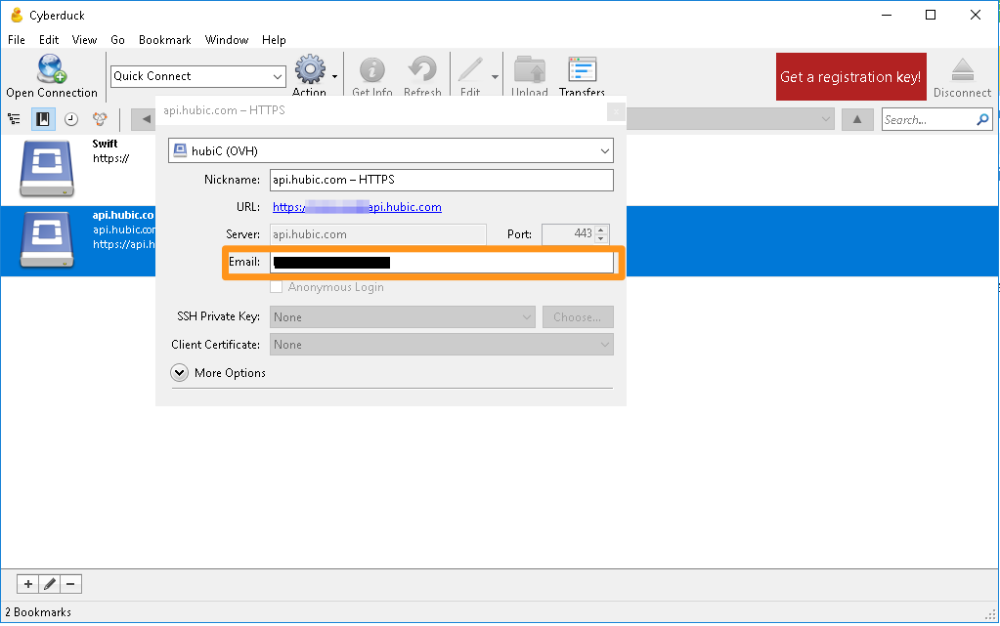{.thumbnail}

In the Cyberduck application, double-click on the hard disk icon next to where your email address is indicated. 

A webpage should open, prompting you to enter your hubiC connection details. Enter the information requested, then click `Accept`{.action}. This action will authorise Cyberduck to connect to hubiC.

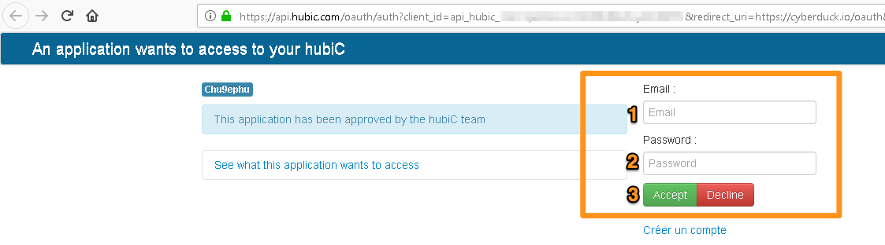{.thumbnail}

Once you have done this, you will receive an authorisation code, validating this access.

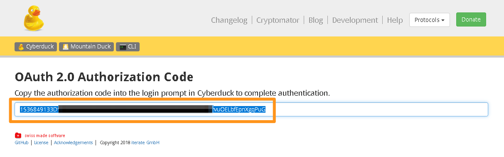{.thumbnail}

Copy and paste this into Cyberduck, in the “Authorization code” section, then click `Continue`{.action}. 

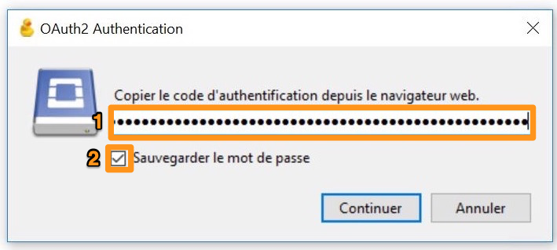{.thumbnail}

Once the window closes, click `Login`{.action}.

### Step 4: Connect to your hubiC account via Cyberduck.

Once you go back to the Cyberduck software, you can connect to your hubiC cluster at any time by double-clicking on the hard disk icon.

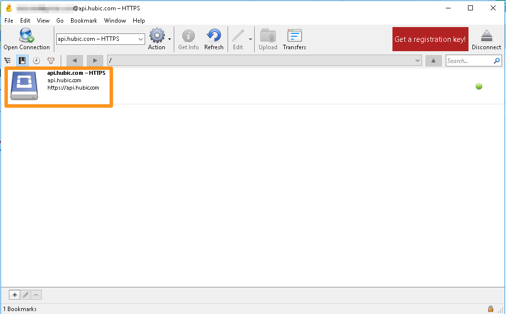{.thumbnail}

You will find your files and folders located there. 

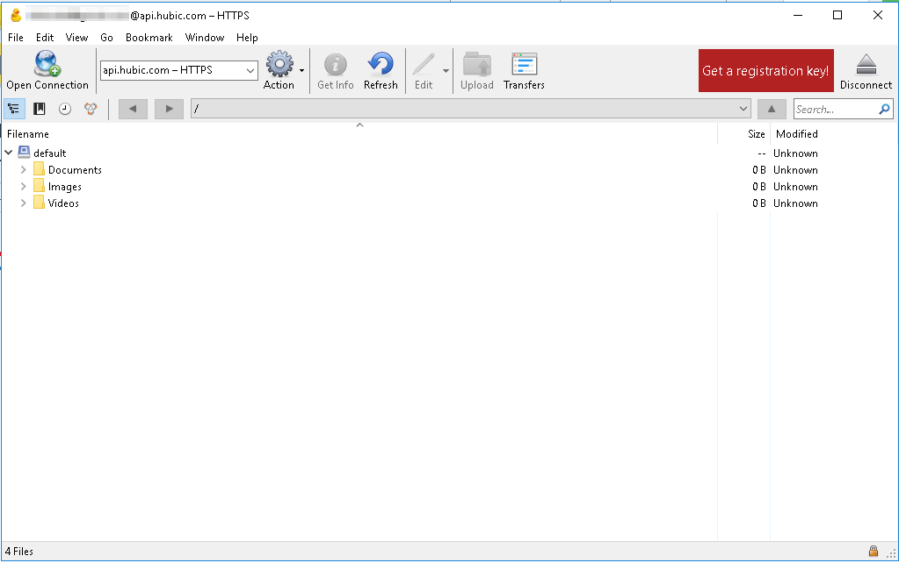{.thumbnail}

By right-clicking on a file or folder, you can access different options: clicking `download` will download the file or folder concerned, and `delete` will delete the file or folder.

> [!warning]
> 
> Do not, under any circumstances, delete the *Default* or *Default_segments* sections, because this will make your hubiC account unusable, and you will lose all of your stored data.
>

## Connect to a hubiC cluster via Mountain Duck.

Mountain Duck is a software platform for Windows and macOS. You can use it to connect to certain data storage services, like hubiC. They will be provided as network disks in your computer, and can be used in the same way. 

> [!primary]
>
> Mountain Duck is a paid application. **A trial version is available, but it does not allow connections to remain established for longer than 10 minutes.**

### Step 1: Download and install Mountain Duck.

Download the latest Mountain Duck version for your operating system via [this link](https://mountainduck.io/){.external}. Launch the installation, then enter the registration key you received when you purchased your licence.

### Step 2: Get your authentication data. 

You will need to create and enter a specific connection profile in order to connect to hubiC via Mountain Duck.

This profile is a file that you can download by clicking [here](https://svn.cyberduck.io/trunk/profiles/hubiC.cyberduckprofile){.external}.

By opening this file, hubiC should be added to the list of supported services.

### Step 3: Open a hubiC network hard disk.

Check that Mountain Duck is working properly, then right-click on the corresponding icon in the taskbar.

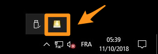{.thumbnail}

A configuration window will pop up. Select `hubiC (OVH)`{.action} in the dropdown menu.

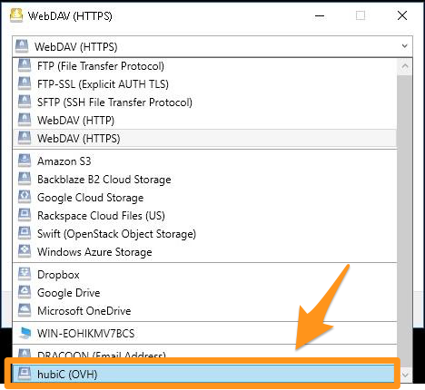{.thumbnail}

In the new window that pops up, enter your hubiC account email address in the “Email” field, then click `Connect`{.action}.

### Step 4: Authorise Mountain Duck to connect to your hubiC account.

A webpage should open, prompting you to enter your hubiC connection details. Enter the information requested, then click `Accept`{.action}. This action will authorise Mountain Duck to connect to hubiC.

{.thumbnail}

A new page will then open, providing you with an authorisation code that validates this access.

{.thumbnail}

Copy and paste it into the corresponding window.

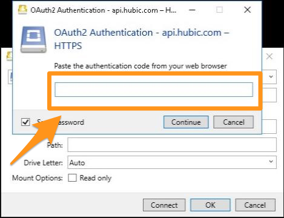{.thumbnail}

Once you have entered this code into Mountain Duck, your hubiC space will be accessible as a network reader on your computer.

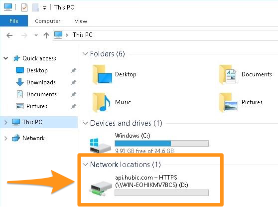{.thumbnail}

## Connect to a hubiC cluster via SVFS.

If you are using a computer with a GNU/Linux operating system (Debian in our example), you can access your hubiC space via an SVFS mount point (*Swift Virtual File System*). You can find more information on SVFS in the [project’s GitHub repository](https://github.com/ovh/svfs).

### Step 1: Install SVFS.

Connect via SSH, and retrieve the SVFS packet that is compatible with hubiC using the following command:

```sh
wget https://github.com/ovh/svfs/releases/download/v0.9.1/svfs_0.9.1_amd64.deb
```

Then start installing it:

```sh
dpkg -i svfs_0.9.1_amd64.deb
```

During the installation phase, you may encounter correspondence errors. Most of them can be corrected using the following command (for Debian and derivative systems):

```sh
apt --fix-broken install
```

You can then relaunch the installation, and should no longer encounter the same errors.

### Step 2: Configure the mount point.

Log in to [hubic.com](https://hubic.com). Click on `My account`{.action}, then `Developers`{.action}, then `Add an application`{.action}. Name it, then add the following in “Redirection domain”:

```sh
http://localhost
```

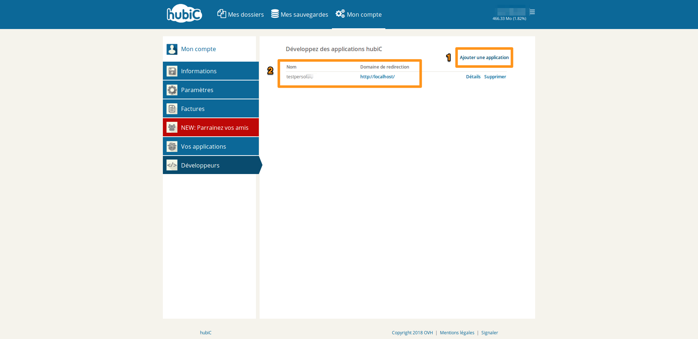{.thumbnail}

On the right of the application you have created, click `Details`{.action} and retrieve the information in the “Client ID” and “Client Secret” fields.

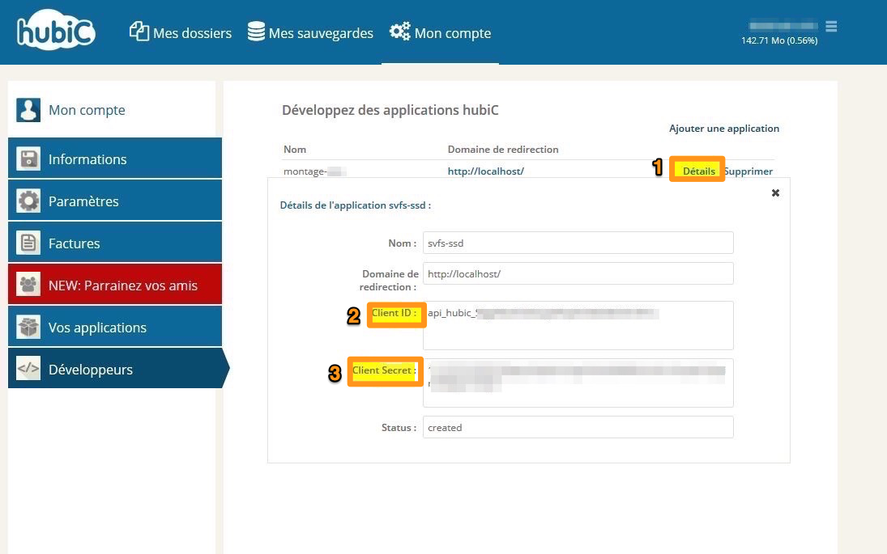{.thumbnail}

Stay connected via SSH, and enter the following command:

```ssh
hubic-application
```

Enter the information requested:

| Field name              | Information to enter               |
|---------------------------|----------------------------------------|
| Application redirect URL  | http://localhost/                      |
| Application Client ID     | The client ID retrieved earlier.     |
| Application Client Secret | The client secret retrieved earlier. |

Then fill in the following elements:

```
1. Setting scope ... OK ~> Email: /your hubic email address/ ~> Password: /your hubic password/
2. Granting access ... OK
3. Getting refresh token ... OK == Your mount options == ~> hubic_auth=xxxxxxxx ~> hubic_token=xxxxxxxx
```

### Step 3: Create the mount point.

Once you have entered all of the required information, you can create an SVFS mount point using the elements you have retrieved:

```
# sudo mount -t svfs hubic /mountpoint -o hubic_auth=<hubic_auth>,hubic_token=<hubic_token>,container=default
```

## Conclusion

You can now access your hubiC storage space without using the official application or the hubic.com website (the web application). 

Please note, however, that we still recommend accessing your data via hubic.com. OVH cannot provide you with further assistance regarding the instructions detailed above.