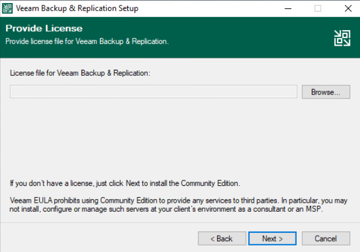
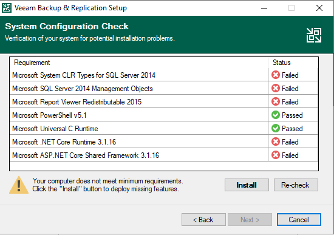
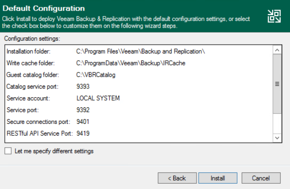
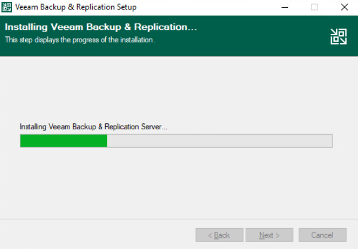
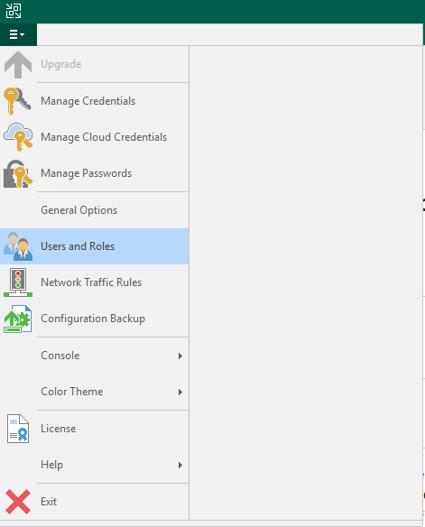
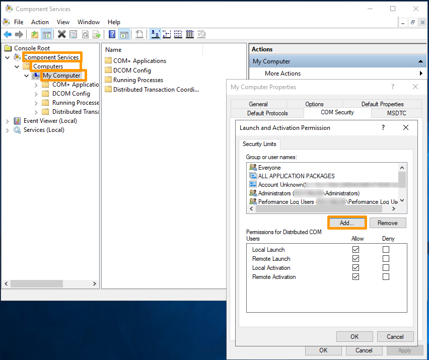
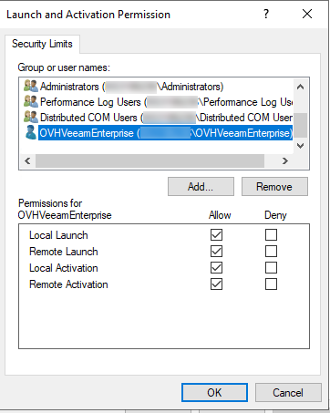
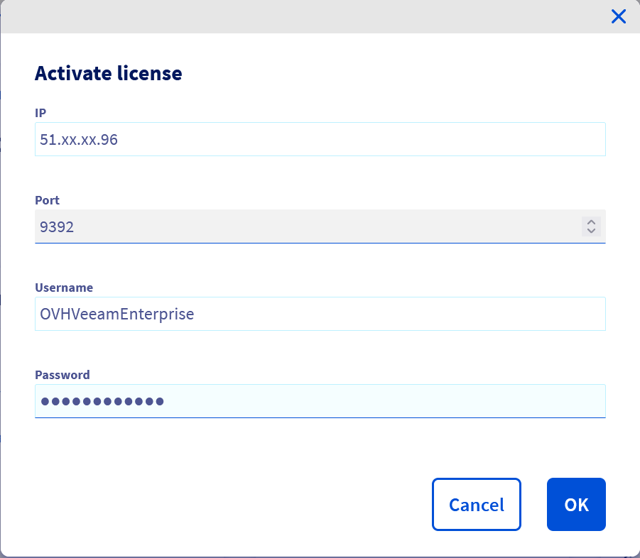

**Last updated 7th March 2022**

## Objective

Veeam Backup & Replication is a data protection software. It offers its users a wide range of options for backing up, replicating and restoring their data.

**This guide explains how to set up a Veeam Backup & Replication server, then register it with an OVHcloud Veeam Enterprise licence server.**

## Requirements

- a [Veeam Enterprise solution](https://www.ovhcloud.com/asia/storage-solutions/veeam-enterprise/){.external}
- Windows Server 2012 or a newer version

## Instructions

### Setting up Veeam Backup & Replication

Download the **Veeam Backup & Replication** solution from the [Veeam website](https://www.veeam.com/downloads.html?ad=top-sub-menu){.external}. If you do not have an account, you will need to set one up (account setup is free).

The file will appear in ISO disk image format. Once you have transferred it onto your server, select the server’s CD reader, then select the image.

On the server, you can then launch the installation wizard. Select `Veeam Backup & Replication (Install)`{.action}.

{.thumbnail}

After you have read the licence agreement, accept the terms and click `Next`{.action}.

{.thumbnail}

Click `Next`{.action} to skip the step of opening a licence file.

{.thumbnail}

In the step where you select components to install, leave everything unchanged. However, depending on your requirements, you can change the destination path. Confirm by clicking `Next`{.action}.

{.thumbnail}

The installation wizard will then carry out a requirement check. If you are working from a clean Windows installation, some components will be missing, but the installation wizard will download and install them automatically. Confirm by clicking `Next`{.action}.

{.thumbnail}

Next, wait for the missing components to be installed.

{.thumbnail}

Once the installations are complete, confirm the **Veeam Backup & Replication** setup by clicking `Next`{.action}.

{.thumbnail}

During the customisation stage of the setup, confirm the operation by clicking `Install`{.action}.

{.thumbnail}

Next, wait for the installation to complete.

{.thumbnail}

Once it is complete, exit the installation wizard by clicking `Finish`{.action}.

{.thumbnail}

You will be redirected to the launch wizard, simply close the window.

### Creating a Veeam Enterprise service account

#### Step 1: Launch a service account

You will need to generate a **complex** password.

To begin, launch Windows Powershell as an administrator.

Next, create a service account, entering these lines of command:

```powershell
New-LocalUser "OVHVeeamEnterprise" -Password (ConvertTo-SecureString -AsPlainText "P@ssword01" -Force) -Description "OVHcloud Service Account for Veeam Enterprise" -PasswordNeverExpires:$true -UserMayNotChangePassword:$true -AccountNeverExpires:$true
```

Please note that the account name and password shown here are examples, and must be replaced with your own details:

- Account name: OVHVeeamEnterprise
- Password: P@ssword01

#### Step 2: Define the service account authorisations

Launch the Veeam console.

{.thumbnail}

Check that it is in **Community Edition** mode, in the bottom right-hand corner.

{.thumbnail}

Go to the menu, and click `Users and Roles`{.action}.

{.thumbnail}

In the `Security`{.action} window, select `Add...`{.action}.

{.thumbnail}

Then, in the "Add User" window, enter the service account name you have created. Select the **Veeam Backup Administrator** role and confirm by clicking `OK`{.action}.

{.thumbnail}

If you go back to the **Security** window, you can check that the account has been defined properly.

{.thumbnail}

#### Launch and Activation Permissions

The OVHVeeamEnterprise user is only accessible locally, so it is necessary to add permissions in the Windows graphical user interface to enable the remote connection.

Via the graphical user interface:

1. In your Windows search bar, type `Component Services`{.action} and launch the service.
2. On the left menu and following the tree structure, click on `Component Services`{.action}, then on `Computers`{.action}, then on `My Computer`{.action}.
3. On the right, under the `Actions`{.action} tab, click on `More Actions`{.action}, then on `Properties`{.action}.
4. Go to `COM Security`{.action}, underneath the second section `Launch and Activation Permissions`{.action}, click on `Edit Limits`{.action}. Next, click on `Add...`{.action}.

{.thumbnail}

<ol start="5">
  <li>Click on <code class="action">Advanced</code> to locate the previously added service account and click on <code class="action">Find Now</code>. Select the <code class="action">OVHVeeamEnterprise</code> user from the list of users.</li>
</ol>

{.thumbnail}

<ol start="6">
  <li>Click on <code class="action">OK</code> to confirm the selection, and on <code class="action">OK</code> to validate. Next, enable all permissions on the <code class="action">OVHVeeamEnterprise</code> user.</li>
</ol>

{.thumbnail}

<ol start="7">
  <li>Click on <code class="action">OK</code> to confirm and on <code class="action">Apply</code> to validate the changes.</li>
</ol>

Your OVHVeeamEnterprise user is now accessible locally and remotely.

#### Step 3: Register the Veeam Backup & Replication server

##### **Using the OVHcloud Control Panel**

In your OVHcloud Control Panel, open the `Hosted Private Cloud`{.action} section and select your service labelled **backupserverenterprise** from `Platforms and services`{.action}. On this page, click on `Activate license`{.action} in the `Shortcuts` box.

{.thumbnail}

In the new window, enter the following information:

- The public IP address through which your **Veeam Backup & Replication** server can be reached.
- The port of your **Veeam Backup & Replication** server (usually **9392/TCP**).
- The login credentials you have created previously (user name and password).

Validate by clicking `OK`{.action}.

{.thumbnail}

Once the activation is complete, you will find the main information on the service page.

{.thumbnail}


##### **Using the OVHcloud API**

First, retrieve your serviceName:

> [!api]
>
> @api {GET} /veeam/veeamEnterprise
>

Then register it:

> [!api]
>
> @api {POST} /veeam/veeamEnterprise/{serviceName}/register
>

You will need the following information:

 * the public IP address that can be used to contact your **Veeam Backup & Replication** server
 * your server’s **Veeam Backup & Replication** port (usually **9392/TCP**)
 * the login for the account you have just created
 * the password for your service account

You can retrieve the public IP used by Veeam Enterprise to contact your **Veeam Backup & Replication** server via:

> [!api]
>
> @api {GET} /veeam/veeamEnterprise/{serviceName}
>

#### Step 4: Verify the registration

Launch the Veeam console.

{.thumbnail}

Go to the menu, then click `License`{.action}.

{.thumbnail}

Check that the information displayed is definitely for your OVHcloud licence.

{.thumbnail}

## Go further

Join our community of users on <https://community.ovh.com/en/>.
