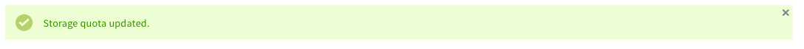

**Last updated 7th December 2021**

## Objective

Veeam Cloud Connect is an off-site backup solution. It provides an easy and secure way to manage cloud backups without having to manage an infrastructure on a second site.

**This guide explains the setup and usage of Veeam Cloud Connect.**

## Requirements

- a subscription to the [Veeam Cloud Connect](https://www.ovh.com/ca/en/storage-solutions/veeam-cloud-connect/) solution
- a compatible service (OVHcloud or external)

> [!primary]
>
> Our Veeam offers are currently not compatible with the latest version (11) offered by Veeam. OVHcloud will continue to offer version 10 until further notice. Please take this into consideration when configuring Veeam for your services.
>

### Compatible services

The main advantage of Veeam Cloud Connect, beyond its simplicity, is that it works regardless of where your operating infrastructure is hosted. It can be hosted at OVHcloud, another provider, or at your own facilities.

OVHcloud services that are compatible with Veeam Cloud Connect:

- [Hosted Private Cloud](https://www.ovhcloud.com/en-ca/enterprise/products/hosted-private-cloud/)
- Virtual machines running on [dedicated servers](https://www.ovh.com/ca/en/dedicated-servers/), administrated with Microsoft Hyper-V or VMware ESXi

## Instructions

### Subscribing to the Veeam Cloud Connect solution

Order your solution on the [website](https://www.ovh.com/ca/en/storage-solutions/veeam-cloud-connect/). Once the payment is processed, you will receive a confirmation email, containing:

- the IP address and name of your service
- user name and password

### Managing the service in the OVHcloud Control Panel

In your [OVHcloud Control Panel](https://ca.ovh.com/auth/?action=gotomanager&from=https://www.ovh.com/ca/en/&ovhSubsidiary=ca), switch to the "Hosted Private Cloud" section and open the menu `Platforms and services`{.action} in the left-hand navigation bar.

{.thumbnail}

Click on your new service to view the `Home` tab, where some general information is displayed.

{.thumbnail}

On the second tab, `Storage Space`, you will find your storage space's name, usage, quota, and replication data centre.

{.thumbnail}

You can use the `...`{.action} button on this page to modify the quota for your storage space.

{.thumbnail}

Define the new quota and click on `Edit`{.action} to confirm.

{.thumbnail}

### Setting up your solution with the Veeam console

Veeam Cloud Connect and the required Veeam backup server are managed from the Veeam Backup & Replication console, available from the official [Veeam website](https://www.veeam.com).

In the first step, add the service to your console by clicking on `ADD SERVICE PROVIDER`{.action} in the "Service Providers" menu.

{.thumbnail}

Fill in the IP address or name of your solution (received via email) and click on `Next`{.action}.

{.thumbnail}

Add the user name and password in this step and click on `OK`{.action}, then on `Apply`{.action}.

{.thumbnail}

A summary of the resources available on this service will appear.

{.thumbnail}

On the final "Summary" page, click on `Finish`{.action}.

{.thumbnail}

Your service will be added to the list in the console.

{.thumbnail}

#### Configuring backup tasks

In the left-hand menu, switch to the section "BACKUP & REPLICATION". Your backup tasks ("Jobs") will be listed here.

Click on `Backup Copy`{.action} in the top menu bar to configure a backup copy job.

{.thumbnail}

First, give a name to this new task. You can also choose the frequency of this action.

{.thumbnail}

On the next page, "Virtual Machines", you can add VMs using the `Add`{.action} button. Please refer to this [official documentation](https://helpcenter.veeam.com/docs/backup/vsphere/backup_copy_vms.html?ver=95){.external} for a detailed explanation of your choices.

In this example, "from backups" is chosen.

{.thumbnail}

Next, select the repository assigned to the service (previously displayed on the "Resources" page at setup).

{.thumbnail}

To transfer data from your server to the OVHcloud infrastructure, there are two options. Depending on the availabe connection, you can select "Direct" or you can use the Veeam WAN Accelerator Service.

Please refer to this [official documentation](https://helpcenter.veeam.com/docs/backup/vsphere/wan_hiw.html?ver=95){.external} to learn how it operates.

{.thumbnail}

After clicking on `Next`{.action}, you can specify the time periods during which data transfer is allowed to take place.

{.thumbnail}

On the "Summary" page, click on `Finish`{.action}.

{.thumbnail}

If the appropriate scheduling conditions are met, the new task will start to run immediately and you can review it on the `Home` page.

{.thumbnail}

#### Restoring backups

In order to restore a backup, right-click on the task in the table. You can choose to restore the entire virtual machine, or certain files.

{.thumbnail}

In the Restore Wizard, select the VM and the backup to be restored.

{.thumbnail}

Next choose the "Restore Mode" (to the original or a different location).

{.thumbnail}

You can additionally specify a "Reason" for your own documentation. Finally, a summary of the operation will be displayed.

{.thumbnail}

Click on `Finish`{.action} and a window will open in your Veeam console, indicating the tasks that are in progress.

In your vSphere client, you can verify that various events are logged when a restoration has been launched.

{.thumbnail}

## Go further

Join our community of users on <https://community.ovh.com/en/>.
