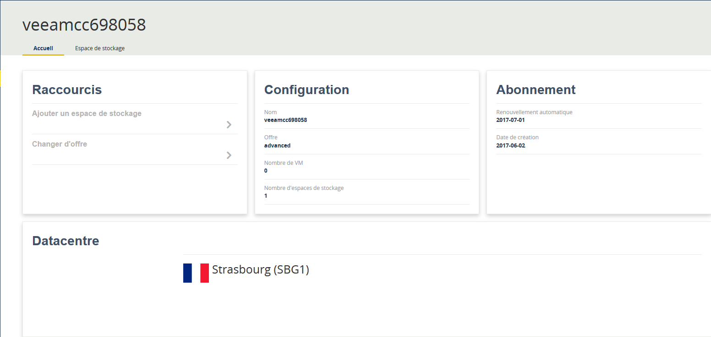
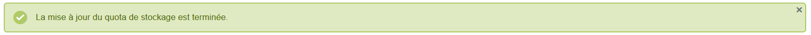
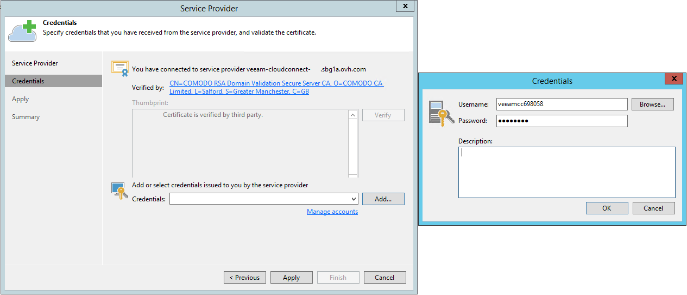
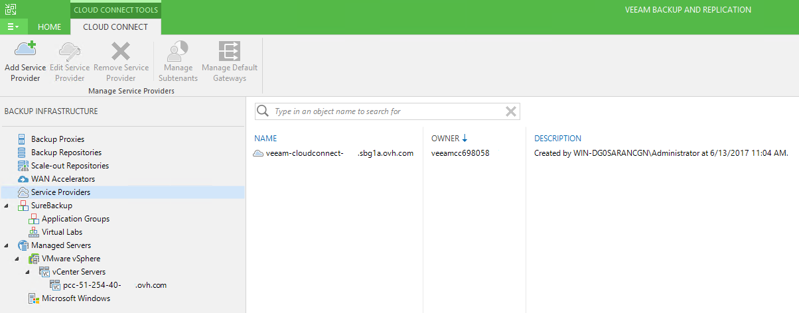
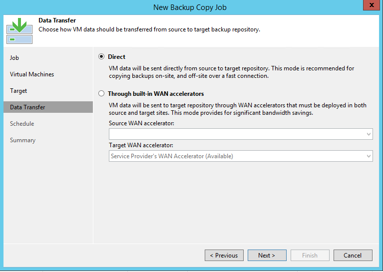
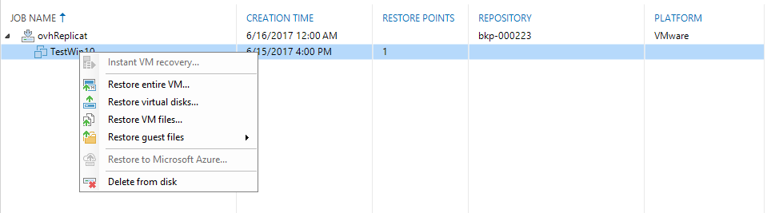

**Ostatnia aktualizacja z dnia 07-12-2021**

## Wprowadzenie

Veeam Cloud Connect to rozwiązanie oferowane przez wydawcę Veeam. Umożliwia ono posiadanie kopii bezpieczeństwa poza miejscem działalności (“off-site”), i to bez konieczności zarządzania infrastrukturą w drugiej lokalizacji. Ideą rozwiązania Veeam Cloud Connect jest zapewnienie łatwego i bezpiecznego sposobu na wykonywanie kopii zapasowych i przywracania danych z chmury.

**Dowiedz się, jak skonfigurować ofertę Veeam Cloud Connect**

## Wymagania początkowe

- Wykupienie usługi [Veeam Cloud Connect](https://www.ovh.pl/storage-solutions/veeam-cloud-connect/){.external}

> [!primary]
>
> Nasze pakiety Veeam nie są obecnie kompatybilne z najnowszą wersją (11) proponowaną przez Veeam. OVHcloud będzie nadal proponować wersję 10, aż do odwołania. Prosimy o uwzględnienie tego punktu podczas konfiguracji usługi Veeam.
>

## W praktyce

### Kompatybilne produkty

Główną zaletą rozwiązania Veeam Cloud Connect, poza prostotą, jest działanie niezależnie od lokalizacji infrastruktury operacyjnej. Może być ona hostowana w OVHcloud (usługa Hosted Private Cloud lub dedykowany serwer, na którym samodzielnie przeprowadzasz wirtualizację za pomocą hipernadzorcy VMware lub Microsoft), u innego dostawcy lub w pomieszczeniach Twojej firmy.

Lista kompatybilnych produktów OVHcloud:

- [Hosted Private Cloud](https://www.ovhcloud.com/pl/enterprise/products/hosted-private-cloud/){.external}
- Maszyny wirtualne hostowane na naszych [dedykowanych serwerach](https://www.ovh.pl/serwery_dedykowane/){.external} i zarządzane przez hipernadzorcę Microsoft Hyper-V lub VMware ESXi.

### Zamówienie oferty

Ofertę można zamówić na stronie [OVH.com](https://www.ovh.pl/storage-solutions/veeam-cloud-connect/){.external}

Po dokonaniu płatności otrzymasz wiadomość e-mail z następującymi informacjami:

- adres IP/nazwa usługi,
- nazwa użytkownika i hasło.

### Panel klienta OVHcloud

W Panelu klienta OVHcloud przejdź do sekcji `Serwer`, a następnie `Platformy i usługi`.

{.thumbnail}

Znajdziesz się na stronie z informacjami na temat konfiguracji oferty, abonamentu i przestrzeni dyskowej.

{.thumbnail}

Na drugiej karcie `Przestrzeń dyskowa` znajdziesz nazwę Twojej przestrzeni dyskowej oraz informacje o jej użyciu, limitach i centrum danych replikacji.

{.thumbnail}

Na końcu tego wiersza znajduje się przycisk.

Służy on do zwiększania lub zmniejszania limitu przestrzeni dyskowej.

{.thumbnail}

Po zmianie wartości pojawi się następujący komunikat:

{.thumbnail}

### Instalacja

Aby wdrożyć usługę Veeam Cloud Connect, musisz posiadać własny serwer kopii zapasowych Veeam.

Wdrożenie Veeam Cloud Connect przeprowadza się w tym samym interfejsie, konsoli Veeam Backup & Replication, do pobrania ze strony [Veeam](https://www.veeam.com/){.external}.

> [!success]
>
> Informacje na temat instalacji konsoli znajdują się na tej stronie.
> 

Najpierw dodaj usługę do konsoli, klikając polecenie “ADD SERVICE PROVIDER”

{.thumbnail}

Wprowadź adres IP/nazwę oferty, którą znajdziesz w otrzymanej wiadomości e-mail.

{.thumbnail}

Wpisz nazwę użytkownika i hasło, a następnie kliknij “Zastosuj”, aby potwierdzić.

{.thumbnail}

Pojawi się podsumowanie dostępnych zasobów.

{.thumbnail}

Następnie zobaczysz ostatnie podsumowanie.

{.thumbnail}

Kliknij `Zakończ`{.action}, aby zobaczyć swoją usługę w konsoli.

{.thumbnail}

### Konfiguracja

Aby przeprowadzić replikację jednej z kopii zapasowych, przejdź do karty `Backup & Replication` znajdującej się w lewym dolnym rogu konsoli.

Znajdziesz tam zadania kopii zapasowych. Kliknij przycisk `Backup Copy`{.action} znajdujący się na pasku zadań u góry konsoli, aby rozpocząć konfigurację.

{.thumbnail}

Najpierw nazwij nowe zadanie. Możesz też wybrać jego częstotliwość.

{.thumbnail}

Kliknij przycisk `Dodaj`{.action} i wybierz jedną z trzech opcji, opisanych szczegółowo na [tej stronie](https://helpcenter.veeam.com/docs/backup/vsphere/backup_copy_vms.html?ver=95){.external}.

W tym przykładzie przeprowadzimy replikację kopii zapasowej.

{.thumbnail}

Następnie wybierz wskazany wcześniej folder przechowywania kopii zapasowej.

{.thumbnail}

Aby przenieść kopię zapasową z Twojego serwera do naszej infrastruktury za pomocą rozwiązania Veeam Cloud Connect, możesz pozostawić opcję bezpośredniej komunikacji lub wykorzystać akcelerator WAN.

Informacje na temat działania akceleratora WAN zostały przedstawione na [tej stronie](https://helpcenter.veeam.com/docs/backup/vsphere/wan_hiw.html?ver=95){.external}.

{.thumbnail}

Możesz także zaprogramować okresy, podczas których będzie wykonywane to zadanie.

{.thumbnail}

Wyświetlone zostanie podsumowanie. Kliknij `Zakończ`{.action}, aby dodać zadanie.

{.thumbnail}

Zaznacz pole uruchamiające zadanie, aby aktywować zadanie po zakończeniu operacji.

Na stronie początkowej zobaczysz Twoje nowe zadanie.

{.thumbnail}

### Przywracanie

Aby przywrócić kopię zapasową, kliknij zadanie prawym przyciskiem myszy.

Możesz wybrać, czy chcesz przywrócić całą maszynę wirtualną, czy tylko niektóre pliki.

{.thumbnail}

Wybierz maszynę wirtualną i kopię zapasową, która ma zostać przywrócona.

{.thumbnail}

Następnie wybierz lokalizację przywrócenia (początkową lub inną).

{.thumbnail}

Jeśli chcesz, możesz podać powód. Następnie pojawi się podsumowanie operacji.

{.thumbnail}

W konsoli Veeam otworzy się okno z informacjami o bieżących zadaniach.

Podczas przywracania w interfejsie vSphere zauważysz różne operacje.

{.thumbnail}

## Sprawdź również

Dołącz do społeczności naszych użytkowników na stronie [ https://community.ovh.com/en/](https://community.ovh.com/en/){.external}
