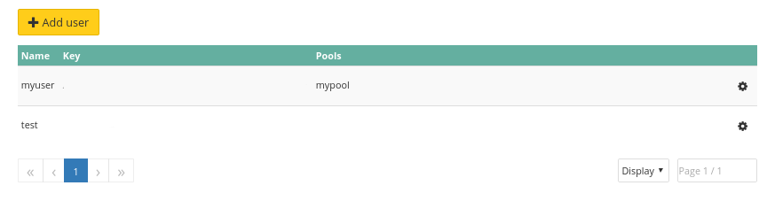

## Utilisation de l'interface web
L'utilisation d'une interface web est le moyen le plus simple de modifier les droits des utilisateurs.

Vous devez d'abord sélectionner votre utilisateur.


{.thumbnail}

Il énumérera les droits actuels, par défaut il n'y a pas de droits.


{.thumbnail}

Choisissons quelques droits pour notre utilisateur.


{.thumbnail}

Comme d'habitude, le statut du cluster et la liste des tâches changent.


## Utiliser l'API

> [!api]
>
> @api {PUT} /dedicated/ceph/{serviceName}/pool
> 

> [!api]
>
> @api {GET} /dedicated/ceph/{serviceName}/user
> 
Exemple de résultat:


```bash
GET /dedicated/ceph/98d166d8-7c88-47b7-9cb6-63acd5a59c15/user
[
  {
    mdsCaps: "",
    monCaps: "allow r",
    serviceName: "98d166d8-7c88-47b7-9cb6-63acd5a59c15",
    name: "myuser"
    osdCaps: "allow class-read object_prefix rbd_children, allow rwx pool=mypool",
    key: "AQA9KpdXoBrDNhAAFCM7m/XOtmWh3LMSNlHVqw==",
  }
]
```