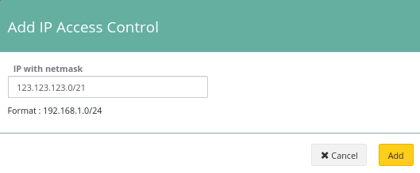

## Utiliser l'interface web


> [!primary]
>
> L'utilisation d'une interface web est le moyen le plus simple de créer un IP LCAs.
>

Tout d'abord, connectez-vous au [l’espace client](https://ca.ovh.com/manager/dedicated/#/configuration){.external} et dans la rubrique Plates-formes et services vous trouverez le service Ceph.

Vous trouverez ici la LCA existante, par défaut il n'y a pas de LCA.


{.thumbnail}

Obtenir votre adresse IP.


```bash
admin@server:~$ ip -4 a
2: eth0: <BROADCAST,MULTICAST,UP,LOWER_UP> mtu 1500 qdisc pfifo_fast state UP group default qlen 1000
    inet 123.123.123.123/32 brd 234.234.234.234 scope global eth0
      valid_lft forever preferred_lft forever
```

Ajouter votre IP.


{.thumbnail}

Et créer l'IP ACL.

Après la création de la pool d'adresses IP, vous êtes de retour au gestionnaire. Vous pouvez voir que le statut du pool a changé car la LCA est en cours de création.


## Utiliser l'API

> [!api]
>
> @api {POST} /dedicated/ceph/{serviceName}/acl
>
serviceName est le fsid de votre cluster.

Vous pouvez vérifier la création d'une LCA en consultant la liste des LCA.


> [!api]
>
> @api {GET} /dedicated/ceph/{serviceName}/acl
>
Example:


```bash
GET /dedicated/ceph/98d166d8-7c88-47b7-9cb6-63acd5a59c15/acl
[
  {
    network: "123.123.123.123"
    id: 57054
    netmask: "255.255.255.255"
    family: "IPV4"
  }
]
```
