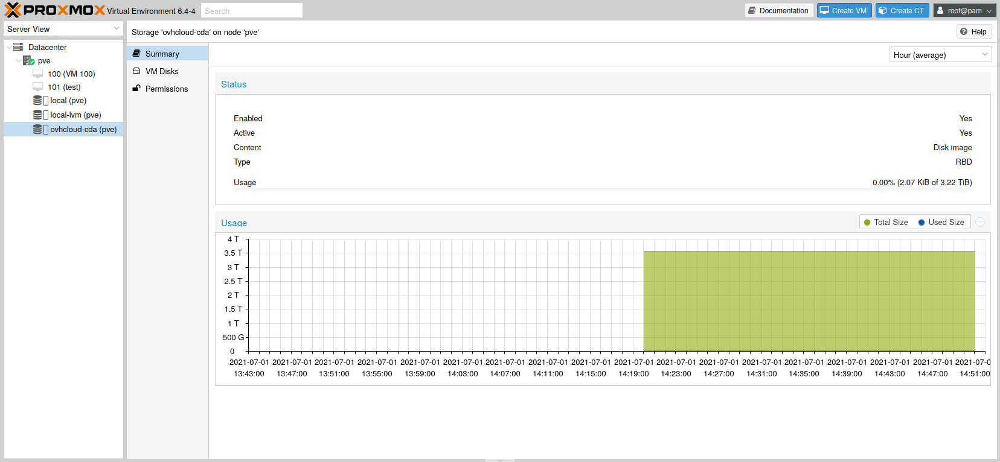

**Last updated 1st July 2021**

## Objective

**This guide explains how to set up the Cloud Disk Array on Proxmox.**

## Requirements

Fist of all, you need your Cloud Disk Array up and ready. Make sure you have:

- created a cluster pool for storing data
- created a Ceph user that Proxmox will use to access the CDA cluster
- configured permissions for this user and pool (allow read and write)
- configured your IP access control list to allow Proxmox nodes to access the CDA

## Instructions

> [!primary]
> In this guide we assume you already have your Proxmox installation up and running. This guide has been tested with Proxmox 6.4.
>

### Ceph RBD storage setup

In order to use Cloud Disk Array, Proxmox needs to know how to access it. This is done by adding the necessary data to the `/etc/pve/storage.cfg` file.

Log in to your Proxmox node, open the file and enter the following lines:

```bash
rbd: ovhcloud-cda
        monhost 10.0.0.1 10.0.0.2 10.0.0.3
        content images
        pool vms
        username proxmox
```

- `monhost`: the IP list of CDA cluster monitors
- `content`: the content type you want to host on the CDA
- `pool`: the CDA pool name that will be used to store data
- `username`: the username of the user connecting to the CDA

### Ceph keyring setup

Your cluster is now configured. To be able to authenticate, Proxmox will also need the keyring.

In order to add the keyring, edit the file `/etc/pve/priv/ceph/<STORAGE_ID>.keyring`. Replace `<STORAGE_ID>` with the actual name you used in the `storage.cfg` file. In the following example output, the name is `ovhcloud-cda`.

```bash
root@proxmox:~$ cat /etc/pve/priv/ceph/ovhcloud-cda.keyring
[client.proxmox]
        key = KLChQNJYQJCuXMBBrbsz2XllPn+5+cuXdIfJLg==
```

You can now see your cluster info using the Proxmox web interface and create a VM on this storage.

{.thumbnail}

{.thumbnail}

### CephFS storage setup

In order to use CephFS, you need to enable it through the Cloud Disk Array API. The user defined in the first step can be used to access both RBD and CephFS.

The user has to be granted access to the `cephfs.fs-default.data` and `cephfs.fs-default.meta` pools. After that, add the following lines to your `/etc/pve/storage.cfg` config file.

```bash
cephfs: ovhcloud-cda-cephfs
        monhost 10.0.0.1 10.0.0.2 10.0.0.3
        path /mnt/pve/cephfs
        content backup,vztmpl
        username proxmox
```

- `monhost`: the IP list of CDA cluster monitors
- `content`: the content type you want to host on the CDA
- `username`: the username of the user connecting to the CDA

### CephFS secret

CephFS is now configured. You need to add the secret of your Proxmox user (`proxmox` in this example), so Proxmox can authenticate.

Edit the file `/etc/pve/priv/ceph/<STORAGE_ID>.secret`. Replace `<STORAGE_ID>` with the actual name you used in the `storage.cfg` file. In the following example output, the name is `ovhcloud-cda-cephfs`.

Unlike with the RBD keyring, you need to provide only the secret.

```bash
root@proxmox:~$ cat /etc/pve/priv/ceph/ovhcloud-cda-cephfs.secret
KLChQNJYQJCuXMBBrbsz2XllPn+5+cuXdIfJLg==
```

You can now download container templates and store them on CephFS:

```sh
root@pve:~$ pveam update
root@pve:~$ pveam available --section system
root@pve:~$ pveam download ovhcloud-cda-cephfs ubuntu-20.04-standard_20.04-1_amd64.tar.gz
```

Once a template has been downloaded, you can start using it to create containers.

{.thumbnail}

{.thumbnail}

## Go further <a name="gofurther"></a>

Join our community of users on <https://community.ovh.com/en/>.