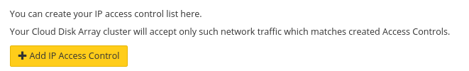

## Using web interface


> [!primary]
>
> Using web interface is the easiest way to create an IP ACL.
> 

First, connect to the [Cloud Disk Array manager](https://www.ovh.com/manager/cloud/index.html){.external}. Under 'Platforms and services' select your Ceph cluster. On the bottom right, you will find the existing ACL. By default there is no ACL.


{.thumbnail}

Get your ip address.


```bash
admin@server:~$ ip -4 a
2: eth0: <BROADCAST,MULTICAST,UP,LOWER_UP> mtu 1500 qdisc pfifo_fast state UP group default qlen 1000
    inet 123.123.123.123/32 brd 234.234.234.234 scope global eth0
      valid_lft forever preferred_lft forever
```

Add your IP.


{.thumbnail}

And create the IP ACL.

After the pool creation, you are back to manager. You can see that cluster status has changed because the ACL is being created.


## Using API

> [!api]
>
> @api {POST} /dedicated/ceph/{serviceName}/acl
> 
serviceName is the fsid of your cluster.

You can check ACL creation by listing ACL.


> [!api]
>
> @api {GET} /dedicated/ceph/{serviceName}/acl
> 
Example:


```bash
GET /dedicated/ceph/98d166d8-7c88-47b7-9cb6-63acd5a59c15/acl
[
  {
    network: "123.123.123.123"
    id: 57054
    netmask: "255.255.255.255"
    family: "IPV4"
  }
]
```