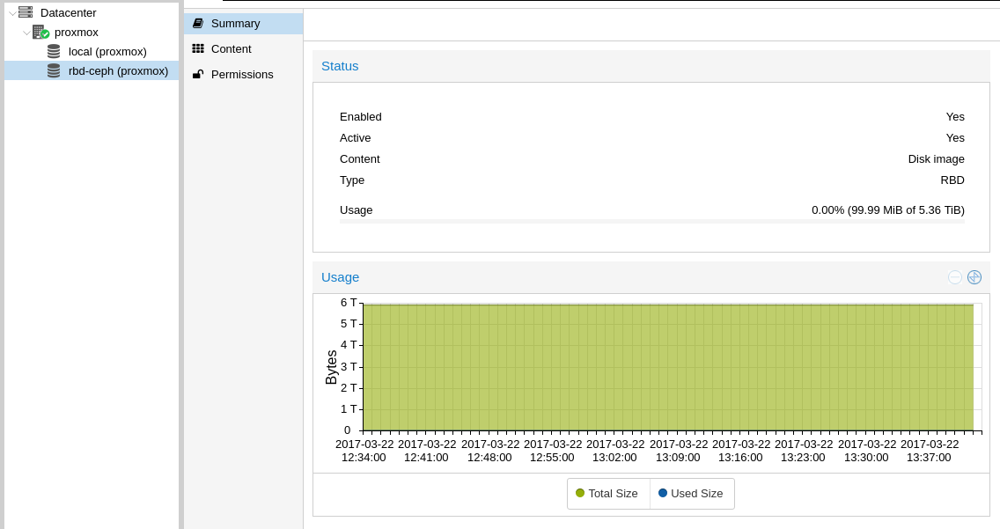
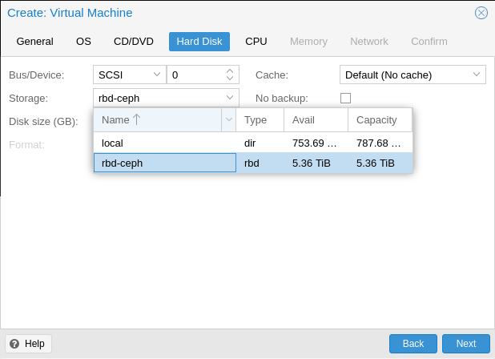

## Requirements
Fist of all, you need a Ceph cluster already configured. Create the pools, users and set the rights and network ACL.

You also need a proxmox, this documentation is made with proxmox 4.4-13


## Storage setup
We edit the file /etc/pve/storage.cfg to add our Ceph storage


```bash
rbd: rbd-ceph
        monhost 10.99.100.1 10.97.76.1 10.97.64.1
        content images
        krbd 0
        pool rbd
        username admin
```

- monhost is the ip of our monitors
- content is the content we want to host on ceph
- krbd 0/1 if you want to use the kernel or librbd to use the Ceph cluster
- pool is the pool that will be used to store data
- username is the username that will be used to connect to the cluster


## Keyring setup
Our cluster is now in configuration, but proxmox can't auth yet, we have to add the keyring.

We have have to edit the file /etc/pve/priv/ceph/<STORAGE_ID>.keyring, where STORAGE_ID is the name we used in our storage.cfg, here it's rbd-ceph.


```bash
root@proxmox:~# cat /etc/pve/priv/ceph/rbd-ceph.keyring
[client.admin]
        key = KLChQNJYQJCuXMBBrbsz2XllPn+5+cuXdIfJLg==
```


## Update Ceph packages
Proxmox uses some old Ceph packages, we'll add the official repositories to use the lastest Ceph packages to use the lastest features. We first need to add the keys.


```bash
wget -q -O- 'https://download.ceph.com/keys/release.asc' | apt-key add -
```

Then add the repository.


```bash
echo 'deb https://download.ceph.com/debian-jewel/ jessie main' > /etc/apt/sources.list.d/ceph.list
```

Update repositories.


```bash
root@proxmox:~# apt update
```

Upgrade packages.


```bash
root@proxmox:~# apt upgrade ceph-common
```

You can check the version intalled.


```bash
root@proxmox:~# dpkg -s ceph-common
Package: ceph-common
Status: install ok installed
...
Source: ceph
Version: 10.2.6-1~bpo80+1
```

You can now see your cluster info using proxmox web interface and create VM on this storage.


{.thumbnail}


{.thumbnail}