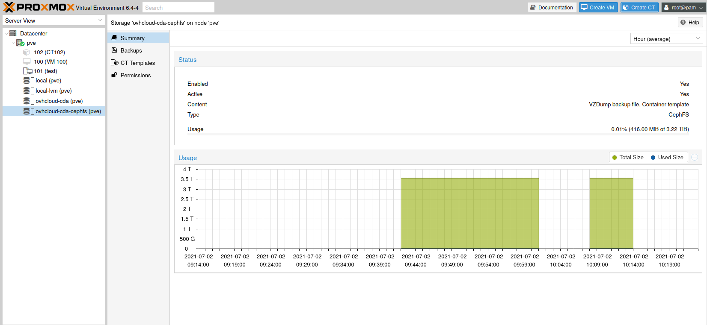

## Requirements
Fist of all, you need your Cloud Disk Array up and ready. Make sure you have:
- created pool for storing data
- created Ceph user that Proxmox will use to access CDA cluster
- configured permissions for this user and pool (allow read and write)
- added IP ACL to allow Proxmox nodes to access CDA

In this guide we assume you aready have Proxmox installation up and running.
This guide has been tested with Proxmox 6.4.


## Ceph RBD storage setup
In order to use Cloud Disk Array one need to tell Proxmox how to access it.
This is done by adding necessary entries into `/etc/pve/storage.cfg` file.

Login to your Proxmox node and add following entry:


```bash
rbd: ovhcloud-cda
        monhost 10.0.0.1 10.0.0.2 10.0.0.3
        content images
        pool vms
        username proxmox
```

- `monhost` -- the IP list of CDA cluster monitors
- `content` -- content type we want to host on CDA
- `pool` -- CDA pool name that will be used to store data
- `username` -- username that will be used to connect to the CDA


# Ceph keyring
Our cluster is now in configuration, but proxmox can't auth yet, we have to add the keyring.

We have have to edit the file `/etc/pve/priv/ceph/<STORAGE_ID>.keyring`, where `STORAGE_ID` is the name we used in our `storage.cfg`, here its' `ovhcloud-cda`.


```bash
root@proxmox:~# cat /etc/pve/priv/ceph/ovhcloud-cda.keyring
[client.proxmox]
        key = KLChQNJYQJCuXMBBrbsz2XllPn+5+cuXdIfJLg==
```


You can now see your cluster info using proxmox web interface and create VM on this storage.


{.thumbnail}


{.thumbnail}


## CephFS storage setup
In order to use CephFS one need to enable it through Cloud Disk Array API.
Same user as above can be used to access both RBD and CephFS. One need to grant
this user access to `cephfs.fs-default.data` and `cephfs.fs-default.meta` pools.
After that add following entry to `/etc/pve/storage.cfg` config file.


```bash
rbd: ovhcloud-cda-cephfs
        monhost 10.0.0.1 10.0.0.2 10.0.0.3
        path /mnt/pve/cephfs
        content backup,vztmpl
        username proxmox
```

- `monhost` -- the IP list of CDA cluster monitors
- `content` -- content type we want to host on CDA
- `pool` -- CDA pool name that will be used to store data
- `username` -- username that will be used to connect to the CDA


# CephFS secret
CephFS is now in configuration, but Proxmox can't authenticate yet, one have
to add the secret for `proxmox` user.

Edit file `/etc/pve/priv/ceph/<STORAGE_ID>.secret`, where `STORAGE_ID`
is the name we used in our `storage.cfg`, here its' `ovhcloud-cda-cephfs`.
In contrast to RBD keyring, here one need to provide only secret.


```bash
root@proxmox:~$ cat /etc/pve/priv/ceph/ovhcloud-cda-cephfs.secret
KLChQNJYQJCuXMBBrbsz2XllPn+5+cuXdIfJLg==
```


One can now download container templates and store them on CephFS:

```bash
root@pve:~$ pveam update
root@pve:~$ pveam available --section system
root@pve:~$ pveam download ovhcloud-cda-cephfs ubuntu-20.04-standard_20.04-1_amd64.tar.gz
```

Once template has been downloaded one can start using it to create containers.


{.thumbnail}

{.thumbnail}
