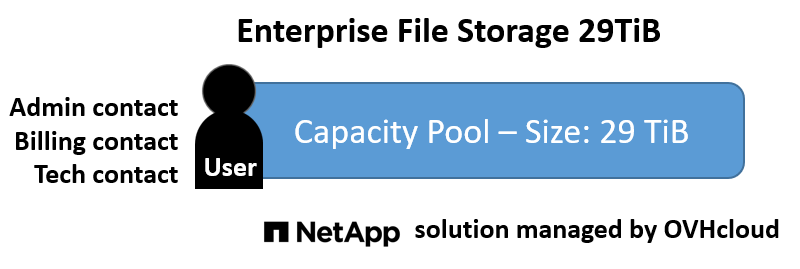
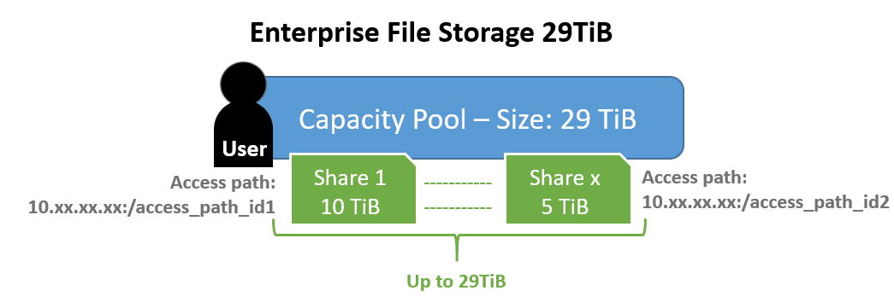
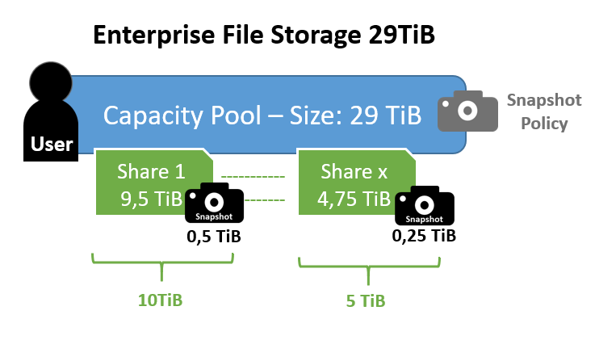
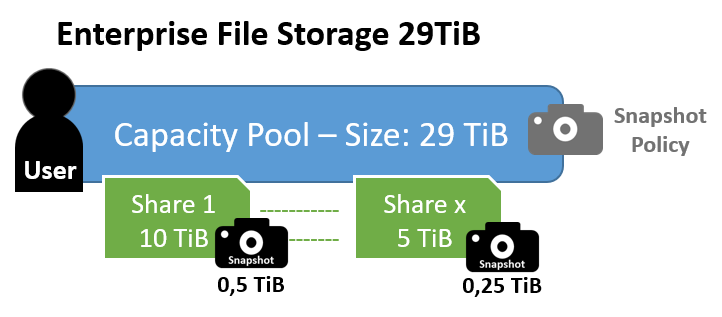

**Last updated 27th October 2021**

## Objective

With the OVHcloud Enterprise File Storage solution, you can order a capacity pool and manage file volumes accessible through network.
In this quick start guide, you can learn about the concepts behind Enterprise File Storage, as well as the limitations of the solution.

**Learn how Enterprise File Storage works**

## Instructions

### What is Enterprise File Storage?

Enterprise File Storage is a file system solution managed by OVHcloud, based on the NetApp ONTAP Software-Defined Storage solution.

You can order one or more storage spaces between 1 TiB and 29 TiB with your OVHcloud customer account.

> [!primary]
>
> What is the difference between Terabyte (TB) and Tebibyte (TiB)?
>
> - T, the “tera-” prefix, is a metric and SI standard where you are using base-10. So 1 TB = 10^12=1000000000000 bytes = 1000 GB.
>
> - Ti, the “Tebi-” prefix, was created later as one of the Binary prefixes that are now an IEC/ISO standard where you are using base-2. It means 1024^4=2^40. So 1 TiB = 1099511627776 bytes= 1024 GiB.
>
> - Computers are using base-2 so the amount of storage that you can see in your OS is in TiB. Storage vendors tend to use TB because it makes for a larger number than TiB.
>
> - The problem is that they are similar (2,4%) at the KB level, but at the TB level they have a 10% difference which increases exponentialy.
>
> - For Enterprise File Storage, because we want to be transparent with you, we will deliver the volume in TiB even if you see TB as unit because the general public is using TB.
>
> - So if you order a 1 TB Enterprise File Storage, in reality, you will have 1TiB = 1,09951 TB ;-).
>

### The principle of capacity pools

When you order an Enterprise File Storage service between 1 and 29 TiB via your OVHcloud account, you will receive a Netapp capacity pool.

By default, the OVHcloud account is the administrative, technical and billing contact for the service. You can find more information in our guide [“Managing contacts for your services”](https://docs.ovh.com/ie/en/customer/managing-contacts/).

> [!primary]
>
> Each capacity pool can only belong to one OVHcloud account (NIC-handle). However, the technical and billing contacts can be associated with other accounts.
>

### How volumes work

Once your Enterprise File Storage solution is up and running, you can create one or more volumes in your capacity pool.
 These volumes allow you to store files, and are accessible via a network IP address provided by OVHcloud.
 Creating a volume automatically triggers the creation of a primary path and three secondary paths.

> [!primary]
>
> - Each volume belongs to a single capacity pool, but a capacity pool can contain multiple volumes.
>
> - The size of a volume cannot exceed the total size of the capacity pool minus the space allocated to the snapshots it contains.
>
> - The size of a volume can be scaled up or down.
>

You can find more information in our guide on [“Managing volumes”](../netapp-volume-acl).

### The principle of ACL operation

For security reasons, a volume is not immediately accessible via its path. You need to create rules in the volume's access control list (ACL) in order to allow users to access it.

A rule consists of a source IP address of your network in the format x.x.x.x/x and the type of access, either read-only (RO) or read/write (RW).

> [!primary]
>
> You can create one or more rules per volume.
>

You can find more information in the guide [“Managing volume ACLs”](../netapp-volume-acl).

### The working principle of snapshots

Enterprise File Storage's snapshot technology provides a local data protection solution in the same location as the production data. Thanks to snapshots, we can proceed to do a fast restoration.

An Enterprise File Storage snapshot is an image of a volume at a specific date and time.

It only takes a few seconds to create, regardless of the volume size, capacity used, or activity level on the volume.

The snapshot is a copy of the metadata of the volume at a given point in time (a snapshot of the inodes table).

The daily observed consumption of snapshots is between 1% and 5% of the volume's capacity for many applications. As a result, OVHcloud reserves 5% of its capacity for volume snapshots each time a volume is created.

You can find more information in the [“Managing volume snapshots”](../netapp-volume-snapshots) guide.

### Limits of Enterprise File Storage for the external testing phase (Beta)

The capacity pools of the Enterprise File Storage solution are limited as follows:

- A capacity pool has an allocated and dedicated size between 1 TiB and 29 TiB.
- A capacity pool is limited to 20 volumes by TiB.

Volumes have the following limits:

- A volume cannot exceed the size of 29 TiB minus the 5% reserved for snapshots (1.45 TB), i.e. 27.55 TiB.
- The minimum volume size is 1 GiB.
- A volume cannot have more than 255 snapshots.
- A volume has only an IP address on the OVHcloud internal network in 10.x.x.x.

## Go further

Join our community of users on <https://community.ovh.com/en/>.
