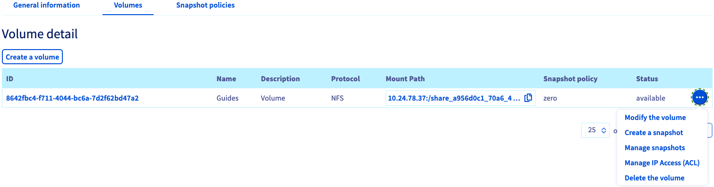
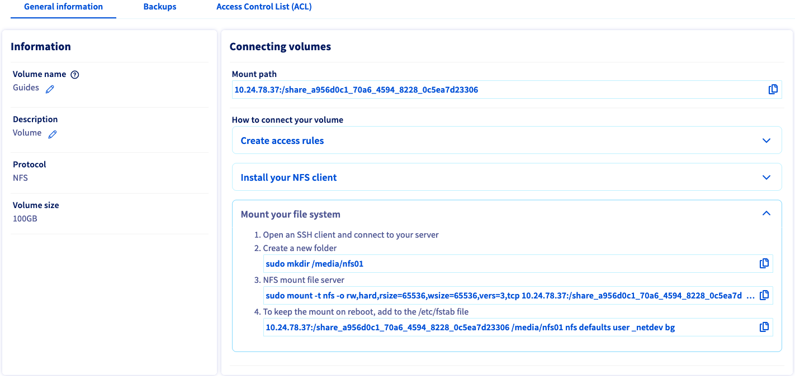
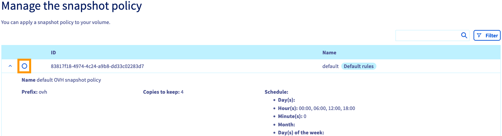
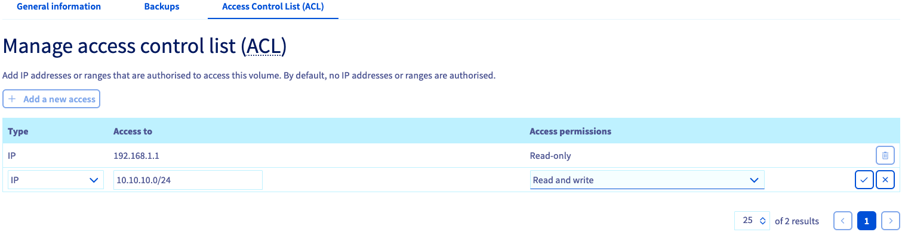

> [!primary]
> Esta traducción ha sido generada de forma automática por nuestro partner SYSTRAN. En algunos casos puede contener términos imprecisos, como en las etiquetas de los botones o los detalles técnicos. En caso de duda, le recomendamos que consulte la versión inglesa o francesa de la guía. Si quiere ayudarnos a mejorar esta traducción, por favor, utilice el botón «Contribuir» de esta página.
> 

**Última actualización: 14/04/2022**

## Objetivo

Los servicios Enterprise File Storage pueden administrarse [a través de la API de OVHcloud](../netapp-quickstart/) o desde el área de cliente de OVHcloud.

**Esta guía explica cómo gestionar los volúmenes y los snapshots de Enterprise File Storage desde el área de cliente.**

## Requisitos

- Tener un servicio Enterprise File Storage en su cuenta de OVHcloud.
- Tienes acceso a tu [Panel de configuración de OVHcloud](https://ca.ovh.com/auth/?action=gotomanager&from=https://www.ovh.com/world/&ovhSubsidiary=ws).

## Procedimiento 

Conéctese al [Panel de configuración de OVHcloud](https://ca.ovh.com/auth/?action=gotomanager&from=https://www.ovh.com/world/&ovhSubsidiary=ws) y seleccione `Bare Metal Cloud`{.action} en la barra de navegación superior. Abra `Storage y Backup`{.action}, luego `Enterprise File Storage`{.action} en el menú de la izquierda y seleccione su servicio de la lista.

{.thumbnail}

La pestaña `Información general`{.action} muestra información técnica sobre su servicio, información general sobre la suscripción y un atajo para [crear un volumen](#create_volume).

> [!primary]
> Para más información sobre las propiedades técnicas de la solución Enterprise File Storage, consulte la página [Concepts](../netapp-concepts/).
>

### Gestión de volúmenes 

Haga clic en la pestaña `Volúmenes`{.action}. La tabla muestra todos los volúmenes creados para el servicio seleccionado. Puede hacer clic en un ID de volumen para abrir su [página de gestión](#modify_volume). 

{.thumbnail}

Puede realizar varias acciones haciendo clic en el botón `..`{.action} en cada línea de la tabla.

- **Modificar el volumen**: abre el apartado "[Información general](#modify_volume)" del volumen.
- **Crear un snapshot**: abre la sección "[Copias de seguridad](#snapshots)" para realizar un snapshot manual del volumen.
- **Gestionar los snapshots**: abre la sección "[Copias de seguridad](#snapshots)" del volumen.
- **Gestionar IP Access (ACL)**: abre la sección "[ACL](#access_control)" para gestionar el control de acceso al volumen.
- **Eliminar el volumen**: permite eliminar el volumen una vez confirmada la acción en la ventana que aparezca.

#### Creación de un volumen 

Haga clic en el botón `Crear un volumen`{.action}. En la nueva ventana, escriba el nombre y la descripción del volumen. Determine el tamaño en GB y haga clic en `Crear un volumen`{.action} para aceptar la creación.

{.thumbnail}

Puede eliminar un volumen pulsando el botón `..`{.action}. de la tabla y, a continuación, `Eliminar el volumen`{.action}.

#### Modificación de un volumen 

Haga clic en un ID de volumen de la tabla para abrir la página de gestión del volumen.

{.thumbnail}

La pestaña `Información general`{.action} muestra los detalles de su volumen, así como instrucciones detalladas sobre la conexión al volumen, incluyendo los parámetros individuales.

#### Creación y gestión de snapshots de un volumen 

La pestaña `Snapshots`{.action} muestra todos los snapshots creados para el volumen seleccionado.

{.thumbnail}

Para añadir manualmente un nuevo snapshot del volumen a su estado actual, haga clic en el botón `Acciones`{.action} y seleccione `Crear un snapshot`{.action}.

Se abrirá una nueva ventana en la que podrá introducir un nombre y una descripción. Haga clic en el botón `Crear un snapshot`{.action} para comenzar la creación.

En la misma pestaña, también puede ver todas las [políticas de snapshots](#snapshot_policy) creadas para el servicio y aplicarlas a dicho volumen.

{.thumbnail}

Haga clic en la línea de la regla correspondiente para consultar los detalles de la planificación de los snapshots. Seleccione una política a través del botón de selección dedicado y haga clic en el botón `Aplicar tipo de letra`{.action} situado debajo de la tabla.

Para configurar sus [políticas de snapshot](#snapshot_policy), acceda a la sección [Gestión de volúmenes](#instructions) del servicio y abra la pestaña `Snapshot policiales`{.action}.

#### Lista y recuperación de snapshots 

En el área de cliente no es posible consultar la lista de snapshots realizados ni restaurarlos.

Para acceder a los snapshots desde el punto de montaje, puede utilizar los comandos que se ofrecen en la documentación [NetApp](https://library.netapp.com/ecmdocs/ECMP1196991/html/GUID-36DC110C-C0FE-4313-BF53-1C12838F7BBD.html){.external}.

#### Gestión de volúmenes ACL 

El control de acceso a los volúmenes funciona mediante restricciones de direcciones IP. Como no hay ninguna restricción configurada por defecto, el primer paso al crear los volúmenes es definir las direcciones IP o los rangos desde los que se autorizará el acceso.

En la pestaña `Control de accesos (ACL)`{.action}, haga clic en el botón `+ Añadir un nuevo acceso`{.action}.

{.thumbnail}

Esta acción crea una nueva línea en la tabla, en la que puede introducir una dirección IP o un bloque de dirección (CIDR). Seleccione `Sólo Lectura` o `Lectura y escritura` como tipo de acceso en el menú desplegable y marque esta entrada para añadirla al ACL.

Para eliminar el acceso al volumen, haga clic en el icono de la papelera correspondiente de la tabla.

### Gestión de las políticas de snapshots 

La adición de políticas permite planificar la creación de snapshots para todos sus volúmenes.

Haga clic en la pestaña `Snapshot policiales`{.action}. La tabla muestra todas las políticas creadas para el servicio seleccionado.

Ya hay una política predeterminada que no puede modificarse. Para añadir la suya, haga clic en el botón `Crear una nueva Snapshot policy`{.action}.

{.thumbnail}

En la nueva página, introduzca un nombre y una descripción para la política. A continuación, utilice el botón `+ Añadir una nueva regla`{.action} para añadir una o más reglas a la política.

{.thumbnail}

Rellene los campos para indicar la frecuencia de creación del snapshot. También debe indicar un prefijo para los snapshots, necesario para su denominación.

Para más información sobre cada valor, haga clic en el icono con signo de interrogación (¿`?`{.action}). Si desarrolla la sección `Ejemplo`{.action}, puede ver dos conjuntos de reglas de política con una explicación de los resultados.

Marque la nueva regla para añadirla. Una vez que haya creado todas las reglas, haga clic en `Crear una nueva Snapshot policy`{.action}.

[Seleccione un volumen](#manage_volume) y abra la pestaña `Snapshots`{.action} para [aplicar las reglas](#snapshots).

Para eliminar una política, haga clic en el icono de la papelera correspondiente de la tabla.

> [!primary]
>
> Los snapshots utilizan la capacidad de almacenamiento de su solución Enterprise File Storage. El 5% del tamaño de un volumen siempre está reservado a los snapshots.
>

### Primeros pasos 

Si no está familiarizado con la solución Enterprise File Storage, puede seguir los pasos que se indican a continuación:

- [Crear un volumen:](#create_volume)
- [Configurar el control de accesos](#access_control)
- [Configurar las políticas de snapshot](#snapshot_policy) (opcional)
- [Aplicar reglas de snapshot al volumen](#snapshots) (opcional)
- [Listar y recuperar los snapshots](#access_snapshots) (opcional)
- [Conéctese a su volumen siguiendo las instrucciones de la sección "Información general".](#modify_volume)
- [Cómo utilizar Enterprise File Storage a través de la API con nuestras guías](#gofurther) (opcionales)

## Más información 

[Enterprise File Storage - API Quickstart](../netapp-quickstart/)

[Enterprise File Storage - Gestión de volúmenes](../netapp-volumes/)

[Enterprise File Storage - Gestión de ACL de volumen](../netapp-volume-acl/)

[Enterprise File Storage - Gestión de snapshots de volúmenes](../netapp-volume-snapshots/)

Interactúe con nuestra comunidad de usuarios en <https://community.ovh.com/en/>.
