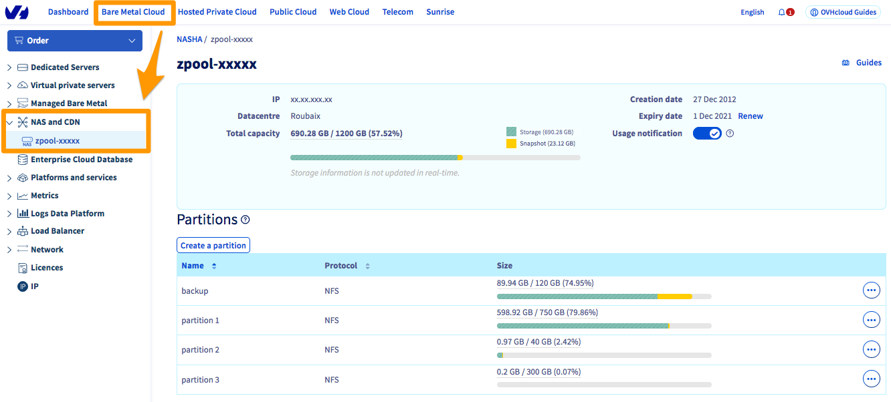
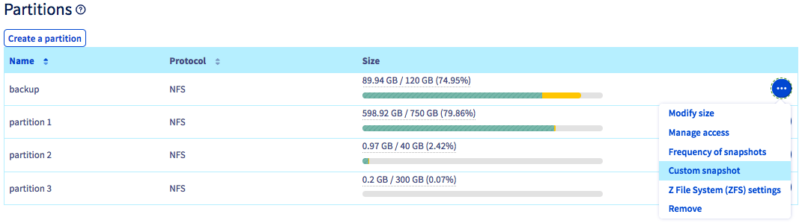
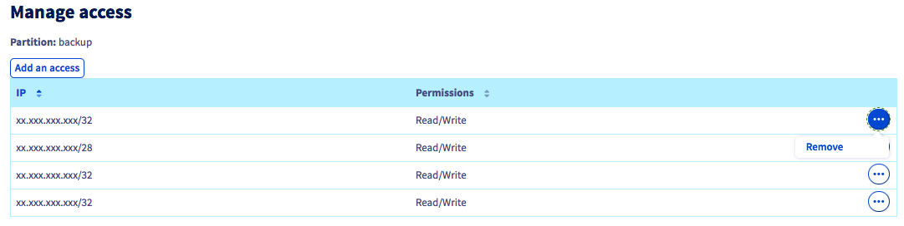

**Dernière mise à jour le 16/09/2021**

## Objectif

Le NAS (Network Attached Storage) est un serveur de fichiers relié à un réseau dont la principale fonction est le stockage de données en un volume centralisé pour des clients réseau hétérogènes.

## Prérequis

- Disposer d'une adresse IP attachée à un service OVHcloud (Hosted Private Cloud, Serveur Dédié, VPS, Instance Public Cloud, etc...)
- Disposer d'un [NAS-HA](https://www.ovh.com/ca/fr/nas/)
- Être connecté à votre [espace client OVHcloud](https://ca.ovh.com/auth/?action=gotomanager&from=https://www.ovh.com/ca/fr/&ovhSubsidiary=qc){.external}.

## En pratique

La gestion de votre NAS-HA s'effectue via l'[espace client OVHcloud](https://ca.ovh.com/auth/?action=gotomanager&from=https://www.ovh.com/ca/fr/&ovhSubsidiary=qc){.external}.

Une fois connecté, cliquez sur `Bare Metal Cloud`{.action} puis sur `NAS and CDN`{.action} dans le menu à gauche. Cliquez sur votre service pour avoir accès au menu d'administration.

{.thumbnail}

### Créer une partition

Pour ajouter une nouvelle partition, cliquez sur `Créer une partition`{.action}.

{.thumbnail}

Il vous suffit alors de renseigner le **nom de votre partition**, la **taille** de celle-ci, ainsi que le **protocole autorisé** (NFS ou CIFS).

{.thumbnail}

### Modifier la taille d'une partition

Pour modifier la taille d'une partition, cliquez sur le bouton `(...)`{.action} situé à droite de la partition concernée, puis sur `Modifier la taille`{.action}.

{.thumbnail}

Indiquez la nouvelle taille, puis validez.

### Modifier la fréquence des snapshots

Par défaut, un snapshot du contenu de votre NAS a lieu toutes les heures, et s'enregistre sur votre NAS.

Il vous est néanmoins possible de créer jusqu'à 3 snapshots supplémentaires à des fréquences différentes si vous le souhaitez, qui seront également enregistrés sur votre NAS.

Pour cela, cliquez sur le bouton `(...)`{.action} situé à droite de la partition concernée, puis sur `Fréquence des snasphots`{.action}.

{.thumbnail}

Choisissez la nouvelle fréquence puis validez.

### Créer un snapshot instantané

En dehors des snapshots réalisés automatiquement, vous pouvez à tout moment créer un snapshot instantané d'une partition, en cliquant sur le bouton `(...)`{.action} situé à droite de la partition, puis sur `Snapshot instantané`{.action}.

{.thumbnail}

Nommez le snapshot et cliquez sur `Ajouter`{.action}

### Ajouter un accès

Afin de pouvoir accéder à la partition que vous avez créée précédemment, vous devez configurer un accès.

> [!primary]
>
> Seules les adresses IP de services OVHcloud peuvent accéder à votre NAS (ex : un serveur dédié, un VPS, une instance Public Cloud, etc...)
>

Pour autoriser une IP à accéder au NAS, cliquez sur le bouton `(...)`{.action} situé à droite de la partition existante, puis sur `Gérer les accès`{.action}.

{.thumbnail}

Cliquez alors sur `Ajouter un accès`{.action} puis sélectionnez l'adresse IP de votre produit OVHcloud.
 Vous devez également définir si l'accès autorisé pour cette adresse IP est en lecture seule (*Read-only*) ou en lecture/écriture (*Read/Write*)

{.thumbnail}

#### Supprimer un accès

Pour supprimer un accès à une partition, cliquez sur le bouton `(...)`{.action} situé à droite de l'adresse IP concernée puis sur `Supprimer`{.action}.

{.thumbnail}

### Paramètres Z File System (ZFS)

> [!warning]
>
> Tous les paramètres ZFS par défaut sont optimisés. Bien que nous déconseillons la modification de ces paramètres, ce menu permet d'ajuster le ZFS utilisé par le NAS-HA.
>

Pour modifier les paramètres ZFS d'une partition, cliquez sur le bouton `(...)`{.action} à droite de la partition concernée, puis sur `Paramètres Z File System (ZFS)`{.action}.

{.thumbnail}

- **Désactiver la mise à jour des temps d'accès (*atime*)** : La désactivation du *atime* signifie que le noyau ne mettra plus à jour l'horodatage du système de fichiers à chaque accès à un fichier. Cela peut être utile pour accélérer les opérations de lecture fréquentes, par exemple sur des pages web statiques. Cependant, cette désactivation n'est pas conseillée pour les applications critiques en terme de cohérence, telles que les bases de données.
- **ZFS recordsize** : Cette propriété modifie la taille de bloc maximale sur le système de fichiers ZFS. Notez que ZFS utilisera toujours une taille de bloc inférieure si le fichier est inférieur à la taille maximale. Par exemple, un fichier de 16 KB utilisera un bloc de 16 KB (plus les métadonnées) pour ne pas gaspiller d'espace de stockage. De manière générale, nous vous déconseillons donc de modifier le ZFS *recordsize*.
- **Sync** : Ce paramètre modifie le comportement des transactions du système de fichiers ZFS en ce qui concerne la mise en mémoire tampon des données RAM et l’écriture des données sur le disque. Sauf raison spécifique, nous vous déconseillons de modifier cette propriété.

### Supprimer une partition

> [!alert]
>
> La suppression d'une partition entraîne la suppression totale et définitive de toutes les données qu'elle contient.
>

Pour supprimer une partition, cliquez sur le bouton `(...)`{.action} situé à droite de la partition existante, puis sur `Supprimer`{.action}.

{.thumbnail}

## Aller plus loin

Échangez avec notre communauté d'utilisateurs sur <https://community.ovh.com/>.
