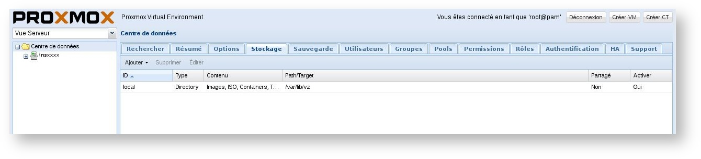
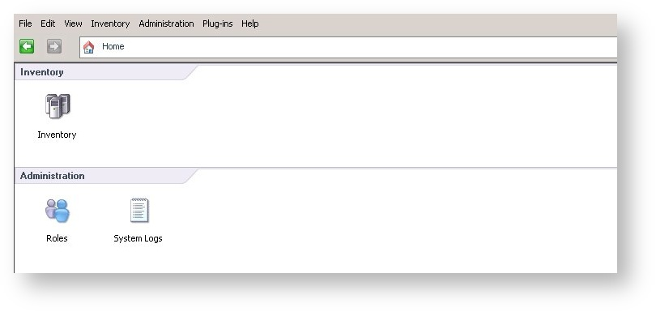
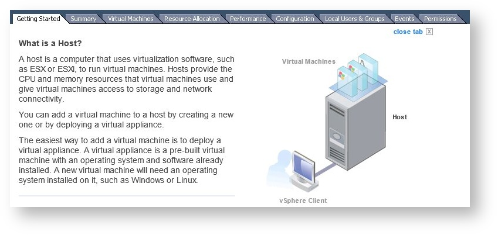
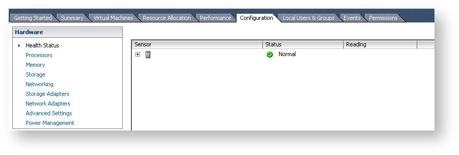
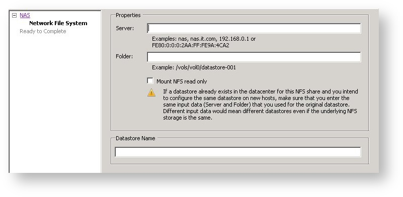

**Dernière mise à jour le 21/02/2022**

## Prérequis

Ce guide vous permet de réaliser un montage NFS sur les distributions les plus courantes. Pour effectuer le montage d'un partage NFS , il vous faut :

- Un [serveur dédié](https://www.ovhcloud.com/fr/bare-metal/) **ou** un [VPS](https://www.ovhcloud.com/fr/vps/) **ou** une [instance Public Cloud](https://www.ovhcloud.com/fr/public-cloud/).
- Une offre [NAS-HA](https://www.ovh.com/fr/nas/).
- Une distribution compatible NFS.


### Linux

Compatibilité : Debian & Ubuntu 

Pour monter un partage NFS sous Linux, il faut :

- Se connecter au serveur en SSH.
- Installer le paquet "nfs-client" via la commande :


```sh
aptitude install nfs-client
```

Utilisez ensuite la commande de montage suivante :


```sh
mount -t nfs -o _netdev,mountproto=tcp IP_NAS:/CHEMIN_NFS /DOSSIER_MONTAGE
```

|Argument|Description|
|---|---|
|IP_NAS|Correspond au nom ou l'IP du NAS|
|/CHEMIN_NFS|Chemin sur le serveur NFS pour le partage (Ex : "nas-000YY/mapartition")|
|DOSSIER_MONTAGE|Correspond au dossier où vous allez monter votre partage NFS sur votre serveur|


> [!primary]
>
> Vous pouvez automatiser le montage du NAS au démarrage de votre distribution via la ligne suivante à ajouter dans le fichier /etc/fstab :
> 
> ```
> IP_NAS:/CHEMIN_NFS /DOSSIER_MONTAGE nfs rw,_netdev,mountproto=tcp 0 0
> ```
>

*Exemple :*

```sh
mount -t nfs -o _netdev,mountproto=tcp 10.16.XXX.YYY:zpool-999888/PartitionName /media/NasHA -v
```

|Argument|Description|
|---|---|
|IP_NAS|10.16.XXX.YYY|
|/CHEMIN_NFS|zpool-999888/PartitionName|
|DOSSIER_MONTAGE|/media/NasHA -v|

### CentOS

Pour monter un partage NFS sous CentOS, il faut :

- Se connecter au serveur en SSH.
- Installer les paquets "nfs-utils" et "rpcbind" via la commande :


```sh
yum install nfs-utils rpcbind
```

Redémarrez ensuite le service `rpcbind` via la commande suivante :


```sh
/etc/init.d/rpcbind start
```

Utilisez ensuite la commande de montage suivante :

```sh
mount -t nfs -o _netdev,mountproto=tcp IP_NAS:/CHEMIN_NFS /DOSSIER_MONTAGE
```

|Argument|Description|
|---|---|
|IP_NAS|Correspond au nom ou l'IP du NAS|
|/CHEMIN_NFS|Chemin sur le serveur NFS pour le partage  (Ex : "nas-000YY/mapartition")|
|DOSSIER_MONTAGE|Correspond au dossier où vous allez monter votre partage NFS sur votre serveur|


> [!primary]
>
> Vous pouvez automatiser le montage du NAS au démarrage de votre distribution via la ligne suivante à ajouter dans le fichier /etc/fstab :
> 
> ```
> IP_NAS:/CHEMIN_NFS /DOSSIER_MONTAGE nfs rw,_netdev,mountproto=tcp 0 0
> ```
>

### Gentoo

Pour monter un partage NFS sous Gentoo, il faut :

- Se connecter au serveur en SSH.
- Installer le paquet "nfs-utils" via la commande :


```sh
emerge nfs-utils
```

Démarrez ensuite le service NFS via la commande :

```sh
/etc/init.d/nfs start
```

Utilisez enfin la commande de montage suivante :


```sh
mount -t nfs IP_NAS:/CHEMIN_NFS /DOSSIER_MONTAGE
```

|Argument|Description|
|---|---|
|IP_NAS|Correspond au nom ou l'IP du NAS|
|/CHEMIN_NFS|Chemin sur le serveur NFS pour le partage  (Ex : "nas-000YY/mapartition")|
|DOSSIER_MONTAGE|Correspond au dossier où vous allez monter votre partage NFS sur votre serveur|


> [!primary]
>
> Vous pouvez automatiser le montage du NAS au démarrage de votre distribution via la ligne suivante à ajouter dans le fichier /etc/fstab :
> 
> ```
> IP_NAS:/CHEMIN_NFS /DOSSIER_MONTAGE nfs rw 0 0
> ```
> 
> Puis mettre le service "nfsmount" au démarrage du serveur avec la commande suivante :
> 
> ```
> rc-update add nfsmount default
> ```
>

### Proxmox

Compatibilité : Proxmox 3.X

Pour monter un partage NFS sous Proxmox, il faut :

- Se connecter à l'interface d'administration de Proxmox.
- Cliquez sur l'onglet `Stockage`{.action}.


{.thumbnail}

- Cliquez sur `Ajouter`{.action} et sélectionnez `NFS`{.action}.


{.thumbnail}


|Argument|Description|
|---|---|
|ID|Nom souhaitez pour votre partage NFS|
|Serveur|Correspond au nom du NAS|
|Export|Chemin sur le serveur NFS pour le partage|
|Contenu|Type de contenu pour ce partage NFS (valeur possible : Images, ISO, Template, Backups, Containers)|


> [!primary]
>
> Vous pouvez automatiser le montage du NAS au démarrage de votre distribution via la ligne suivante à ajouter dans le fichier /etc/fstab :
> 
> ```
> IP_NAS:/CHEMIN_NFS /DOSSIER_MONTAGE nfs rw 0 0
> ```
>

### ESXI

Pour monter un partage NFS sous ESXI, il faut :

- Un accès au serveur via vSphere
- Sur le panel de gestion, cliquez sur `Inventory`{.action} : 


{.thumbnail}

- Accédez à l'onglet `Configuration`{.action} :


{.thumbnail}

- Puis enfin cliquez sur `Storage`{.action} dans le menu de gauche :


{.thumbnail}

Vous aurez alors accès à un formulaire à complêter :


{.thumbnail}

|Argument|Description|
|---|---|
|Server|Correspond au nom ou l'IP du NAS|
|Folder|Chemin sur le serveur NFS pour le partage  (Ex : "/nas-000YY/mapartition")|
|Datastore Name|Il s'agit du nom que vous souhaitez donner au datastore|


## Informations Complémentaires


> [!alert]
>
> L'utilisateur NFS est `root`, les modifications de droits avec cet utilisateur peuvent générer des conflits avec des droits CIFS/SMB existants.
> 

## Aller plus loin

Échangez avec notre communauté d'utilisateurs sur <https://community.ovh.com>.